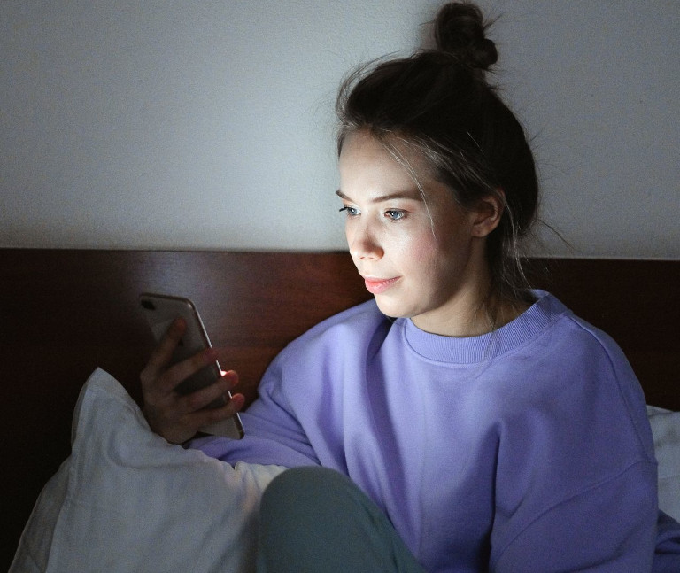
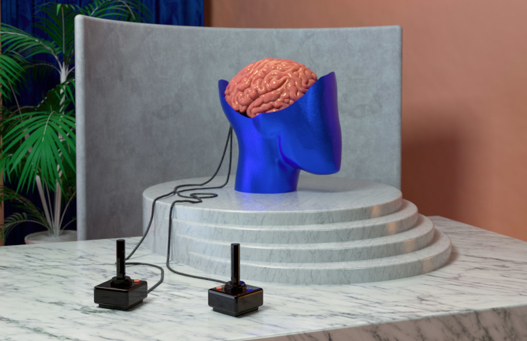
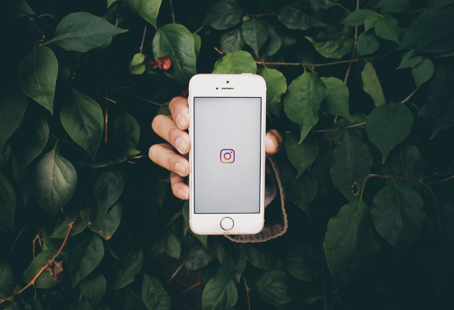
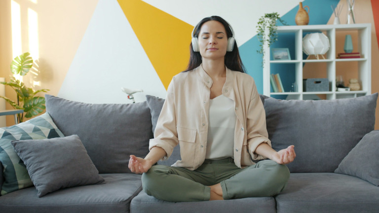

## What Is a Digital Detox?

A digital detox (also called digital detoxification or digital fasting) means that you **temporarily give up digital media such as computers, smartphones or social media** in order to reduce stress and support your mental health. The goal is to limit the constant sensory overload, reflect on your media consumption and consciously experience real life again.

### Key Points at a Glance

*   Excessive screen time and the constant sensory overload caused by digital media put a strain on our mental health and can lead to a range of problems.
*   Many apps have addictive potential because they build in small rewards, enable endless scrolling or send push notifications.
*   That is why some important detox tips are to track your screen time digitally, define time limits and activate offline mode during digital breaks.
*   Longer breaks in particular, such as an offline vacation, require careful preparation so that you can consistently follow through with your digital detox, and especially your social media detox.
*   In the long term, the aim is to live more mindfully again and to establish healthy habits such as exercise, walks in nature, game nights with friends or creative hobbies.

As you read on, you will find a **step-by-step guide and plenty of tips** on how to successfully carry out a digital detox, incorporate more offline activities into your everyday life or plan your next vacation completely offline.

## Why Body and Mind Need a Digital Detox More Often

The smartphone has long been an everyday companion, communication hub and entertainment device all in one. It provides **permanent access to apps, games and information on the internet**. What at first seems practical can mean that we barely have any longer breaks left for undisturbed experiences in the real world. Many people reach for their phone dozens or even hundreds of times a day, often completely automatically. A few minutes quickly turn into **several hours of screen time** that are then missing offline for rest, meeting others or hobbies.

The **addictive potential** stems from the fact that many apps (especially games, shopping, dating and social media) activate our reward system. New levels, purchases, likes or comments release small amounts of **dopamine**. This hormone motivates us to reach for our smartphone again and again. And even when you have put the smartphone aside, **push notifications** interrupt your concentration and make longer periods of focus considerably more difficult. On top of that, they intensify our fear of missing out, better known as **FOMO**.



Our social contacts, whether coworkers, friends or family members, often expect us to be reachable at all times. This creates a lot of pressure to respond to messages quickly and keeps us in a constant state of alert. It is pure stress, which you can ease through open communication: let your contacts in on your detox and announce, before a digital break, that your next reply will take longer than usual.



## Constant Sensory Overload: When Excessive Screen Time Makes You Ill

Many people underestimate how strongly constant stimulation and excessive screen time affect their mental health. While we **jump back and forth between digital media content, chat messages and social media**, our brain runs at full speed without pause, and real life simply passes us by. In the worst case, digital media can even keep us from real meetups, hobbies or physical exercise.

This behavior becomes problematic when it turns into a [habit](). Endless scrolling in the evening in particular has a negative effect on body and mind, because the bright light of the display influences your **sleep-wake rhythm**. A blue light filter can reduce this effect somewhat, but it is no substitute for a conscious digital detox before going to bed.

### Possible Consequences of Too Much Screen Time

*   declining ability to concentrate
*   a severely shortened attention span
*   increasing inner restlessness and irritability
*   a feeling of being overwhelmed and exhausted
*   sleep disorders and fatigue
*   listlessness and procrastination
*   social isolation and neglect



Frequent use of digital media can also cause physical complaints such as mouse arm, tech neck or tendinitis through **monotonous movements and improper strain**. In addition, it often goes hand in hand with **too much sitting** and an unergonomic posture, which in turn can trigger **back pain and tension** and impair your physical fitness.



## How a Digital Detox Can Strengthen Your Mental Health

A digital detox **frees you from the relentless pressure of the always-on mentality** and limits your previous media use with all the mechanisms mentioned above. Even a daily digital break of 1 to 2 hours can help to **reduce the permanent overstimulation of the brain** and give your body time to recover. When you practice a digital detox in the evening, you usually not only get **more sleep** but also experience **fewer sleep disorders and less inner restlessness**.

People who **work at a computer** in particular inevitably rack up more than 8 hours of screen time a day. When private emails, messenger notifications or video calls are added in the evening, this exposure extends almost imperceptibly right up until bedtime. A digital detox creates **clear boundaries** here and ensures that genuine recovery can actually take place. It also brings back **moments of true mindfulness** such as walks, conversations or creative hobbies, along with **periods of productivity** that are not constantly interrupted by incoming messages.

## Digital Detox in Everyday Life: Ways Out of Constant Sensory Overload

A successful digital detox starts with an **honest analysis** of your habits. Most smartphones now have features that let you track your weekly or daily screen time in detail and, if needed, set limits (overall or for specific apps). Take a look at these numbers, because the evaluation alone leaves many people astonished. So a detox first of all makes you aware of **how much time you spend on digital devices**.

Once you have created transparency, you should ask yourself **which apps actually offer you real value and which merely cost you time**. This is exactly where the digital detox comes in. It is not about avoiding digital media altogether. Rather, a detox means reshaping your digital media consumption, doing without unnecessary time wasters and finding a **healthy balance between online and offline time**. Through this regular detox, you live more consciously again instead of being permanently reachable online.

Consistently using offline modes during certain focus phases is helpful here. Almost all smartphones offer an **airplane, sleep or do-not-disturb mode** right out of the box. This lets you avoid push notifications and distractions. Often you can also specify precisely which apps and people are still allowed to send you notifications, so that you do not miss anything in an emergency.

## Social Media Detox: Your Way Out of the Algorithm Trap

[Social networks]() are deliberately designed to hold your attention for as long as possible. **Endless scrolling, personalized content and continuous notifications** ensure that even passive users stay online much longer than planned. And if you actively post content and interact with your community, your brain releases small amounts of dopamine with every **like, comment or share**, spurring you on to ever more interactions.

However, a social media detox does not necessarily mean deleting all your apps. Instead, it is about regaining control over your consumption by sticking to fixed social media times, for example a maximum of 20 minutes per platform per day. This puts a stop to the **addictive mechanisms** and helps you escape the **algorithm** that keeps suggesting new content tailored to your interests.

If you consistently follow through with a social media detox, you will often notice more calm and emotional balance after just a few days. People with social media detox experience often report that they **compare themselves to others less often**, take more pleasure in offline activities and feel **less FOMO** than before.

## Digital Detox Checklist: 7 Steps to a More Mindful Life

If you want to gain your first digital detox experiences, a sensible approach could look something like this:

1.  **Measure and analyze your screen time**: You can only change your media use if you understand it. Tracking your screen time on your smartphone is especially easy: simply activate the feature of the same name in the settings (on Android devices it is also called "Digital Wellbeing").

2.  **Define time limits and eliminate time wasters**: Self-confidence is good, but self-control is better. Use a timer to limit the daily usage time for certain apps such as social networks or games. Digital time wasters that you can do without entirely should be banished from your life.

3.  **Reduce push notifications**: So that your smartphone does not constantly distract you, only truly important apps should send urgent notifications, make sounds or appear on your lock screen. Set all other push notifications to silent or turn them off completely.

4.  **Stick to smartphone-free times**: Schedule daily periods of concentration or rest during which you consciously stay offline. To help, you can activate airplane, sleep or do-not-disturb mode on your phone, or simply put it out of reach.

5.  **Dare to take digital breaks**: A Sunday on which all smartphones, computers and televisions stay switched off from morning to night, does that sound harsh or heavenly? A digital timeout is often difficult at first, but it can be surprisingly liberating.

6.  **Foster mindfulness**: To make good use of your digital breaks, you can try out new activities that promote mindfulness. Walks, meditation exercises or creative projects slow you down and help you live in the here and now.

7.  **Protect your sleep**: Too much display light in the evening throws off your sleep-wake rhythm. So put your smartphone aside at least half an hour before going to bed. This reduces trouble falling asleep and improves the quality of your sleep.

Don't worry: your digital detox does not have to go perfectly at all. Don't be too hard on yourself if you occasionally exceed your usage limits or reach for your smartphone during digital breaks. What matters is making your media consumption more conscious in the long run, establishing routines that work over time and experiencing more offline moments.

## Ideas for Activities That Make Your Digital Detox More Enjoyable

Radical abstinence requires a lot of self-discipline and therefore rarely leads to the goal. Instead, you should look for offline activities that you enjoy doing regularly in order to create a healthy counterbalance to digital sensory overload. Here we have gathered a few ideas for you.

### Relaxation & Mindfulness

*   **Meditation**: Use mindfulness, yoga or breathing techniques to relax.
*   **Keeping a journal**: Record your thoughts, feelings and experiences by hand in a [bullet journal]().
*   **Reading**: Swap your e-book reader for a real [book]() and immerse yourself in a story.

### Nature

*   **Walks**: Explore your local surroundings on foot and take a deep breath of fresh air.
*   **Forest bathing**: Find peace in a forest and listen to the sounds of nature.
*   **Gardening**: [Plant a bed in your garden]() or repot houseplants on your balcony.

### Creativity & Handicraft

*   **Painting**: Get your brushes and paint ready and give your creativity free rein on a canvas.
*   **Playing instruments**: Devote yourself entirely to a musical instrument and practice your favorite pieces.
*   **Cooking or baking**: Try out an elaborate recipe and celebrate the process.
*   **Discovering something new**: Take a course to learn pottery, macramé or candle making, for example.

### Social & Culture

*   **Game night**: Spend an evening with family or friends playing classic board or card games.
*   **Concert or show**: Attend a concert or show by your favorite artist and cheer along with other fans.
*   **Theater and opera**: When did you last watch a live performance of a classical work?

### Exercise & Travel

*   **Swimming**: Whether at the pool, a lake or the sea, do your laps and let yourself float.
*   **Bike ride**: Grab your bicycle and explore the cycle paths in your area.
*   **Short trip or camping**: Go camping for several days or take a trip wherever you like.
*   [Geocaching](): Set off on a treasure hunt where you discover new places and solve exciting puzzles.

## An Offline Vacation: How to Plan Your Time Off Strategically

A vacation promises relaxation and seems practically predestined for a digital detox. Many people, however, take their smartphone to the beach, for example, to watch videos, chat with friends or post photos on social media. On hikes and road trips it serves as a navigation device, and in the evening in the hotel room Netflix is running. In some cases, people even check work emails.

A true digital detox vacation without constant availability therefore only succeeds with good **preparation**:

*   Inform important contacts about your absence and set up an automatic email reply.
*   Warn family and friends in advance that you will often be unreachable during your vacation.
*   Print out any necessary documents and download maps and music so that you can stay offline while traveling.

Over the course of your offline vacation, you can stick to these simple **rules**:

*   Switch off mobile internet as often as possible and only connect to the hotel Wi-Fi.
*   While out and about, only use your smartphone as a camera or for navigation.
*   Avoid social media, shopping and gaming apps during your trip.

A well-planned digital detox vacation significantly lowers your stress level. Without constant availability, you recover more quickly and experience many moments much more intensely.



If you want to go through a radical withdrawal, you can book a vacation where no internet-capable devices are allowed. These can be monastery stays and yoga retreats, but also special spa and wellness offerings.



## How SeaTable Can Support Your Digital Detox

A common mistake during a digital detox is suddenly demonizing everything digital across the board. For a long-lasting detox, it makes more sense to use digital media thoughtfully and to deliberately employ digital tools to get an overview of your media use and find a balance between online and offline phases.

Useful templates from SeaTable can help you with this:

*   Use the [Habit Tracker]() to track your personal goals and establish healthy habits.
*   Prepare your next digital detox vacation with the [Travel Planner]() or keep a [travel journal]().
*   Create your [personal exercise guide]() and document your progress.



With our [AI no-code solution](), you can quickly capture all your thoughts and information, organize your tasks efficiently and thereby have more time for the important things in life. That is precisely the idea behind a sustainable digital detox.

And the best part: you can use the [SeaTable Cloud]() completely [free of charge]() in its basic version and upgrade at any time as soon as you need more storage space.



## Conclusion: Long-Term Habits Instead of Short-Term Abstinence

A digital detox is not a short-term challenge but a **conscious decision in favor of more balance in life**. When you regularly take digital breaks, you reduce sensory overload, improve your concentration and strengthen your mental health. Whether through a social media detox, a planned digital detox vacation or regular offline activities in everyday life, even small changes can make a big difference. The most valuable digital detox experiences usually do not come from completely giving up digital media, but from mindful use and a change of habits.

## Frequently Asked Questions About Digital Detox



A digital detox checklist includes monitoring and limiting your screen time, disabling unnecessary push notifications and taking longer digital breaks with mindfulness-promoting activities. In addition, clear rules for the evening and an offline mode for periods of concentration and recovery can help you find more calm and prevent trouble falling asleep.





Many digital detox experiences show that people start too radically and try to give up all digital media from one day to the next. A more sustainable digital detox is one in which you gradually reduce your media use and replace individual habits. If you plan offline alternatives such as exercise, walks or game nights, you are less likely to fall back into old patterns. What matters is that you find a healthy balance in the long run.





Endless scrolling, personalized content and tempting likes: the design and algorithms of social networks make conscious consumption especially difficult. With a social media detox, however, you can reduce sensory overload, lessen your FOMO and reclaim more time for real experiences. Many social media detox experiences show that after a few weeks people feel more emotionally balanced again because they compare themselves to others less and no longer have constant stimuli and information overloading their brain.





Before a digital detox vacation without constant availability, you should inform important contacts and set up automatic out-of-office replies. In addition, you can download maps and music in advance and save your travel documents offline. Last but not least, you should set clear rules for your smartphone use, for example using only hotel Wi-Fi instead of mobile data. This turns your vacation into genuine relaxation.





Long-term digital detox experiences often include less screen time, more concentration and mindfulness, less inner restlessness and noticeably stronger mental health. Many people develop healthy habits, sleep better and experience their free time and relationships more intensely again.


