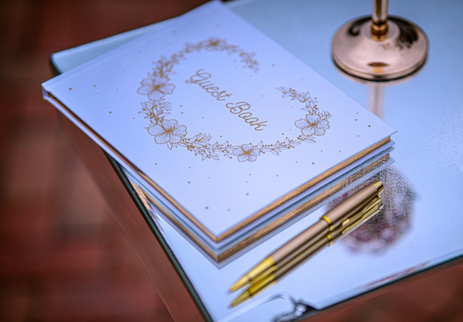
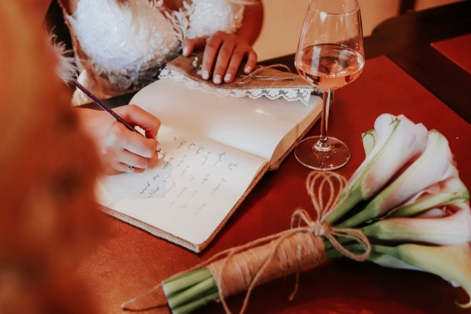
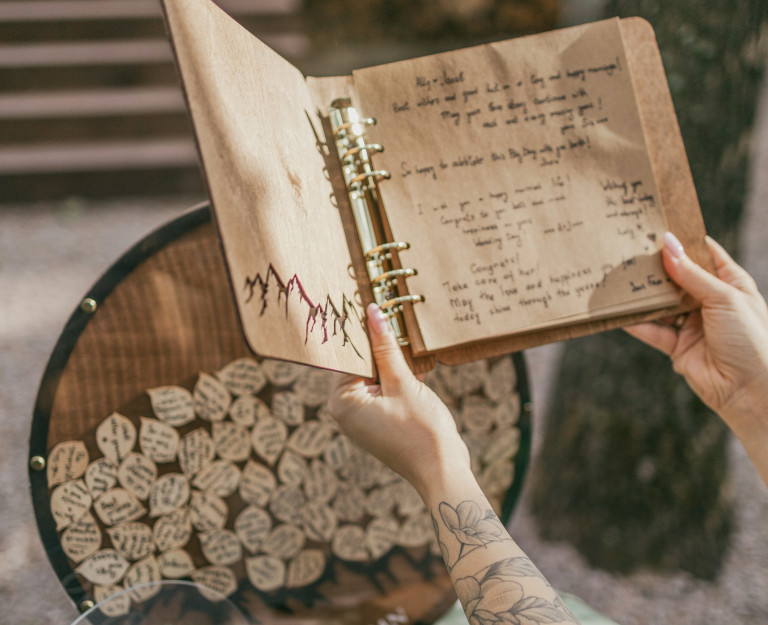
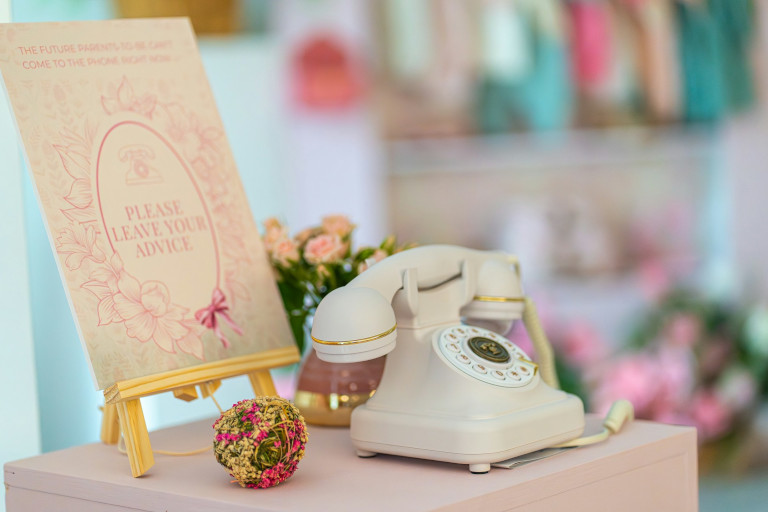
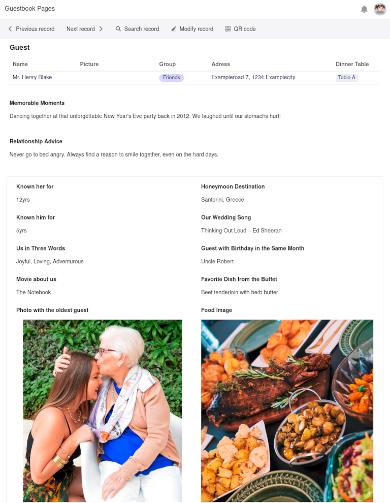
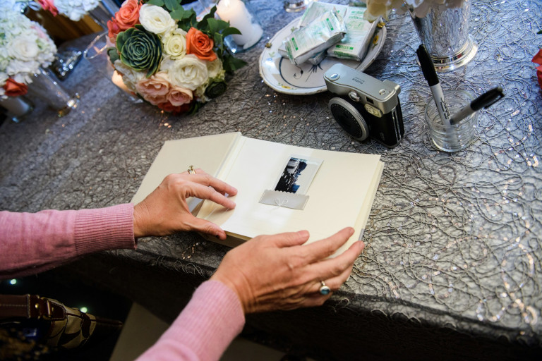
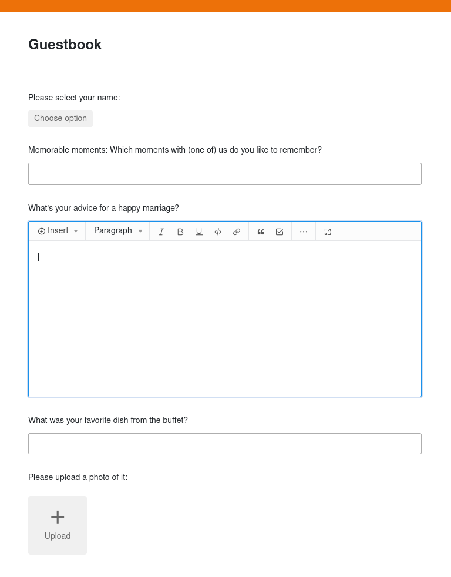
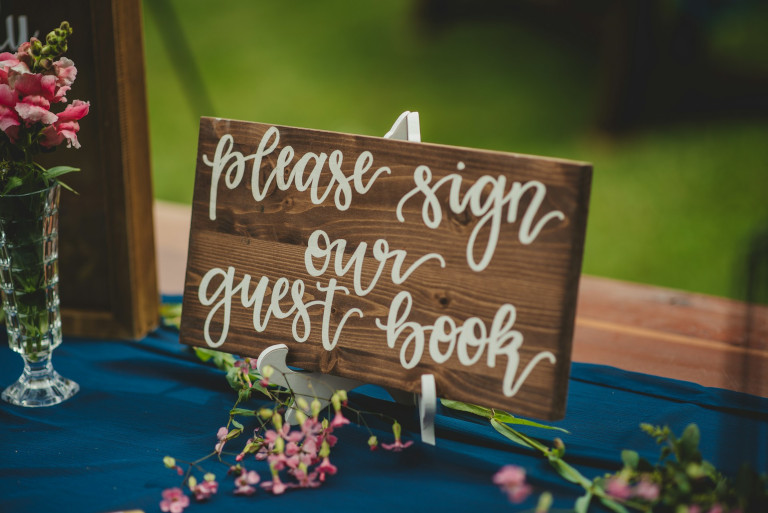
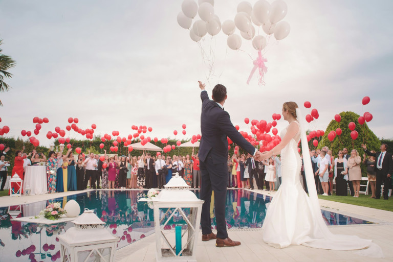

## Die wichtigsten Vorteile eines Gästebuchs

*   **Emotionale Momente festhalten**: Viele Gäste formulieren ihre Glückwünsche spontan. Gerade diese ehrlichen Worte besitzen einen besonders hohen Erinnerungswert.  
*   **Persönliche Geschichten sammeln**: Nicht jeder Gast hält eine Rede. Im Gästebuch finden deshalb auch kleine Anekdoten, Insider oder gemeinsame Erinnerungen ihren Platz.  
*   **Dekoratives Erinnerungsstück**: Ein schönes Hochzeitsgästebuch verschwindet nicht im Schrank. Es lädt dazu ein, den Hochzeitstag immer wieder Revue passieren zu lassen.  

## Das klassische Buch hat ausgedient: Warum moderne Hochzeiten neue Ansätze erfordern

Ein Gästebuch gehört für viele Brautpaare so selbstverständlich zur Hochzeitsfeier wie die Torte oder der erste Tanz. Trotzdem zeigt sich immer wieder das gleiche Problem: **Viele Gäste stehen ratlos vor dem Buch**, überlegen minutenlang und schreiben am Ende lediglich „Alles Gute für eure gemeinsame Zukunft“.  
  
Wenn Sie für Ihr Gästebuch zur Hochzeit nach Ideen suchen, wollen Sie vermutlich genau das vermeiden. Schließlich soll Ihr Hochzeitsgästebuch **nicht nur Unterschriften sammeln, sondern Augenblicke und Emotionen bewahren**, die Ihnen Jahre später noch Freude bereiten.  
  
Eine moderne Gästebuch-Idee, wie beispielsweise **ein digitales Gästebuch** oder ein Video Gästebuch zur Hochzeit, kann hier den Unterschied machen. Es verwandelt eine Pflichtaufgabe in ein echtes Erlebnis, das Ihre Hochzeitsgäste zum Mitmachen einlädt und gleichzeitig einen **hohen Erinnerungswert** bietet.

### Typische Herausforderungen im Überblick

*   **Schreibblockaden**: Auf der Feier sitzen viele Gäste ratlos vor dem Buch und wissen spontan nicht, was sie hineinschreiben sollen.
*   **Fehlende Kreativität**: Letztendlich reihen sich unpersönliche, redundante Standard-Glückwünsche und fast leere Seiten mit nichtssagenden Unterschriften aneinander.
*   **Unterbrechungen**: Im Eifer des Gefechts bleiben unvollständige oder kaum lesbare Einträge zurück, die sich nicht mehr zuordnen lassen.
*   **Technische Hürden**: Wenn von den Großeltern bis zu den Kindern alle mitmachen sollen, können kreative Ideen wie ein Video Gästebuch auf der Hochzeit herausfordernd sein.

## Kreativer Eintrag in das Gästebuch zur Hochzeit: Lustige Sprüche und emotionale Text-Vorlagen

Betrachten wir es aus Sicht der Hochzeitsgäste: Man befindet sich auf der Feier und braucht für das Gästebuch zur Hochzeit noch Ideen für den Text. Dürfen die Sprüche zur Hochzeit im Gästebuch lustig sein oder mag das Brautpaar es eher ernsthaft und romantisch? Hier sind einige Anregungen, wie ein kreativer Eintrag in das Gästebuch zur Hochzeit aussehen könnte, sofern es keine klare Anleitung vom Brautpaar gibt.

### Lustige Sprüche zur Hochzeit

*   Player 2 has entered the game – herzlichen Glückwunsch zum erfolgreichen Abschluss der Ehe-Mission! Next Level oder Game over? Wir hoffen, dass ihr beide gewinnt!
*   Ab heute dürft ihr euch offiziell gegenseitig die Decke wegziehen. Wie sagt man so schön: In der Ehe versucht man Probleme zu zweit zu lösen, die man alleine gar nicht gehabt hätte.
*   Herzlichen Glückwunsch zur Steueroptimierung: Ab heute teilt ihr nicht nur Miete und Nebenkosten, sondern verdoppelt auch euren Steuerfreibetrag!
*   Eine Ehe ist kein Sprint, sondern ein Marathon. Wir wünschen euch viel Kraft und einen langen Atem, damit ihr mindestens 50 Jahre durchhaltet!
    


Bitte wägen Sie sorgfältig ab, **wie viel Humor** bei der konkreten Hochzeit erwünscht ist. Auch wenn Sprüche zur Hochzeit im Gästebuch lustig gemeint sind, kommen weniger nette Sprüche fürs Gästebuch nicht bei jedem Brautpaar gut an.



### Romantik und Philosophie

*   Die Ehe ist wie ein [Garten]() – sie braucht Pflege und Zeit, um zu gedeihen. Auf dass die Sonne für euch scheint, damit eure Liebe wächst und Früchte trägt!
*   Möge das Segelboot eurer Ehe stets Rückenwind haben, die Liebe euer Kompass sein und euch sicher durch alle Stürme des Lebens steuern!
*   Eure Ehe ist wie ein [Buch](): Jeder Tag ist eine neue Seite, jedes Jahr ein neues, spannendes Kapitel und ihr zwei schreibt die schönste Geschichte eures Lebens!
*   Eine Ehe ist kein Selbstläufer, sondern die Entscheidung, jeden Tag gemeinsam zu gehen. Auf dass ihr euch jeden Morgen wieder gerne füreinander entscheidet!

Wie Sie sehen, sind bei einem klassischen Gästebuch zur Hochzeit die Ideen begrenzt. Oft bleiben nette Sprüche fürs Gästebuch austauschbar, egal wie sehr sich die Gäste um einen kreativen Eintrag ins Gästebuch bemühen.

## Originelle Ideen für ein Gästebuch zur Hochzeit

Um Ihren Gästen und sich selbst viele redundante Sprüche und Standardformulierungen zu ersparen, können Sie tiefer in die Trickkiste greifen. Wenn Sie für Ihr Gästebuch zur Hochzeit nach Ideen suchen, stehen Ihnen zahlreiche originelle Möglichkeiten offen.

*   **Sofortbildkameras**: Polaroid-Bilder sorgen für spontane Schnappschüsse von Ihrer Feier. Die Gäste können Fotos direkt in das Gästebuch einkleben und mit einem persönlichen Eintrag versehen.

*   **Fotobox**: Ihre Gäste posieren mit lustigen Requisiten wie Hüten, Brillen, Schnurrbärten etc. vor der Kamera. In einer Fotobox entstehen besonders authentische Erinnerungen.

*   **Fingerabdruck-Leinwand**: Jeder Gast hinterlässt seinen Fingerabdruck und ergänzt ihn mit seinem Namen. Das fertige Gemälde ist später ein Hingucker in jeder Wohnung.

*   **Puzzle**: Jeder Gast gestaltet ein ausgestanztes Puzzleteil, zum Beispiel mit Pinsel und Farbe. Am Ende ergibt sich ein Gesamtkunstwerk, zu dem alle Hochzeitsgäste beigetragen haben.  

*   **Wunschbaum**: Statt in ein Hochzeitsgästebuch schreiben die Gäste ihre Wünsche auf Karten. Diese werden anschließend an einen Baum gehängt, der Wachstum und Beständigkeit symbolisiert.

### Audio- und Video-Gästebuch: Erinnerungen zum Anhören und Anschauen

Darüber hinaus erfreut sich das Audio-/Video-Gästebuch zur Hochzeit immer größerer Beliebtheit. Oft sieht es aus wie ein altes Telefon oder eine Telefonzelle. Die Gäste nehmen den Hörer (mit Mikrofon) in die Hand, sprechen ihre Wünsche hinein und werden dabei gegebenenfalls von einer Kamera aufgenommen. Dadurch bietet ein Video Gästebuch zur Hochzeit die Möglichkeit, Emotionen und spontane Reaktionen wie ein Lachen besonders authentisch einzufangen.



Viele Brautpaare kombinieren auch ein Audio-Gästebuch mit einer Fotobox, ein klassisches Hochzeitsgästebuch mit Sofortbildkameras oder ein digitales Gästebuch mit Fotos und Videos. **Diese Kombinationen erhöhen den Erinnerungswert erheblich**.



## Digitales Gästebuch für die Hochzeit: Struktur statt Schreibblockade

Viele Hochzeitsgäste möchten etwas Besonderes schreiben, finden jedoch im entscheidenden Moment nicht die passenden Worte. Hier hilft eine strukturierte Vorgehensweise, die zum Beispiel ein digitales Gästebuch mit **vorgefertigten Fragen** ermöglicht:

*   Wie lange kennst du Braut und Bräutigam schon?
*   An welche Momente mit (einem von) uns erinnerst du dich gerne?
*   Was ist dein Tipp für eine glückliche Ehe?
*   Wie würdest du das Brautpaar in drei Worten beschreiben?
*   In welchem Film könnten wir die Hauptrollen spielen?
*   Welches Reiseziel empfiehlst du für die [Flitterwochen]()?
*   Welcher Song beschreibt unsere Hochzeit am besten?
*   Was vom Buffet hat dir am besten geschmeckt?
    
So geben Sie Ihren Gästen konkrete Anknüpfungspunkte, um wirklich persönliche Worte zu finden und gemeinsame Erinnerungen zutage zu fördern. Zudem können Sie Ihren Gästen **kleine Aufgaben** geben, um unvergessliche Momente zu schaffen. Zum Beispiel funktionieren für das Gästebuch zur Hochzeit diese Ideen:

*   Finde den ältesten Gast / den Gast mit der weitesten Anreise / den Gast mit den meisten Kindern etc. und lade ein Selfie mit ihm hoch.  
*   Finde jemanden, der im gleichen Monat wie du Geburtstag hat. Singt zusammen „Happy Birthday“ und ladet die Aufnahme hoch.
*   Finde jemanden mit der gleichen Schuhgröße wie du und frage ihn nach seiner Lieblingssportart. Trage Namen und Sportart hier ein.
*   Was war das Leckerste, das du heute gegessen hast? Lade ein Foto davon hoch.

## Analoges vs. digitales Gästebuch: Vor- und Nachteile

### Analoge Gästebücher

Ein klassisches Hochzeitsgästebuch kann nur von einem Gast gleichzeitig ausgefüllt und gestaltet werden. Die Seiten sind immer gleich groß und bieten für manche Gäste zu viel, für manche zu wenig Platz. Egal, ob Standard-Gästebuch oder kreativere Formen wie der Wunschbaum – folgende Vor- und Nachteile haben alle analogen Gästebücher gemeinsam.

#### Vorteile

- **Das eigenhändige Schreiben auf Papier** wirkt bei einem festlichen Anlass persönlicher und offizieller.  
- Für analoge Gästebücher benötigen Sie **kein Internet/WLAN und keine Mobilgeräte mit geladenem Akku**.  
- Gerade kreativere Ideen wie ein Puzzle können später als **dekoratives Erinnerungsstück** in Ihrer Wohnung zur Geltung kommen.

#### Nachteile:

- Alle Gäste können die bisherigen Einträge lesen und **voneinander abschreiben**. 
- **Unleserliche Handschriften** und **unvollständige Beiträge** sind schwer zuzuordnen. 
- Video- und Audio-Aufnahmen lassen sich **nicht** integrieren.
- Bei **Verlust oder Beschädigung** gehen Erinnerungen verloren.

### Digitales Gästebuch

Heutzutage eröffnen digitale Lösungen für ein Gästebuch zur Hochzeit neue Ideen und Möglichkeiten. Zum Beispiel können Sie ein Online-Formular mit konkreten Fragen und Upload-Funktionen erstellen, um Ihre Gäste strukturiert durch den Ausfüllprozess zu leiten.

#### Vorteile
  
- Ein digitales Gästebuch können alle Gäste **gleichzeitig ausfüllen** oder auch nach der Feier ergänzen.  
- Es bietet **flexible Eingabefelder**, sodass Gäste sowohl kurze als auch lange Texte verfassen können.  
- Die Gäste können **Fotos und Videos hochladen** oder sogar Sprachnachrichten hinterlassen.  
- Wenn Sie alle Beiträge in der [Cloud]() speichern, sind sie **vor Verlust und Zerstörung geschützt**.  
- Jeder Eintrag ist eindeutig einem Gast zugeordnet und dank **Suchfunktion** leicht auffindbar.

#### Nachteile

- Die Gäste müssen **internetfähige Geräte** mitbringen und gutes Netz an der Location haben.  
- Ein digitales Gästebuch enthält **weniger persönliche Elemente** wie z. B. Handschriften.  
- Aufgrund der vorgefertigten Struktur haben die Gäste **weniger Gestaltungsspielraum**.

## Gästebuch zur Hochzeit: Ideen für Ihre Checkliste

Damit Ihre Gästebuch-Ideen am Hochzeitstag zünden, empfiehlt sich eine gute Vorbereitung. 

### Vor der Hochzeit 
- Wählen Sie eine Gästebuch-Idee aus, die gut zu Ihrer Hochzeit passt. Auch Kombinationen sind möglich. 
- Falls Sie eine Fotobox oder ein Video Gästebuch für die Hochzeit mieten wollen, buchen Sie diese rechtzeitig. 
- Wenn Sie ein digitales Gästebuch nutzen möchten: Bereiten Sie ein Online-Formular mit Fragen und Upload-Möglichkeiten vor. 
- Wenn Sie ein analoges Gästebuch bevorzugen: Besorgen Sie alle Materialien, die für die Gestaltung nötig sind, z. B. genügend Stifte, Malutensilien, Klebestreifen, Sofortbildkameras etc. 

### Während der Hochzeitsfeier 
- Platzieren Sie das Gästebuch und eine kurze Anleitung an einer gut sichtbaren Stelle. Digitale Gästebücher können Sie beispielsweise über einen QR-Code verfügbar machen. 
- Nehmen Sie einen Punkt ins Programm auf, zu dem Sie ausdrücklich auf das Gästebuch hinweisen. 
- Bitten Sie Trauzeugen oder enge Angehörige, regelmäßig nach dem Buch zu sehen und andere Gäste aktiv zu Beiträgen anzuregen. 

### Nach der Hochzeit 
- Sichern Sie alle Medien (Foto-, Video- und Audio-Dateien), die Sie von den für das Gästebuch zur Hochzeit gemieteten Ideen gesammelt haben.
- Suchen Sie einen geeigneten Ort, an dem Sie das Gästebuch aufbewahren können. Digitale Erinnerungen können Sie z. B. in einer Cloud zusammenführen oder auf einer Festplatte speichern.

## Ihr digitales Hochzeitsgästebuch erstellen: SeaTable als flexible Organisations-Plattform

Der [Hochzeitsplaner]() von SeaTable ist ein echter Gamechanger. Er enthält nicht nur wertvolle **Checklisten und Übersichten** für die Organisation Ihrer Hochzeit, sondern auch ein integriertes **digitales Gästebuch**. Statt einer leeren Seite bekommen Ihre Gäste ein Webformular mit kleinen Aufgaben und kreativen Fragen zum Ausfüllen. Alle Gäste können ihre Beiträge **gleichzeitig** einreichen und nicht voneinander abschreiben, damit die Inhalte wirklich einzigartig werden.



Mit dem integrierten [App-Builder]() erstellen Sie nicht nur **Online-Formulare mit Upload-Funktionen**, sondern auch **individuelle Gästebuchseiten und Fotogalerien** im Handumdrehen. Nutzen Sie einen **QR-Code**, den Ihre Gäste auf der Feier scannen können, um spielend leicht Zugang zu erhalten. Sicher ist sicher: Alles, was die [SeaTable Cloud]() betritt, ist DSGVO-konform auf Servern in Deutschland gespeichert.

Und das Beste: Sie können die Basis-Version von SeaTable komplett [kostenlos]() nutzen und jederzeit upgraden, sobald Sie mehr Speicherplatz benötigen.



## Fazit: Das Gästebuch für die Hochzeit mit Ideen upgraden

Sie können ein klassisches Gästebuch bei der Hochzeit auslegen oder neue Ideen und digitale Lösungen ganz nach Ihren Wünschen nutzen. Unsere Empfehlung: Nehmen Sie sich die Zeit, die Medienauswahl für das Gästebuch selbst zu gestalten. Denn beim Gästebuch zur Hochzeit helfen kreative Ideen, Ihre Hochzeitsgäste aktiv einzubinden, Schreibblockaden zu lösen und gemeinsame Erinnerungen zu sammeln. Ob Puzzle, Wunschbaum, Fotobox, Audio- oder Video Gästebuch zur Hochzeit – jede Variante besitzt ihren eigenen Reiz, um unvergessliche Momente einzufangen. Ein digitales Gästebuch ist das Mittel der Wahl, wenn Sie persönliche Botschaften und verschiedene Mediendateien strukturiert erfassen möchten.

## Häufig gestellte Fragen zum Hochzeitsgästebuch



Als Faustregel gilt: eine Seite pro Gast, z. B. 80 Seiten bei 80 Gästen. Wenn unter den Gästen viele Paare oder Familien sind, die oft zusammen eine Seite gestalten, reichen 50 bis 60 Seiten. Bei einem digitalen Gästebuch mit genügend Speicherplatz kann jeder Gast so viele Texte und Mediendateien hochladen, wie er will – unabhängig von freien Seiten.





Wenn sie das Buch vor sich haben, bekommen viele Gäste eine spontane Schreibblockade, überlegen minutenlang und formulieren schließlich doch austauschbare Standard-Glückwünsche wie „Alles Gute für eure Zukunft“. Kreative Aufgaben, vorbereitete Fragen und interaktive Gästebuch-Ideen erleichtern den Einstieg und führen zu deutlich persönlicheren Gästebucheinträgen. 





Bei einem Online-Gästebuch können Sie kreative Fragen und kleine Aufgaben mithilfe eines Formulars vorgeben. Statt allgemeiner Wünsche schreiben die Gäste persönliche Erinnerungen, Beziehungstipps oder lustige Erlebnisse in das digitale Gästebuch. Zudem können Sie Ihre Gäste untereinander Aufgaben lösen und mit Fotos/Videos dokumentieren lassen. Dadurch entsteht eine abwechslungsreiche Sammlung mit hohem Erinnerungswert. 





Wenn Sie Ihr Gästebuch selbst gestalten, sollten Sie frühzeitig alles vorbereiten. Dazu gehören bei einem analogen Gästebuch ausreichend Stifte, Malutensilien und Klebematerialien, bei einem digitalen Gästebuch ein Online-Formular mit Fragen und Upload-Möglichkeiten und bei einem Video-Gästebuch gegebenenfalls eine gemietete Fotobox. Für die Hochzeit ist es sinnvoll, im Programm ausdrücklich auf das Gästebuch hinzuweisen, eine Anleitung bereitzustellen und Trauzeugen oder enge Angehörige einzuplanen, um andere Gäste aktiv anzusprechen. Vergessen Sie nicht, sich nach der Feier alle Medien und Dokumente zu sichern.


 



Eine cloudbasierte [No-Code-Plattform]() wie SeaTable hilft Ihnen Fotos, Videos, Audio-Nachrichten und beliebig lange Texte strukturiert zu erfassen und zentral zu speichern. Unser digitales Gästebuch zur Hochzeit können mehrere Gäste gleichzeitig ausfüllen. Es ermöglicht die intuitive Erstellung von Online-Formularen, erleichtert das spätere Wiederfinden einzelner Beiträge und erlaubt die visuelle Aufbereitung der Daten (z. B. in Bilder-Galerien).


 



Entscheiden Sie sich am besten für einen Cloud-Anbieter, der alle Daten DSGVO-konform innerhalb der EU speichert. Holen Sie bei Fotos und Videoaufnahmen das Einverständnis der Beteiligten ein, informieren Sie Ihre Hochzeitsgäste transparent darüber, wo Sie die hochgeladenen Inhalte speichern, und beschränken Sie den Zugriff auf wenige autorisierte Personen wie das Brautpaar und die Trauzeugen. So bleiben persönliche Daten und Erinnerungen geschützt und verantwortungsvoll verwaltet.


