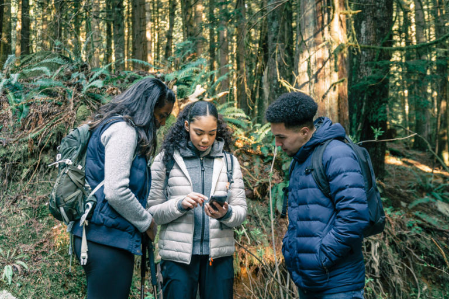
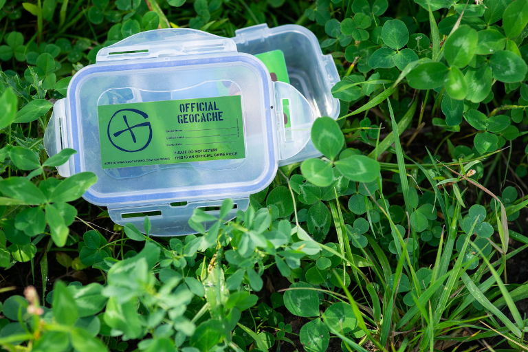
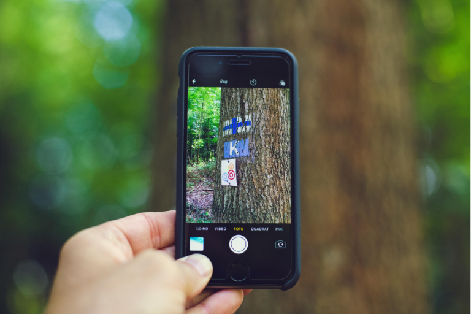
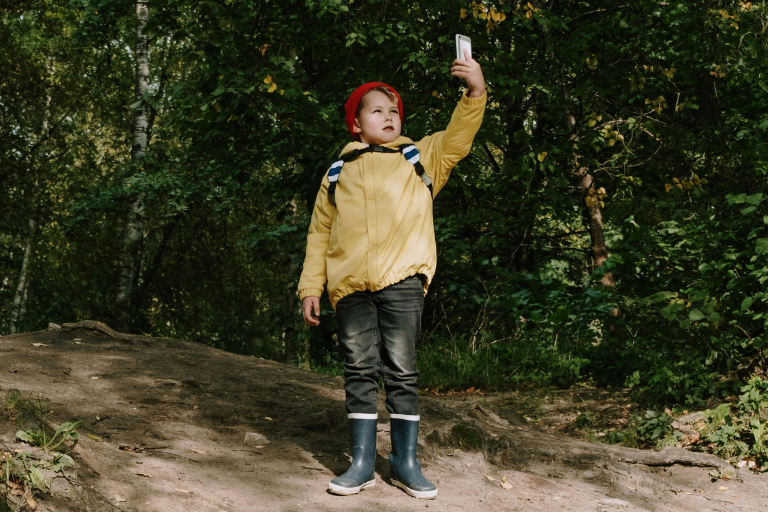

## Points clés

- Le géocaching est une chasse au trésor moderne qui consiste à trouver des boîtes cachées à l'aide de coordonnées GPS.
- Chaque cache contient généralement un carnet de visite dans lequel vous pouvez vous inscrire, ainsi que de petits objets à échanger, appelés « trackables ».
- Il existe différents types de caches : les caches traditionnelles mènent directement à la destination, les multi-caches se composent de plusieurs étapes, tandis que les caches mystères contiennent des énigmes à résoudre au préalable.
- Le géocaching permet également d'organiser des fêtes d'anniversaire pour enfants en intégrant des itinéraires personnalisés, des énigmes et de petits trésors.
- SeaTable est idéal pour planifier vos propres itinéraires de géocaching. Vous pouvez enregistrer des coordonnées GPS, planifier des étapes, documenter des énigmes, relier logiquement les tâches, ajouter des indices, créer des carnets de bord numériques et générer des rapports.

## Le géocaching – qu'est-ce que c'est ?

Le géocaching est un loisir qui allie technologie et aventure d'une manière particulière. **À l'aide de coordonnées GPS, vous recherchez de petites cachettes dans votre environnement** que d'autres personnes ont dissimulées auparavant. Ces cachettes s'appellent des « caches » et contiennent généralement un journal de bord, mais parfois aussi de petits objets à échanger. 

Vous choisissez une cache, vous vous laissez guider jusqu’à la destination à l’aide d’un smartphone ou d’un appareil GPS, puis vous commencez la recherche proprement dite sur place. C’est précisément là que réside tout l’intérêt, car il faut de l’attention, de la patience et un bon œil pour les détails afin de remarquer des choses qui passent souvent inaperçues au quotidien.



L'idée du géocaching a vu le jour vers l'an 2000, lorsque le GPS est devenu accessible à tous. La plateforme Groundspeak a lancé le mouvement et continue aujourd'hui encore de mettre en relation des millions de géocacheurs à travers le monde.



## Les différents types de caches que vous rencontrerez

Au fil du temps, vous découvrirez différents types de caches qui présentent chacun leurs propres défis et leurs propres règles du jeu. Chacun de ces types de caches contribue à sa manière à ce que le géocaching ne devienne jamais ennuyeux. Ils font appel à des compétences variées, proposent de nouveaux défis et permettent de vivre des aventures d'intensité très différente.



La cache traditionnelle est la forme classique : les **coordonnées GPS vous mènent directement à la cache** et tout l'intérêt réside dans la recherche elle-même. Vous devez être attentif, observer attentivement les environs et parfois repérer de petits détails qui dissimulent le carnet de visite ou les objets à échanger.





Une multi-cache va encore plus loin, car elle **se compose de plusieurs étapes que vous devez parcourir les unes après les autres**. Chaque étape peut comporter de petites tâches, des indices ou des énigmes que vous devez résoudre avant de passer à la suivante. La recherche se transforme ainsi en un petit périple qui fait appel à votre sens de l'orientation, à votre patience et à votre créativité.





Les caches mystères mettent à l'épreuve votre esprit de déduction et votre intuition. Avant même de pouvoir partir, vous devez d'abord **résoudre une énigme pour obtenir les bonnes coordonnées GPS**. Ces énigmes peuvent être logiques, mathématiques ou créatives, et rendent le jeu particulièrement passionnant, car le point de départ n'est pas révélé d'emblée.





Enfin, les trackables apportent un dynamisme supplémentaire au jeu. Il s'agit d'**objets spéciaux qui voyagent de cache en cache et accomplissent leur propre mission**, comme atteindre un objectif précis ou être déposés à un endroit déterminé. Les trackables relient les géocacheurs du monde entier, garantissent des aventures à long terme et montrent que le géocaching ne se résume pas à la simple recherche de caches, mais qu'il s'agit d'un jeu interconnecté à l'échelle mondiale et plein de surprises.





Outre les types de caches classiques, il existe de nombreuses autres variantes qui apportent de la diversité au géocaching. Les caches événementielles et les **CITO** mettent en avant des aspects sociaux ou écologiques, les **caches virtuelles et Wherigo** offrent des aventures interactives, et les **EarthCaches** permettent d'acquérir des connaissances sur la nature.



## Jouer gratuitement au géocaching : comment commencer

Vous pouvez jouer gratuitement au géocaching et vous lancer immédiatement. Vous avez probablement déjà tout ce qu'il vous faut dans votre sac. Recherchez en ligne les coordonnées d'une géocache située près de chez vous. Pour commencer, choisissez des cachettes faciles afin de connaître rapidement vos premiers succès et de vous familiariser avec le jeu. 

Votre smartphone se charge de la navigation, mais un petit stylo fait également partie de l'équipement de base pour que vous puissiez vous inscrire dans le journal de bord après avoir trouvé la cache. Si vous le souhaitez, emportez également de petits objets. Vous pourrez les échanger contre d'autres et ainsi personnaliser votre expérience. Plus vous jouez au géocaching, mieux vous comprenez les cachettes typiques et développez votre propre stratégie.

## Guide étape par étape : trouver votre première géocache

Pour que votre première chasse au trésor soit une véritable réussite, il est utile de connaître quelques notions de base. Grâce à ces étapes simples et à ces conseils pratiques, vous vous assurerez dès le départ que votre chasse au trésor soit amusante, se déroule sans encombre et que vous profitiez pleinement de l'aventure.

1.  Pour réussir votre première découverte, préparez-vous bien. Choisissez une **cache de faible difficulté** et lisez attentivement la description. De nombreux indices s'y cachent. 
2.  Les coordonnées GPS vous guident pas à pas vers votre destination. Peu avant d'arriver à destination, ralentissez et **observez attentivement votre environnement**. La précision du GPS varie parfois légèrement, c'est pourquoi il vaut la peine d'y jeter un œil attentif. 
3.  Soyez attentif aux **endroits qui semblent inhabituels**. Soulevez prudemment les pierres ou inspectez les petites cachettes près des arbres et des balustrades. Avec un peu de patience, vous découvrirez la cache. 
4.  Dès que vous avez trouvé la cache, ouvrez-la avec précaution et **inscrivez votre nom dans le journal de bord**. Ce moment est l'un des plus beaux du géocaching, car vous avez atteint votre but. 
5.  Veillez à **tout remettre exactement comme vous l’avez trouvé**. Vous permettrez ainsi à d’autres de vivre une expérience réussie. Restez aussi discret que possible, car les « Moldus » ne doivent pas découvrir la cachette.



Un Moldu est une personne qui ne connaît pas le géocaching. Ces personnes pourraient passer par hasard devant une cache ou la découvrir sans comprendre les règles du jeu. Pour que votre cache reste intacte, veillez à faire preuve de discrétion lors de la recherche. Observez les environs, restez vigilant et protégez la cache afin qu’elle reste accessible aux autres joueurs.



## Ce qu'il faut savoir lorsque vous cachez vous-même des géocaches

Si vous souhaitez cacher vous-même des géocaches, vous offrez aux autres joueurs la possibilité de vivre une aventure inoubliable. Pour cela, vous devez respecter quelques points importants afin de garantir la sécurité, le plaisir et l'équité. Choisissez tout d'abord un emplacement approprié. L'endroit doit être captivant, mais aussi accessible en toute sécurité et ne pas nuire à l'environnement. Évitez les zones sensibles telles que les réserves naturelles, les propriétés privées sans autorisation ou les lieux où des personnes pourraient être mises en danger. 

Planifiez également soigneusement le type de cache et sa cachette. Réfléchissez par exemple à **la taille que devrait avoir le conteneur**, **aux indices que vous souhaitez donner** et à **la manière dont vous pouvez intégrer des énigmes ou des défis dans la recherche**. Veillez à ce que la cache soit bien camouflée, tout en restant repérable pour les géocacheurs expérimentés. Un autre aspect important est l'entretien des géocaches. Vérifiez régulièrement si le carnet de log est intact, si les objets à échanger sont toujours au complet et si la cache reste bien en place. C'est la seule façon de garantir que votre cache fera plaisir à long terme et que la communauté pourra en profiter.

## Le géocaching pour un anniversaire d'enfant : l'aventure en plein air par excellence

Si vous organisez un anniversaire d'enfant spécial, un anniversaire géocaching est une excellente idée. Vous créez ainsi une expérience qui enthousiasme les enfants tout en leur permettant de faire de l'exercice en plein air. Vous pouvez personnaliser l'itinéraire et l'adapter à l'âge des enfants. Intégrez une petite histoire qui accompagne la recherche. Les enfants aiment se glisser dans des rôles et se plonger pleinement dans l'aventure. 

Testez le parcours à l'avance afin que tout se passe sans accroc le jour J. Veillez à ce que les chemins restent facilement praticables et que la durée soit adaptée au groupe. De petites énigmes disséminées le long du parcours ajoutent un peu de piment. À la fin, l'idéal est de prévoir un trésor qui fera briller les yeux des enfants. La réussite d'un anniversaire d'enfant avec géocaching repose précisément sur ce moment où le groupe atteint un objectif ensemble. Vous encouragez ainsi **le travail d'équipe et la créativité**, tandis que les enfants **s'entraident et découvrent à quel point il est amusant de partir à la découverte ensemble**.

## Une organisation systématique : pourquoi SeaTable est l'outil idéal pour les géocacheurs

Dès que vous planifiez votre propre circuit ou même une fête d'anniversaire géocaching pour enfants, vous collectez de nombreuses informations en même temps. Vous réfléchissez aux coordonnées GPS appropriées, développez des étapes, imaginez des énigmes et déterminez où placer chaque cache. Sans un bon système, vous risquez rapidement de perdre le fil.

Avec l'application gratuite [Modèle]() sur SeaTable, vous planifiez votre itinéraire de géocaching étape par étape. Vous enregistrez chaque étape, notez les indices et reliez les tâches entre elles de manière logique. Ainsi, à partir d'une première idée, vous créez peu à peu une chasse au trésor bien pensée, qui semble cohérente pour vos participants. 



Cette structure vous est d'une aide précieuse, notamment lors d'un anniversaire d'enfants avec géocaching. Vous adaptez le contenu de manière ciblée à l'âge des enfants tout en gardant une vue d'ensemble sur le déroulement de l'activité. Vous décidez en toute connaissance de cause quand une énigme peut être un peu plus difficile et quand une réussite rapide est source de motivation. Vous façonnez ainsi activement l'expérience et évitez les erreurs de planification courantes.

Grâce à l'application pratique, vos participants accèdent directement, pendant leur parcours, aux coordonnées GPS, aux indices et même à un journal de bord numérique. Vous n'avez pas besoin de distribuer des feuilles ni d'expliquer les informations à plusieurs reprises, mais mettez tout à disposition de manière centralisée. Cela garantit un déroulement sans accroc et laisse plus de place à l'aventure proprement dite.

C'est après l'événement que les choses deviennent particulièrement passionnantes. Grâce aux options d'évaluation intégrées, vous pouvez rapidement voir si votre planification a bien fonctionné. Vous comparez votre propre estimation de la difficulté ou de la nature du terrain avec les retours réels de vos participants. Vous tirez ainsi des enseignements de chaque parcours et développez vos prochaines expériences de géocaching de manière ciblée. [S'inscrire]() Inscrivez-vous gratuitement pour commencer tout de suite.

## Conseils de pros pour les géocacheurs confirmés

En vous plongeant davantage dans le géocaching, vous élargissez considérablement vos possibilités. Vous découvrez des caches plus complexes, vous testez de nouvelles techniques et, grâce à un équipement spécialisé, vous accédez à des endroits qui restent cachés aux autres. Les lampes UV, par exemple, vous aident à rendre visibles les indices dissimulés, et les cannes à pêche magnétiques vous permettent de récupérer des caches dans des cachettes insolites. 

Peut-être aurez-vous envie, un jour, de cacher vous-même une cache. Dans ce cas, **choisissez un endroit à la fois captivant et sûr**. Obtenez les autorisations nécessaires et respectez l'environnement. Entretenez régulièrement votre cache afin qu'elle reste en bon état et fasse le bonheur des autres. Vous créerez ainsi des expériences qui resteront longtemps gravées dans les mémoires.

## FAQ – Questions fréquentes sur le géocaching



Le géocaching est une forme moderne de chasse au trésor qui vous guide, à l'aide de coordonnées GPS, vers des contenants cachés, appelés « caches ». Ces caches contiennent souvent un registre dans lequel vous pouvez vous inscrire. Parfois, vous y trouverez également de petits objets à échanger, que vous pouvez emporter et échanger contre vos propres objets.





En principe, vous pouvez pratiquer le géocaching gratuitement. De nombreuses caches sont librement accessibles et il vous suffit d'un smartphone ou d'un appareil GPS pour suivre les coordonnées. Diverses plateformes proposent en outre des abonnements premium comprenant des fonctionnalités avancées, des filtres plus précis ou des statistiques spécifiques. Ceux-ci sont toutefois facultatifs et ne sont en aucun cas indispensables pour vivre l'aventure ou trouver votre première cache. 





Dans le géocaching, un « moldu » désigne une personne qui ne connaît pas ce jeu. Ces personnes peuvent passer par hasard devant une cache ou la découvrir sans comprendre de quoi il s'agit. Pour que votre cache reste intacte, veillez à ce que la recherche se fasse discrètement. Cela ne signifie pas que vous devez vous cacher, mais que vous devez rester attentif à votre environnement, faire preuve de discrétion et gérer les caches de manière à ce qu'elles restent accessibles aux autres géocacheurs.





Vous ne devez pas cacher les caches n'importe où. Vous devez toujours respecter la sécurité et les droits d'autrui. Les terrains privés ne peuvent être utilisés qu'avec une autorisation expresse, et des règles particulières s'appliquent dans les réserves naturelles ou les zones protégées. De plus, les cachettes doivent être placées de manière à ne pas nuire à l'environnement ni mettre des personnes en danger.





Même les géocacheurs expérimentés tombent parfois sur des caches qui ne se trouvent pas tout de suite. Si vous ne trouvez pas une cache, relisez d'abord attentivement la description et les indices. Vérifiez que les coordonnées GPS ont été saisies correctement et repérez les cachettes typiques. Il est souvent utile de prendre du recul, puis de revenir plus tard ou d'observer les environs sous un autre angle. Vous pouvez également consulter les journaux d'autres géocacheurs pour obtenir des indices sans gâcher le jeu. La patience et l'attention sont les outils les plus importants pour réussir à trouver même les cachettes les plus difficiles. 



