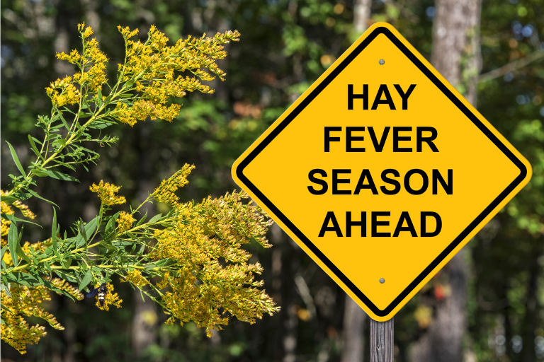
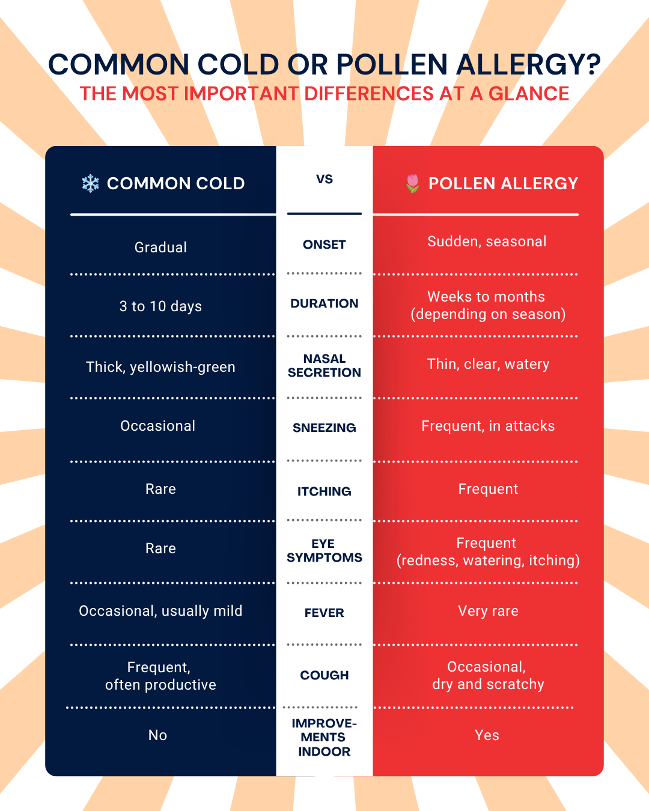

A meio de uma reunião, o seu nariz começa a fazer comichão e logo se segue o ataque de espirros. Os seus olhos lacrimejam e a concentração desaparece. Um comprimido alivia por momentos, mas muitas vezes deixa-o sonolento. Assim, a rinite alérgica pode parecer-lhe uma escolha entre dois males.

No entanto, existe um caminho melhor, que começa com perguntas simples: **Em que dias as suas queixas são mais intensas? Que pólen está a circular neste momento? Que remédio o ajuda realmente?** Quando observa e regista isto, começa a reconhecer padrões.

Neste artigo, fica a saber como interpretar corretamente os seus sintomas, como contrariá-los com remédios caseiros e tratamentos modernos e como esclarecer a situação com um diário de alergias.

## O que é a rinite alérgica e quem é afetado?

Por detrás da rinite alérgica está um equívoco do seu corpo. O seu sistema imunitário classifica os **pólens inofensivos das flores como uma ameaça** e, para se defender, liberta o mensageiro químico histamina. Esta histamina desencadeia as reações típicas nas mucosas. O nariz pinga, os olhos fazem comichão, surge a vontade de espirrar. É precisamente por isso que sente as queixas sobretudo onde o seu corpo tem contacto direto com o ar.

Com esta reação não está de modo algum sozinho, pois a rinite alérgica é a alergia mais comum de todas. Cerca de 15 por cento dos adultos na Europa sofrem dela. Uma alergia ao pólen pode, em princípio, surgir em qualquer idade, mas manifesta-se frequentemente pela primeira vez ainda na infância ou na adolescência. Se é ou não afetado depende, na maioria dos casos, de uma combinação de predisposição hereditária e fatores ambientais.

Quando exatamente surgem as suas queixas é-lhe revelado pela planta à qual reage. É que os sintomas seguem o período de floração. Se reage a vários tipos de pólen, a sua época pode prolongar-se por muitos meses.



## Compreender e acompanhar a concentração de pólen no ar

A carga de pólen não é um fluxo constante, mas oscila fortemente. Ao longo da época, diferentes plantas desencadeiam as suas queixas e, mesmo no decorrer do dia, há picos claros e fases mais calmas. Nas cidades, a concentração de pólen é normalmente mais elevada ao final do dia, enquanto no campo é particularmente intensa de manhã. Quem sabe isto pode programar o desporto, os passeios ou o arejamento de forma direcionada para os períodos com menos pólen.

### Que pólens desencadeiam a rinite alérgica?

Consoante a quais destas plantas reage, a sua época pessoal de rinite alérgica desloca-se. Estes quatro grandes grupos são responsáveis pela maioria das queixas:

- As **plantas de floração precoce**, como a aveleira, o amieiro e a bétula, começam muitas vezes já em fevereiro ou março.
- As **gramíneas** afetam muitos alérgicos de maio até pleno verão.
- Os **pólens de cereais**, sobretudo o centeio, circulam no início do verão.
- As **ervas**, como a artemísia e a ambrósia, surgem até setembro.

## Os sintomas clássicos da alergia ao pólen: constipação ou alergia?

Os sintomas da rinite alérgica surgem na maioria das vezes de forma súbita e concentram-se no nariz, nos olhos e nas vias respiratórias. Uma vontade de espirrar em ataques é um dos sintomas mais marcantes da alergia ao pólen, muitas vezes acompanhada de um nariz a pingar com secreção clara e aquosa. Ao mesmo tempo, as mucosas incham, dificultando a respiração pelo nariz. Os olhos também reagem tipicamente. Fazem comichão, lacrimejam e ficam vermelhos. Alguns afetados sentem ainda um arranhão na garganta ou sofrem de cansaço e dificuldades de concentração, porque o corpo funciona constantemente a todo o vapor.

São precisamente estes sintomas da rinite alérgica que levam frequentemente à confusão com uma constipação. A regra prática mais importante: **uma constipação surge gradualmente, desaparece ao fim de uma semana e vem muitas vezes acompanhada de febre e de secreção espessa e amarelada. Os sintomas da rinite alérgica, pelo contrário, surgem de repente, prolongam-se por semanas e melhoram visivelmente em espaços fechados.** O gráfico seguinte mostra as principais diferenças num relance.


Por vezes, uma alergia ao pólen evolui e desencadeia uma chamada alergia cruzada. O seu sistema imunitário confunde então determinados alimentos com os pólens, porque as proteínas se assemelham entre si. Por isso, quem reage ao pólen de bétula deixa, por vezes, de tolerar maçã crua ou avelã. Um [diário alimentar]() pode ajudar a reconhecer estas relações e a descobrir que alimentos provocam, de facto, queixas.


### Quando a alergia atinge as vias respiratórias

Se uma alergia ao pólen ficar anos por tratar, pode propagar-se às vias respiratórias inferiores. Os médicos falam então de mudança de andar. A partir da rinite alérgica no andar superior (nariz, olhos) desenvolve-se uma asma alérgica no andar inferior (brônquios).

Os primeiros sinais são **tosse seca persistente, uma sensação de aperto no peito, ruídos respiratórios sibilantes ou falta de ar durante o esforço**. Os estudos mostram que cerca de um em cada três doentes com rinite alérgica desenvolve, com o tempo, uma asma alérgica. Se notar tais sintomas em si, não deve esperar, mas procurar prontamente um alergologista. Quanto mais cedo começar o tratamento, melhor se consegue evitar a mudança de andar.

## Remédios caseiros eficazes contra a rinite alérgica para o dia a dia

Antes de recorrer ao comprimido, vale a pena dar uma olhadela à cozinha. Muitos remédios caseiros contra a alergia ao pólen têm efeitos anti-inflamatórios, descongestionantes ou calmantes sobre as mucosas e podem ser facilmente integrados na rotina de trabalho.

- **Curcuma:** a especiaria contém curcumina e tem efeito anti-inflamatório.
- **Gengibre:** um chá acabado de fazer atenua as reações inflamatórias e reforça o sistema imunitário.
- **Óleo de cominho-preto:** uma a duas colheres de chá por dia fornecem ácidos gordos que podem atenuar as reações alérgicas.
- **Malagueta e rábano-rusticano:** contêm substâncias picantes que têm um efeito descongestionante sobre a mucosa nasal e libertam rapidamente as vias respiratórias.
- **Coentros:** considerados um anti-histamínico natural e podem ser misturados frescos em saladas ou sopas.
- **Vinagre de maçã:** uma colher de sopa num copo de água morna de manhã pode regular a produção de muco.
- **Mel regional:** contém pequenas quantidades de pólens locais. Alguns afetados referem que uma porção diária reduz a longo prazo a sensibilidade.

Também por fora pode aliviar os sintomas. Uma lavagem nasal com água salgada elimina os pólens diretamente das mucosas e alivia visivelmente o seu nariz. O ideal é a aplicação à noite, depois do trabalho, para se libertar da carga acumulada ao longo do dia. Em caso de nariz entupido, ajuda ainda uma inalação de vapor, de preferência com camomila ou sal. O vapor quente humedece as suas vias respiratórias e dissolve a secreção presa.

Por mais promissora que pareça a lista, o efeito dos remédios caseiros é muito individual. O que faz maravilhas à colega pode não o ajudar em nada a si. É precisamente aqui que compensa registar, durante algumas semanas, que remédios experimentou e como evoluíram as suas queixas depois disso. Com o tempo, vê preto no branco que combinação de remédios caseiros contra a rinite alérgica realmente funciona em si e quais pode poupar.

## Diagnóstico e tratamento médico da rinite alérgica

Os remédios caseiros são um bom começo, mas, em caso de queixas mais intensas, não há como evitar um esclarecimento médico. O primeiro ponto de contacto é o alergologista, que, com testes específicos, descobre ao que reage exatamente.

### Diagnóstico com o teste cutâneo (prick-test)

O teste de rinite alérgica mais comum é o prick-test. Nele, são aplicadas pequenas gotas de diferentes soluções de alergénios sobre a pele do antebraço, que é depois ligeiramente picada. Se o local reagir, ao fim de cerca de 15 a 20 minutos, com vermelhidão ou pápulas, o alergénio é considerado um provável desencadeador.

Em complemento, pode ser realizada uma análise ao sangue para deteção de anticorpos específicos, sobretudo quando o prick-test não fornece resultados claros. Só com este diagnóstico é possível tratar de forma realmente direcionada a sua alergia ao pólen e os sintomas, porque fica claro se reage à bétula, às gramíneas, à artemísia ou a vários pólens.

### Medicamentos para o tratamento sintomático

O tratamento medicamentoso da rinite alérgica atua sobre os sintomas e alivia a sua carga aguda. Três grupos de princípios ativos desempenham o papel principal.

- Os **anti-histamínicos** bloqueiam o efeito da histamina e aliviam assim a vontade de espirrar, a comichão e o corrimento nasal. Tenha atenção aos preparados da nova geração, pois estes provocam muito menos sonolência do que os princípios ativos mais antigos e são também adequados para o dia a dia de trabalho.
- O **cortisona**, sob a forma de spray nasal ou comprimido, tem um forte efeito anti-inflamatório e é o medicamento de eleição em caso de queixas acentuadas. Aplicada localmente, os efeitos secundários são considerados reduzidos.
- Os **cromones** estabilizam os mastócitos e impedem que a histamina seja sequer libertada. Atuam de forma preventiva e devem ser aplicados ainda antes do início da época do pólen.

### A imunoterapia específica como solução de longo prazo

Enquanto os medicamentos apenas aliviam os sintomas, a imunoterapia específica (também chamada hipossensibilização) atua sobre a causa. Ao longo de um período de cerca de três anos, recebe o alergénio em doses crescentes, sob a forma de injeção ou comprimido. Assim, o seu sistema imunitário habitua-se gradualmente a ele e reage, com o tempo, de forma muito mais ténue.

A terapia é o único tratamento da rinite alérgica que atua a longo prazo e pode reduzir o risco de uma mudança de andar. Se é ou não adequada para si, esclarece-o melhor diretamente com o seu alergologista, pois a decisão depende dos seus alergénios, do grau de gravidade e da sua idade.

## Como manter-se produtivo: conselhos de comportamento em caso de alergia ao pólen

A estratégia mais eficaz contra a rinite alérgica continua a ser deixar chegar até si o menos pólen possível. Com alguns ajustes específicos no dia a dia, reduz visivelmente a sua alergia ao pólen, sem que a sua produtividade sofra. Quais destas medidas fazem a maior diferença em si depende da sua rotina e dos seus desencadeadores. Quem experimenta os conselhos e regista, durante algumas semanas, a própria situação de sintomas, descobre rapidamente que ajustes realmente compensam.

### Em casa

- **Tomar banho e lavar o cabelo à noite:** durante o dia, os pólens acumulam-se no cabelo e na pele. Quem os enxagua antes de dormir descansa de forma bem mais reparadora.
- **Despir a roupa fora do quarto:** caso contrário, os pólens ficam presos no tecido e afetam-no durante toda a noite.
- **Arejar de forma intensa no momento certo:** na cidade, areje de preferência entre as 6 e as 8 horas da manhã; no campo, antes entre as 19 e as 24 horas. Fora destes horários, mantenha as janelas fechadas.
- **Redes de proteção contra pólen nas janelas:** retêm a maior parte dos pólens no exterior e são, sobretudo no quarto, um investimento que compensa.

### No escritório

- **Purificador de ar com filtro HEPA:** filtra os pólens do ar do ambiente e proporciona visivelmente menos queixas durante longos dias de trabalho.
- **Manter fechadas as janelas para a rua com muito trânsito:** mesmo que o ar fresco seja tentador, a concentração de pólen é aqui muitas vezes especialmente elevada.
- **Spray nasal de água salgada à mão:** uma breve aplicação à secretária liberta o nariz sem provocar sonolência.

### Em deslocação

- **Máscara FFP2 ao deslocar-se para o trabalho ou ao cortar a relva:** o que se estabeleceu nos últimos anos protege também de forma fiável contra os pólens.
- **Manter as janelas do carro fechadas:** sempre que possível, mande instalar um filtro de pólen no sistema de ventilação.
- **Programar o desporto para os períodos com menos pólen:** depois de um aguaceiro, o ar está particularmente limpo. Ao meio-dia e com vento seco, deve evitar o desporto ao ar livre.
- **Ter em conta a época local de pólen nas viagens:** informe-se, ao [planear as férias](), sobre a carga de pólen no local de destino.

## Porque é que um diário de alergias é o primeiro passo

Um calendário de pólen mostra-lhe o que anda lá fora. Mas não diz nada sobre a intensidade exata com que reage nesse dia. Duas pessoas com a mesma alergia às gramíneas podem ter, com uma concentração de pólen idêntica, sintomas de rinite alérgica completamente diferentes. A sensibilidade pessoal, o sono, o stress, a toma de medicamentos e até a humidade do ar entram em jogo.

É precisamente por isso que vale a pena registar, além da concentração de pólen, também os seus próprios sintomas. Quem anota durante algumas semanas quando surgiram que queixas e que pólens dominavam nesse momento reconhece o seu padrão pessoal. De repente, torna-se visível que os olhos fazem comichão sobretudo nos dias ventosos de bétula ou que os pólens das gramíneas roubam sobretudo o sono. Um simples diário de alergias transforma queixas difusas em desencadeadores concretos, com os quais o leitor e o seu médico podem trabalhar.

Para que não tenha de começar do zero, disponibilizamos-lhe um diário de alergias como modelo gratuito, que traz tudo o que precisa para uma análise rigorosa. Está imediatamente pronto a usar e adapta-se à sua rotina, seja à secretária ou em deslocação no smartphone.



Através de um formulário simples, regista em poucos segundos a data, os sintomas, a intensidade das queixas, os medicamentos tomados e as condições meteorológicas. Uma visão geral visual mostra-lhe **que pólens estão ativos em que momento da época** e **quando as suas queixas foram especialmente intensas**.

Analise em que dias, com que tempo e com que concentração de pólen os seus sintomas foram mais intensos. Assim, reconhece **que pólens o afetam de facto e que medidas realmente ajudam**. No alergologista, pode apresentar diretamente os seus dados, em vez de ter de confiar na memória. Isso poupa-lhe tempo e torna o seu diagnóstico mais preciso.

## FAQ: perguntas frequentes sobre a rinite alérgica e a concentração de pólen


No escritório, são úteis sobretudo os remédios discretos e rápidos. Um spray nasal de água salgada liberta o seu nariz em segundos, sem o deixar sonolento. O chá de gengibre tem efeito anti-inflamatório e pode beber-se a par do trabalho. Um purificador de ar com filtro HEPA na sua secretária reduz visivelmente a carga de pólen no ambiente. Se quiser, complemente com curcuma ou óleo de cominho-preto na sua alimentação, para atenuar a longo prazo a tendência inflamatória.




Assim que os remédios caseiros e os conselhos de comportamento deixam de ser suficientes, faz sentido um tratamento medicamentoso da rinite alérgica. O mais tardar quando o seu sono, a sua concentração ou a sua respiração ficam afetados, não deve esperar mais. Vá atempadamente ao alergologista, pois uma alergia ao pólen não tratada aumenta o seu risco de asma alérgica.




Os sintomas da alergia ao pólen surgem de repente, ocorrem de forma sazonal e manifestam-se com olhos a fazer comichão e a lacrimejar, espirros em ataques e secreção nasal clara. Febre praticamente não há. Uma constipação, pelo contrário, surge gradualmente, desaparece ao fim de uma semana e manifesta-se com secreção espessa e amarelada, dores de garganta e, ocasionalmente, febre. Se respira muito melhor em espaços fechados, tem, com elevada probabilidade, rinite alérgica.




O ideal é fazer um teste de rinite alérgica fora da época do pólen, ou seja, no outono ou no inverno. Nessa altura, os seus sintomas já abrandaram e o seu sistema imunitário não está agudamente irritado, o que melhora a fiabilidade do teste. Além disso, tem tempo suficiente para iniciar de forma direcionada uma terapia antes da próxima época.




Os pólens que se fixam durante o dia no seu cabelo e na sua roupa continuam a afetá-lo durante a noite e provocam um sono agitado, nariz entupido e ataques de espirros matinais. Tome banho à noite e lave o cabelo, para remover a maior parte. Não dispa a roupa do dia no quarto. As redes de proteção contra pólen nas janelas retêm ainda mais pólens no exterior e proporcionam um sono bem mais reparador.


