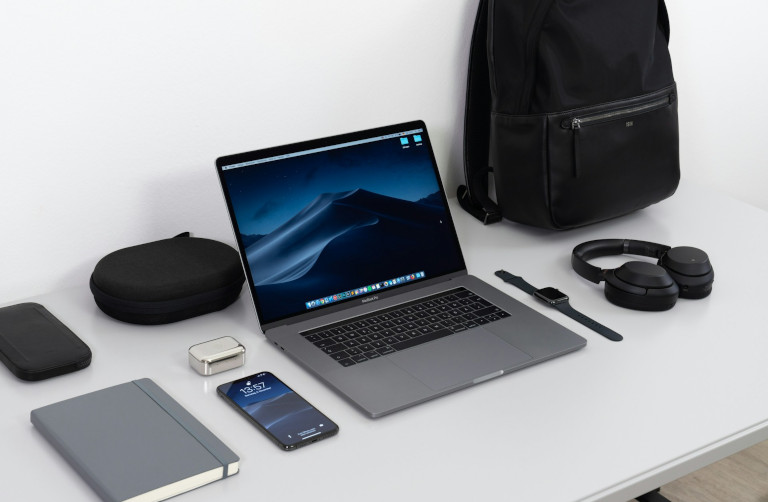
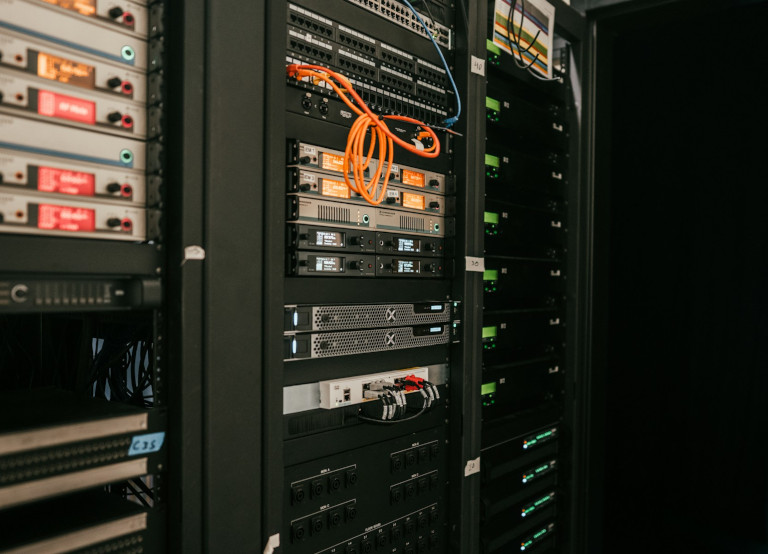

## Qu'est-ce que l'infrastructure informatique ?

L'infrastructure informatique désigne l'**ensemble de tous les composants techniques** dont votre entreprise a besoin pour exploiter, gérer et utiliser ses systèmes informatiques. Cela comprend les composants matériels, logiciels et réseau.

### Points clés à retenir

*   Les exigences les plus importantes envers votre infrastructure informatique sont la **disponibilité, l'évolutivité et la sécurité de vos systèmes informatiques**.  
*   Le **modèle d'exploitation** (sur site, dans le cloud ou hybride) est déterminant pour le développement stratégique de l'infrastructure informatique.
*   En raison de la transformation numérique, l'infrastructure informatique doit également être adaptée à l'utilisation de l'**IA**, de l'**IoT** et du **travail mobile**.  
*   Gardez un œil sur le matériel, les logiciels, les services cloud et les technologies utilisés afin d'éviter le **shadow IT**.
*   Parmi les aspects essentiels de la **sécurité de l'infrastructure informatique** figurent notamment les mises à jour et correctifs réguliers, des mots de passe forts, le chiffrement, l'authentification multifacteur, les sauvegardes, une gestion des incidents qui fonctionne et une gouvernance informatique claire.
    
## Quels sont les composants de l'infrastructure informatique ?

L'infrastructure informatique constitue le socle de votre entreprise et se compose des éléments suivants.

### Matériel

Le matériel constitue l'épine dorsale physique de vos systèmes informatiques. Cela comprend :

*   **Ordinateurs et terminaux mobiles** : par ex. PC de bureau, ordinateur portable, smartphone, tablette
*   **Périphériques** : par ex. écran, imprimante, casque, téléphone, clavier, souris
*   **Serveurs et composants de stockage** : par ex. NAS, CPU, GPU, RAM, SSD, HDD, carte mère  
*   **Infrastructure physique** : par ex. locaux, armoires serveurs, systèmes de refroidissement, alimentation électrique

### Logiciels

Par logiciels, on entend les programmes qui s'exécutent sur le matériel afin de rendre possibles les [processus métier](). En voici quelques exemples :

*   **Systèmes d'exploitation** : par ex. Windows, Linux ou macOS
*   **Systèmes de gestion de bases de données** : par ex. MySQL, MongoDB ou Redis
*   **Applications** telles que les programmes bureautiques, les systèmes [ERP]() ou [CRM]()
*   **Navigateurs web** : par ex. Firefox, Chrome, Safari, Edge

### Réseaux

Les réseaux se composent de canaux de communication qui relient différents appareils entre eux et pilotent le transfert de données. Voici quelques aspects importants :

*   **Équipements réseau** (routeurs, commutateurs)
*   **Câblage et réseaux sans fil** (Wi-Fi, LAN, fibre optique)
*   **Sécurité réseau** (pare-feu, VPN, passerelles)

### Services cloud

Via Internet, vous pouvez utiliser des services cloud, c'est-à-dire une infrastructure, des plateformes ou des logiciels externes que des prestataires tiers mettent à disposition dans des centres de données :

*   **IaaS** : Infrastructure as a Service signifie que vous externalisez vos besoins en serveurs et accédez à des centres de données externes via le cloud.
*   **PaaS** : Platform as a Service offre la possibilité de recourir aux environnements de développement de fournisseurs cloud, dans lesquels vous pouvez créer, tester et déployer des applications.
*   **SaaS** : Grâce au Software as a Service, vous pouvez utiliser des applications dans un cloud afin de rendre les installations locales superflues.

## Quels sont les modèles d'exploitation dans la gestion de l'infrastructure informatique ?

On distingue en principe trois modes de fourniture de l'infrastructure informatique en entreprise : l'infrastructure traditionnelle (sur site), l'infrastructure cloud et l'infrastructure hybride.

### Infrastructure traditionnelle

Dans les années 2000 encore, il n'existait presque exclusivement que des infrastructures informatiques traditionnelles ; l'entreprise possédait elle-même l'ensemble de l'infrastructure informatique dont elle avait besoin. Cela signifie que vous stockez toutes les données sur vos propres serveurs, dans un immeuble de bureaux ou un centre de données sur site. Un grand avantage de ce modèle est la [souveraineté numérique](), c'est-à-dire l'indépendance vis-à-vis des grands fournisseurs cloud, le plus souvent américains. Cependant, acquérir, exploiter et entretenir ses propres serveurs est très contraignant et coûteux.

### Infrastructure cloud

L'infrastructure cloud ne vous appartient pas. Au lieu de cela, vous louez des ressources telles que de l'espace de stockage, de la puissance de calcul ou des logiciels auprès de fournisseurs cloud. C'est pourquoi le [cloud computing]() offre une bien plus grande évolutivité et flexibilité que les infrastructures informatiques traditionnelles. Toutefois, il manque le plus souvent une véritable maîtrise des données, car vous dépendez technologiquement de vos fournisseurs cloud.

### Infrastructure hybride

Aujourd'hui, rares sont les entreprises qui misent encore exclusivement sur des solutions sur site, et tout aussi rares celles qui poursuivent une stratégie « tout cloud ». Dans la plupart des cas, on aboutit donc à un mélange d'infrastructure informatique locale et de services cloud, ce que l'on appelle cloud hybride ou IT hybride.



## Exigences d'une infrastructure informatique moderne

L'infrastructure informatique doit traiter sans interruption les processus critiques pour l'activité, permettre l'évolutivité et être armée contre les menaces de sécurité. À cela s'ajoutent de nouvelles exigences liées à la transformation numérique et à des changements de rupture tels que l'IA et le travail à distance. Enfin, la durabilité et l'efficacité énergétique gagnent elles aussi en importance dans le choix des solutions d'infrastructure informatique.



L'infrastructure informatique la plus haut de gamme ne sert pas à grand-chose si elle n'est pas disponible en raison de temps d'arrêt. C'est pourquoi la gestion de l'infrastructure informatique doit prendre des mesures appropriées pour réduire au minimum les interruptions et les temps d'arrêt et garantir l'accessibilité des systèmes informatiques. La redondance des systèmes critiques pour l'activité, les sauvegardes et les plans d'urgence (reprise après sinistre), par exemple, y contribuent. Pour des processus fluides, la latence/le temps de réponse des serveurs doit également être aussi faible que possible et la bande passante réseau suffisamment élevée.





Au-delà des processus métier courants, vos ressources informatiques doivent être suffisantes pour absorber les charges fluctuantes et les volumes de données temporairement accrus. Outre ces pics de charge, une croissance de l'entreprise inopinément rapide, l'évolution des effectifs et des développements futurs tels que les progrès technologiques, les nouvelles lois ou les crises, par nature difficilement prévisibles, peuvent mettre à l'épreuve l'évolutivité de votre infrastructure informatique.





La sécurité de l'infrastructure informatique constitue la base de la résilience numérique de votre entreprise. La gestion de l'infrastructure informatique doit donc veiller à ce que tous les composants de l'infrastructure informatique soient stables et protégés contre les menaces. Il peut s'agir de pannes système inattendues, de cyberattaques ou de fuites de données. Les mises à jour et correctifs de sécurité réguliers, des mots de passe forts, les techniques de chiffrement et d'authentification ainsi que des pare-feu robustes et des logiciels antivirus ont un effet préventif, tandis qu'une gestion des incidents qui fonctionne aide à réagir rapidement aux événements en cas d'urgence. Une gouvernance informatique claire, des formations à la sécurité pour les collaborateurs et une gestion réfléchie des rôles et des droits renforcent également la sécurité informatique.





Dans la gestion de l'infrastructure informatique, la question n'est souvent pas de savoir quelles solutions d'infrastructure informatique sont théoriquement souhaitables, mais ce qui est réalisable sur les plans financier et organisationnel. L'objectif est d'obtenir un maximum de disponibilité, d'évolutivité et de sécurité des composants de l'infrastructure informatique avec le [budget]() disponible. Là encore, il s'agit de peser combien d'argent vous souhaitez consacrer à l'acquisition et à l'exploitation de votre propre infrastructure informatique et ce que vous pouvez externaliser dans le cloud. En ce qui concerne les coûts logiciels, les licences d'applications cloud constituent désormais, en de nombreux endroits, le poste le plus important.





En raison de la numérisation croissante de l'industrie, la gestion de l'infrastructure informatique s'occupe également de plus en plus de l'IoT. L'Internet des objets désigne la mise en réseau d'objets physiques : des appareils électroniques intelligents équipés de capteurs et de microcontrôleurs collectent des données de leur environnement, les échangent via un réseau et peuvent exécuter automatiquement des actions. Au quotidien, c'est surtout un sujet à travers les montres connectées et la maison intelligente ; dans l'environnement de production, l'Internet industriel des objets relie entre eux des composants spécifiques de l'infrastructure informatique tels que des robots, des machines et des appareils.





Aujourd'hui, presque aucune entreprise ne peut faire l'impasse sur le sujet de l'[IA](). Son développement est fulgurant et met sans cesse à l'épreuve l'infrastructure informatique de l'entreprise. Si vous souhaitez utiliser vos propres serveurs d'IA dans votre entreprise, cela implique des exigences considérables pour les composants de l'infrastructure informatique. Les modèles d'IA nécessitent une puissance de calcul extrêmement élevée pour l'entraînement, qui ne peut actuellement être atteinte qu'avec des processeurs graphiques (GPU). À cela s'ajoutent des infrastructures réseau spéciales à haut débit pour la transmission de données et des solutions de stockage haute performance capables de gérer des volumes de données gigantesques. De plus, le matériel d'IA nécessite beaucoup d'électricité et de refroidissement en raison de la chaleur dégagée. Pour ces raisons, de nombreuses entreprises renoncent à leur propre infrastructure d'IA et utilisent à la place des modèles d'IA dans le cloud, avec les risques correspondants pour la sécurité des données.



## Le télétravail n'était qu'un début : pourquoi le travail mobile exige une infrastructure informatique solide

Ces dernières années, le télétravail et le travail à distance se sont de plus en plus imposés dans le monde du travail. À l'origine de cette évolution se trouve le fait que les activités de bureau numérisées peuvent tout aussi bien être effectuées depuis le domicile ou en déplacement. Une présence quotidienne au bureau n'est plus nécessaire. Du côté des collaborateurs, le travail à distance promet un meilleur équilibre entre vie professionnelle et vie privée, moins de temps de trajet et plus de liberté ; du côté des employeurs, des économies de surfaces de bureaux, de places de parking et d'indemnités de transport, ainsi que l'élargissement du vivier de talents au-delà des frontières régionales.

Cependant, le travail indépendant du lieu entraîne des conséquences considérables pour l'infrastructure informatique de l'entreprise. Si vous souhaitez permettre à vos collaborateurs de travailler à distance, ceux-ci ont besoin de terminaux mobiles tels que des ordinateurs portables et des téléphones professionnels, mais aussi d'équipements de poste de travail comme des écrans, claviers et souris supplémentaires pour le télétravail. Des connexions Internet stables sont nécessaires pour un accès aux données de l'entreprise indépendant du lieu, une collaboration en temps réel et une communication fluide. En bref : des solutions d'infrastructure informatique performantes, flexibles et sécurisées constituent l'épine dorsale du travail mobile et du télétravail. Voici les aspects importants pour votre équipe informatique à distance :

*   **Mobile Device Management (MDM)** : Configurez, sécurisez et gérez tous les terminaux mobiles – où qu'ils se trouvent dans le monde – de manière centralisée au sein de votre équipe informatique à distance. Pour que l'infrastructure informatique mobile ne devienne pas un risque de sécurité en cas de perte ou de vol, le chiffrement des appareils est indispensable.
    
*   **Connexions réseau sécurisées** : Utilisez un VPN (réseau privé virtuel), des accès Wi-Fi chiffrés et des solutions de bureau à distance lorsque les collaborateurs accèdent au réseau de l'entreprise en situation de mobilité. Vous vous assurez ainsi que les données de l'entreprise ne tombent pas entre de mauvaises mains.
    
*   **Identity & Access Management (IAM)** : La gestion des identités et des accès vérifie l'identité de l'utilisateur et détermine à quels systèmes et données la personne autorisée peut accéder. Des procédés très répandus à cet effet sont l'[authentification unique]() et l'authentification multifacteur.
    
*   **Solutions cloud** : Vos collaborateurs peuvent accéder aux données et aux applications dans le cloud depuis n'importe quel endroit du monde. Ils n'ont besoin que d'une connexion Internet et d'un navigateur, ce qui rend le travail indépendant du lieu et de l'appareil extrêmement simple. Au lieu de stocker des données et des documents répartis sur des ordinateurs locaux, il existe une version centrale accessible à tous à tout moment.
    

## 4 conseils pour le développement stratégique de l'infrastructure informatique en entreprise

### Déterminer le statu quo

Avant de concevoir une nouvelle infrastructure informatique, vous devriez dresser un [état des lieux]() : quels matériels, logiciels et technologies sont déjà utilisés ? Quels services cloud sont employés ? Existe-t-il un [shadow IT]() ou des silos de données dans les services métiers ? De quel budget dispose le service informatique et quelles ressources humaines sont disponibles ?

### Définir les exigences et les objectifs

L'étape suivante consiste à déterminer les exigences envers l'infrastructure informatique. Pour cela, vous devriez toujours garder à l'esprit les objectifs stratégiques que vous poursuivez avec le développement de la nouvelle infrastructure informatique. Souhaitez-vous permettre le travail mobile, exploiter vos propres serveurs d'IA ou utiliser davantage de ressources cloud ? Voulez-vous réduire les coûts tout en garantissant une disponibilité, une évolutivité et une sécurité élevées ? Par exemple, il est peu judicieux de vouloir mettre en place et exploiter dans l'entreprise une infrastructure informatique coûteuse et hautement performante si vous ne disposez pas des [spécialistes informatiques]() et des moyens financiers nécessaires.

### Planifier avec anticipation

La mise en place d'une infrastructure informatique exige une planification anticipée importante. Selon le modèle d'exploitation et l'ampleur du projet, les délais de préparation varient fortement. Si vous souhaitez par exemple construire votre propre centre de données à partir de zéro, vous devez compter plusieurs années de construction avant la mise en service. L'acquisition de certains composants de l'infrastructure informatique peut elle aussi prendre plusieurs mois. En revanche, réserver des solutions d'infrastructure informatique auprès de fournisseurs cloud est nettement plus rapide et plus simple.

### Tenir compte des lois, de la protection des données et de la conformité

Selon le secteur et la localisation de l'entreprise, votre infrastructure informatique peut être soumise à certaines réglementations. Lors de la mise en place de votre infrastructure informatique, tenez donc compte des obligations légales en matière de protection des données et de conformité. Par exemple, les entreprises d'infrastructures critiques en Allemagne sont tenues de protéger leur infrastructure informatique de manière particulière contre les pannes et autres menaces. Elles doivent en outre garantir le plus haut niveau de sécurité des données et de conformité au RGPD, ce qui n'est guère possible avec des solutions d'infrastructure informatique d'acteurs non européens (par ex. les fournisseurs cloud américains).

## Liste de contrôle de l'infrastructure informatique pour le travail mobile

*   **Infrastructure cloud, traditionnelle ou hybride** : Décidez d'abord d'un modèle d'exploitation, car cela a des conséquences considérables pour la [gestion des services informatiques]().
*   **Une gestion réfléchie des appareils mobiles** : Avez-vous une vue d'ensemble de tous les terminaux mobiles, sont-ils suffisamment sécurisés et techniquement à jour ?
*   **Pas de frein VPN** : Vos collaborateurs peuvent-ils accéder à vos serveurs d'entreprise ou cloud indépendamment du lieu, via des connexions réseau rapides, stables et sécurisées ?
*   **Éviter les silos et la perte de données** : Avez-vous incité vos collaborateurs à stocker toutes les données et tous les documents de manière centralisée et synchronisée en temps réel sur votre serveur – plutôt qu'en d'innombrables versions locales sur différents appareils ?
*   **Gestion granulaire des rôles et des droits** : Chaque collaborateur peut-il accéder aux systèmes dont il a besoin pour ses tâches, mais ne voir, modifier ou supprimer que les données correspondant à son niveau d'autorisation ?
    

## SeaTable comme centre de pilotage d'une gestion moderne de l'infrastructure informatique

En tant que [plateforme no-code dotée d'IA](), SeaTable peut accompagner votre équipe informatique à distance dans une multitude de tâches. SeaTable convient par exemple pour :

*   [les processus automatisés et assistés par IA]()
*   [l'inventaire des appareils]()
*   [le suivi des bugs]() et les [tests de logiciels]()
*   [la gestion des incidents]() et le [ticketing]()
*   [les bases de données relationnelles]()
*   [le citizen development]()

SeaTable offre une base de données centrale avec une gestion granulaire des rôles et des autorisations ainsi que des fonctions de sécurité robustes telles que l'authentification unique et l'authentification à deux facteurs. Elle décloisonne les silos de données, peut être reliée aux systèmes informatiques existants via des intégrations et une API et permet un travail indépendant du lieu et une collaboration en temps réel. Décidez vous-même si vous souhaitez utiliser SeaTable Cloud ou installer SeaTable Server sur votre propre infrastructure :

*   [SeaTable Cloud]() convainc par son évolutivité et une configuration commode en quelques minutes. Elle est hébergée exclusivement sur des serveurs situés en Allemagne et répond ainsi aux exigences de protection des données les plus élevées.
*   Si vous préférez une maîtrise totale des données et un contrôle physique, vous pouvez également installer [SeaTable Server]() sur site. Vous êtes alors vous-même responsable des performances, de la disponibilité et de la sécurité nécessaires de l'infrastructure serveur.

Découvrez des modèles utiles qui vous faciliteront la prise en main de SeaTable :

{{< tabs
title1="IT Helpdesk"
text1="Gérez les tickets de support dans un système central doté d'une base de connaissances."
id1="79de1c79b29445c280ad"
submit1="Utiliser le modèle"

title2="Inventory List"
text2="Recensez les appareils et leur état ainsi que les licences logicielles et les mises à jour."
id2="11568480344f4a61ab49"
submit2="Utiliser le modèle"

title3="Bug Tracker"
text3="Testez systématiquement les versions de logiciels et corrigez les erreurs."
id3="51d678ca8b004e9b9b79"
submit3="Utiliser le modèle"

title4="Technology Roadmap"
text4="Planifiez et pilotez le développement stratégique de votre infrastructure informatique."
id4="1b086534c58049f481eb"
submit4="Utiliser le modèle" >}}

## Questions fréquentes sur l'infrastructure informatique



Les infrastructures informatiques traditionnelles acheminent l'ensemble du trafic de données via des serveurs sur site et atteignent leurs limites de performance en cas d'accès décentralisé. Or, le matériel situé dans le bâtiment de l'entreprise est conçu pour un nombre constant de collaborateurs et d'appareils sur place et n'est pas évolutif de manière flexible. Pour pouvoir accéder au réseau de l'entreprise depuis n'importe où, des tunnels VPN sont en outre nécessaires. Si de nombreux collaborateurs travaillent désormais à distance, ce goulot d'étranglement entraîne des pertes de vitesse, des coupures de connexion et une surcharge des serveurs et des réseaux.





Pour que le travail mobile ne devienne pas un risque pour la sécurité informatique, vous devriez tenir compte de quelques bonnes pratiques : incitez vos collaborateurs à stocker toutes les données et tous les documents de manière centralisée sur votre serveur ou dans le cloud – car les données enregistrées localement sont perdues si un appareil est volé ou détruit. Si vous avez préalablement chiffré l'appareil et le disque dur, les personnes qui le trouvent ou le volent sans autorisation ne pourront rien en faire. Veillez en outre à des connexions réseau sécurisées, par ex. via des tunnels VPN, afin que les données ne puissent pas être interceptées sur le trajet entre le terminal mobile et le serveur.





Pour un niveau élevé de protection des données, vous devriez stocker toutes les données au sein de l'UE et renoncer aux fournisseurs non européens tels que les clouds américains. Vous n'atteignez la pleine souveraineté des données que si l'ensemble de l'infrastructure informatique vous appartient en propre, par ex. avec vos propres centres de données et l'installation locale de chaque logiciel.





Une liste de contrôle de l'infrastructure informatique pour le travail mobile comprend notamment :

\- le choix d'un modèle d'exploitation (sur site, cloud ou hybride)  
\- des connexions réseau rapides, stables et sécurisées  
\- la gestion des identités, des accès, des rôles et des autorisations  
\- un stockage central des données avec synchronisation en temps réel


