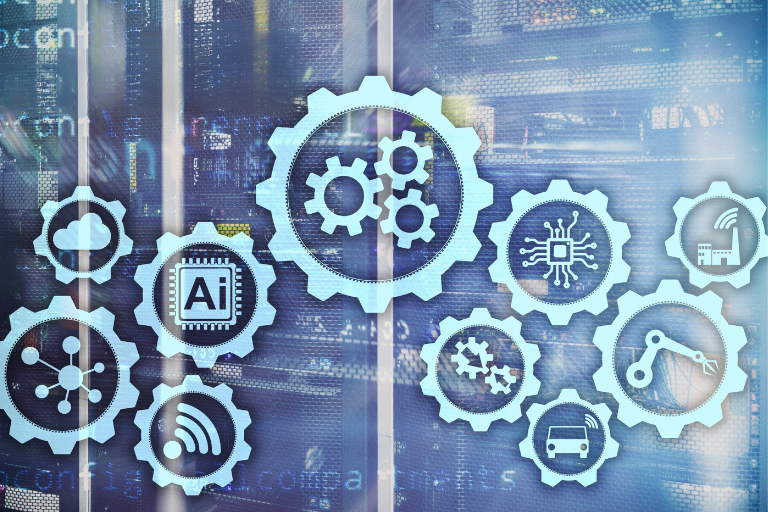

## Почему современному управлению операционной деятельностью требуется новая архитектура данных?

Slack или Teams, Jira или [Asana](), Excel и [Notion](): На первый взгляд набор инструментов большинства команд выглядит современно. Однако зачастую, как только вы заглядываете за гладкий интерфейс, открывается совсем иная картина: изолированные хранилища данных, ручная сверка данных, экспорт в формат CSV и копирование-вставка. Это происходит потому, что каждый инструмент показывает лишь отдельный фрагмент общей картины, но **ни один из них не даёт полного представления о ваших бизнес-процессах**. В результате ваша команда тратит больше времени на сверку данных, чем на оптимизацию рабочих процессов.

С другой стороны, различные исследования — в том числе проведенные McKinsey и KPMG — приходят к выводу, что ИИ обладает огромным потенциалом, особенно в области прогнозирования, обеспечения качества и управления услугами. И тем не менее многие проекты по внедрению ИИ в сфере операционного управления заканчиваются неудачей — и, как правило, не из-за выбранных инструментов ИИ, а из-за отсутствия общей базы данных. К этому добавляется растущее давление в направлении [суверенитета данных](): Любой, кто желает подключить конфиденциальные операционные данные к внешним платформам ИИ, **нуждается в четком суверенитете данных и прозрачном управлении** вместо неконтролируемого [теневого ИТ]().  

### Ключевые факты:

*   Слишком большое количество изолированных инструментов препятствует современной автоматизации и эффективному использованию ИИ.
 
*   Централизованная, структурированная база данных устраняет фрагментированные «силосы» данных и обеспечивает надёжный анализ в режиме реального времени.
 
*   Управление рабочими процессами на основе ИИ и автоматизированные процессы устраняют узкие места.

 

## Почему разрастание числа инструментов сдерживает внедрение ИИ

Управление операционной деятельностью, развивавшееся с течением времени, обычно организовано по отделов и вокруг отдельных систем. Отделы логистики, производства, обслуживания клиентов и контроля качества используют свои собственные инструменты, ведут собственные таблицы в Excel и разрабатывают индивидуальные решения, когда централизованные системы оказываются слишком жесткими. На практике именно это и приводит к сложности процессов и появлению «информационных островков», которые замедляют реализацию проектов в области ИИ.

Это связано с тем, что **системы искусственного интеллекта требуют согласованных данных с богатым контекстом** для получения надёжных результатов. Без общей базы данных ИИ в логистике может планировать уровни запасов, но не может оценить, как это повлияет на вашу цепочку поставок или соглашения об уровне обслуживания. ИИ в службе поддержки клиентов может генерировать ответы, но не знает, существуют ли в данный момент операционные ограничения на производстве. А ваш ИИ в сфере управления качеством может выявлять аномалии, но не способен оценить всю цепочку процессов.

То, с чем люди справляются, затрачивая значительные усилия на ручную работу, представляет собой структурную проблему для систем ИИ. До тех пор, пока прогнозирование, управление запасами или оперативное планирование будут основываться на разрозненных — и, возможно, даже противоречивых — данных, ни одна система ИИ не сможет обеспечить эффективных результатов, какими бы впечатляющими они ни казались в ходе тестирования. Результатом становятся новые узкие места, которые выявляются слишком поздно, а также цели бережливого управления, которых ваша команда просто не может достичь в повседневной работе. Одним словом: **Без контекста ИИ остаётся слепым. И вина за это лежит не на самом инструменте — причина кроется в структуре вашего операционного управления.**

## Контрольный список готовности операционного управления к внедрению ИИ

Поэтому, прежде чем рассматривать новую технологию ИИ, стоит сначала провести объективную оценку готовности ваших операций к внедрению ИИ. Рекомендации по применению ИИ в управлении процессами показывают, что успешные проекты почти всегда опираются на одни и те же основы:

*   **Централизованная модель данных**: храните все основные объекты — заказы, клиентов, оборудование, ресурсы, заявки, данные о качестве — в общей [реляционной базе данных](), а не в изолированных инструментах и файлах Excel.
    
*   **Чётко определённые принципы управления и суверенитет данных**: Чётко определите места хранения, круги ответственности, права доступа и правила именования.
 
*   **Измеримые процессы**: Моделируйте процессы таким образом, чтобы можно было непрерывно измерять сроки выполнения, уровень ошибок и загрузку производственных мощностей.
 
*   **Стандартизированные интерфейсы для инструментов ИИ**: Определите интерфейсы, через которые системы искусственного интеллекта в отдельных подразделениях всегда будут обращаться к одной и той же базе данных.
 
*   **Четкая структура интеграции ИИ в бизнес-процессы**: Расставьте приоритеты среди сценариев использования с учетом их влияния на бизнес и технической осуществимости.
    

### Центральная база данных no-code: операционная «нервная система» для вашего ИИ

Ключевым рычагом является централизованная, хорошо структурированная база данных, которая выступает в качестве «нервной системы» для управления вашими операциями и служит основой для оптимизации процессов: она обеспечивает полное и согласованное представление ваших данных. [Инструменты no-code](), такие как **SeaTable**, предлагают для этого два ключевых преимущества:

*   **Гибкость**: с помощью [решений no-code]() вы можете самостоятельно разрабатывать модель данных и итеративно адаптировать её, не задействуя при этом каждый раз ценные ИТ-ресурсы.
    
*   **Возможность интеграции**: благодаря API и интеграционным интерфейсам вы можете подключать системы искусственного интеллекта, инструменты автоматизации и существующие приложения, не создавая каждый раз новые решения. 

## Объединение стратегического, тактического и операционного управления процессами

Во многих компаниях стратегическое, тактическое и операционное планирование разделены как организационно, так и технически. Результат: цели, мощности и повседневные операции теряют связь друг с другом — и ИИ может оптимизировать лишь небольшую часть общей картины.

Современное управление операциями с использованием ИИ объединяет эти уровни в рамках единой модели данных:

*   Стратегическое планирование: долгосрочные производственные мощности, решения о размещении объектов, выбор систем, а также определение целевых показателей уровня обслуживания и качества.
 
*   Тактическое планирование: графики смен, распределение производственных мощностей, планирование рекламных кампаний, окна технического обслуживания и страховой запас.
    
*   Оперативное планирование: ежедневное составление графиков, упорядочивание заказов, распределение ресурсов, конкретные рабочие процессы.
 

Если вы целостно отобразите тактическое, стратегическое и оперативное [управление процессами]() в вашей центральной базе данных, системы искусственного интеллекта смогут оценивать прогнозы и предложения по оптимизации не только в ограниченном контексте отдельных областей, но и **по всей цепочке процессов**. Таким образом, рекомендации и решения ИИ на операционном уровне больше не будут приниматься изолированно, а будут учитывать контекст стратегических и тактических целей. 

## Конкретные примеры применения ИИ

После создания централизованной, унифицированной базы данных ИИ становится полезным инструментом для оптимизации ваших процессов. Но как именно ИИ может поддержать управление вашей операционной деятельностью в данном сценарии? Давайте подробнее рассмотрим возможности на примере нескольких ситуаций. В этих случаях ИИ получает доступ к централизованной, структурированной базе данных, не требующей программирования:

*   ИИ в логистике: прогнозы объемов отгрузок и сроков выполнения заказов автоматически учитываются при планировании запасов и бронировании слотов. Узкие места выявляются на раннем этапе и могут быть устранены заранее.
    
*   ИИ в управлении цепочкой поставок: модели прогнозирования спроса учитывают данные в режиме реального времени из отделов продаж, производства и складирования и предлагают конкретные корректировки стратегий управления запасами и закупок.
    
*   ИИ в обслуживании клиентов: запросы автоматически классифицируются, приоритизируются и назначаются соответствующим сотрудникам; предлагаемые ответы основываются на связанной информации из истории заказов, текущих заказов и известных проблем. Увеличение количества запросов определённого типа автоматически запускает эскалацию в системе обслуживания и генерирует уведомление ответственному операционному менеджеру. 
    
*   ИИ в управлении качеством: ИИ выявляет закономерности в отчетах о проверках, параметрах производственных процессов и данных о претензиях, а также формирует рабочие процессы для принятия мер до того, как проблемы с качеством накапливаются — например, путем приостановки отгрузки партий товара.

 

## Четырёхэтапное руководство по подготовке управления операционной деятельностью к внедрению ИИ

Мы неоднократно наблюдаем, что многие команды и компании стремятся сразу же добиться значительного прорыва, не выполнив должным образом необходимую подготовительную работу. Однако даже при [внедрении структурированных баз данных no-code]() или систем ИИ итеративный подход доказал свою эффективность и регулярно рекомендуется для того, чтобы внедрение ИИ в управление операционной деятельностью стало контролируемым и измеримым [процессом изменений]().

*   **Обеспечьте прозрачность**: задокументируйте, где в настоящее время хранятся конкретные данные, какие процессы опираются на какие источники данных и какие инструменты для них требуются. Выявите «теневые» ИТ-решения и дубликаты записей данных.
    
*   **Разработайте модель данных**: как только у вас сложится чёткое представление о ваших процессах и данных, начните с моделирования ключевых объектов управления операционной деятельностью в новой базе данных и постепенно переносите соответствующие данные из ваших «информационных силосов».
    
*   **Выберите начальные сценарии использования**: начните с нескольких управляемых сценариев использования, имеющих чёткие показатели эффективности, и интегрируйте необходимые системы искусственного интеллекта.
 
*   **Установите правила управления**: определите чёткие правила доступа, распределения обязанностей и ведения документации. Расширяйте сферу применения на дополнительные области только после того, как система управления и документация станут действительно надежными и будут строго соблюдаться.
 
## Управление ИИ в сфере управления операциями

Проекты в области искусственного интеллекта (ИИ) в сфере управления операциями — это не чисто технические начинания, а проекты, связанные с изменениями, сопряженные с реальными рисками несоблюдения нормативных требований и юридической ответственности. Поэтому любому лицу, ответственному за инфраструктуру ИИ, необходима не только архитектура технического управления, но и стратегическая.

В частности, это означает:  

*   **С самого начала планируйте обеспечение суверенитета данных**: при выборе платформы для данных определите, какие данные могут храниться в какой среде (облако, локальная инфраструктура, гибридная среда), и зафиксируйте это в документации как обязательное архитектурное решение, а не как последующую ИТ-задачу.
    
*   **Четкое распределение ответственности по категориям данных**: для каждой ключевой сущности (заказы, данные о клиентах, данные о качестве) следует определить ответственность со стороны бизнеса. Это гарантирует, что требования GDPR — такие как обязательства по предоставлению информации и удалению данных — могут быть реально реализованы в операционной деятельности.
    
*   **Обеспечьте отслеживаемость решений ИИ**: особенно в случае автоматизированных решений — таких как автоматическая блокировка запасов или эскалация сервисных запросов — функция аудиторского следа является не только передовой практикой, но и нормативным требованием.
    
*   **Информируйте о преимуществах четкого управления**: внутри компании управление часто воспринимается как препятствие. Вместо этого представьте его заинтересованным сторонам таким, каким оно является на самом деле: необходимым условием для обеспечения надежного и масштабируемого внедрения систем ИИ.
    

Центральная база данных no-code с детализированными правами доступа, отслеживаемыми журналами изменений и хостингом, соответствующим требованиям GDPR, составляет техническую основу для этого — однако как ответственное лицо вы должны принять стратегические решения по управлению ещё до интеграции первого инструмента ИИ.

## Современное управление рабочими процессами на базе ИИ с помощью SeaTable

[Платформа SeaTable для ИИ no-code]() демонстрирует, как такая централизованная архитектура данных может выглядеть на практике. В отличие от традиционных систем ERP или жестких решений на базе баз данных, SeaTable позволяет операционным командам **разрабатывать гибкую, настраиваемую и структурированную модель данных и масштабировать её без ограничений**.

Следующие функции особенно важны для построения системы управления операциями, готовой к внедрению ИИ:  

*   **Гибкая реляционная модель данных**: основные объекты, такие как заказы, ресурсы, заявки или данные о качестве, можно отобразить в рамках общей структуры и связать между собой с учётом контекста.
 
*   **Встроенная функциональность уведомлений и автоматизация на базе ИИ**: Уведомления на основе правил и [автоматизированные рабочие процессы на базе ИИ]() можно настраивать непосредственно из базы данных — например, когда уровень запасов опускается ниже порогового значения или определённый тип заявки запускает эскалацию. 
 
*   **Совместная работа в режиме реального времени и детализированные права доступа**: Несколько команд могут одновременно работать с одной и той же базой данных, при этом права доступа точно контролируются на уровне отдельных таблиц, столбцов или строк. Это особенно актуально в тех случаях, когда операционные данные используются различными отделами, но не предполагают полного совместного доступа.
    
*   **API и встроенные интеграции**: системы искусственного интеллекта, инструменты автоматизации (например, n8n или Make) и существующие операционные приложения могут быть напрямую интегрированы.
 
*   **Хостинг, соответствующий требованиям GDPR**: [SeaTable Cloud]() хранит данные исключительно на серверах, эксплуатируемых швейцарской компанией в Германии; [SeaTable Server]() также предлагает вариант локального развёртывания для обеспечения полного суверенитета над данными.



Подпишитесь на нашу **рассылку** и регулярно получайте советы и новости о разработке no-code, современном управлении данными и обработке данных с использованием ИИ в SeaTable — изложенные в практической и доступной форме.



## Часто задаваемые вопросы — ИИ в управлении операционной деятельностью

 
Практичный контрольный список должен включать как минимум следующее: централизованную модель данных, определённые стандарты качества данных, чётко распределённые роли в системе управления, приоритезированные сценарии использования и стандартизированные интерфейсы. Кроме того, вам следует проанализировать, как в систему интегрированы показатели «бережливого управления» и «Шесть Сигма», а также убедиться, что стратегическое, тактическое и оперативное планирование основываются на одних и тех же данных.

 
  
Команды, которые с самого начала рассматривают управление данными как неотъемлемую часть своей дорожной карты по внедрению ИИ, гораздо быстрее достигают надежных результатов и избегают дорогостоящих исправлений в дальнейшем. Без четко определенных обязанностей, прав доступа и правил качества данных невозможно исключить несоответствия — а эти несоответствия затем усиливаются системами ИИ.



Исследования в области успешного управления изменениями показывают, что принятие изменений и новых инструментов, как правило, затрудняется из-за недостаточной прозрачности и недостаточного вовлечения сотрудников. С самого начала сообщайте, какие задачи будут автоматизированы, как изменятся роли и в каких случаях ИИ облегчит рабочую нагрузку на сотрудников, а не заменит их.



При внедрении ИИ в управление операционной деятельностью вам следует сочетать традиционные показатели эффективности с конкретными показателями ИИ (например, точность прогнозирования или среднее время устранения неполадок). Кроме того, вам следует установить ключевые показатели эффективности (KPI) в области рисков и соблюдения нормативных требований (например, уровень ошибок и утечки данных), чтобы обеспечить учет аспектов качества в процессе оптимизации.



SeaTable позволяет объединять данные из разных подразделений в общую базу данных, не требующую программирования, контролировать доступ и права на редактирование на детальном уровне, а также создавать отчёты и информационные панели непосредственно из базы данных. Таким образом создаётся централизованный источник данных для управления вашими стратегическими и операционными процессами. При этом вы сохраняете контроль над тем, каким системам ИИ разрешён доступ к каким данным.



Традиционные структуры зачастую ориентированы на функции и системы, а не на данные и процессы, и поэтому не подходят в качестве основы для оптимизации процессов с помощью ИИ. Изолированные хранилища данных, ручной экспорт и несогласованность данных не позволяют системам ИИ надежно обучаться и принимать решения. Поэтому любой, кто хочет подготовить своё операционное управление к внедрению ИИ, должен сначала модернизировать основу, а не просто добавить ещё один инструмент поверх существующей системы.
