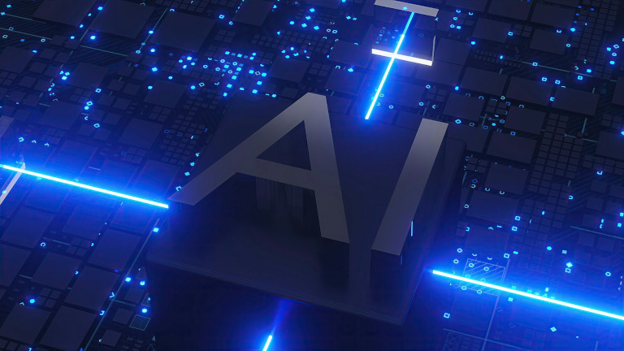
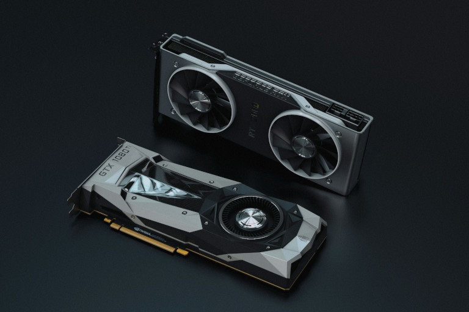
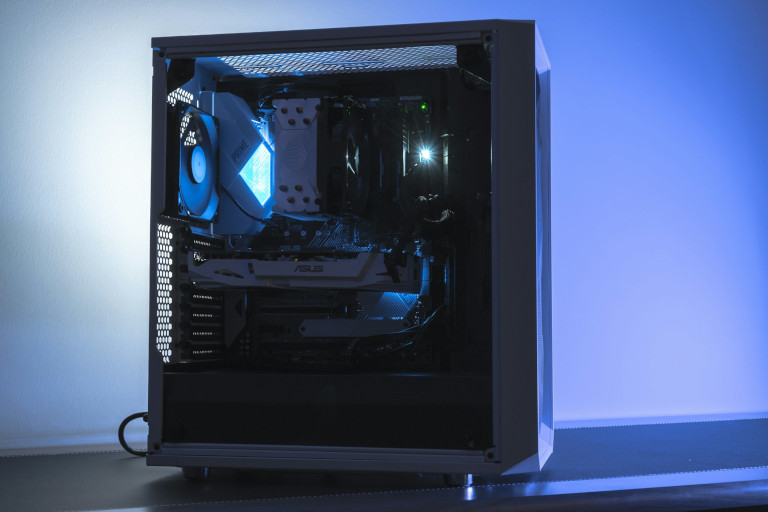
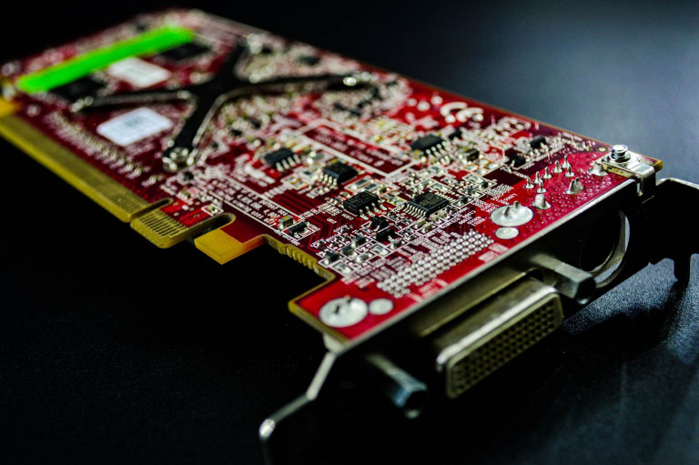
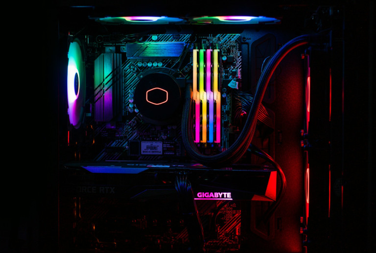
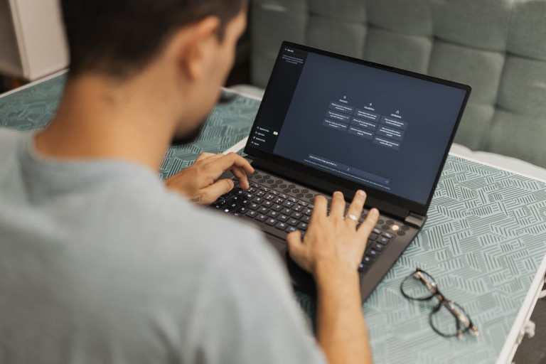
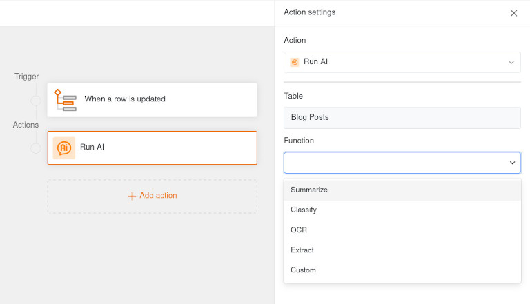

## Warum Sie Ihre eigene KI hosten sollten

Texte schreiben, E-Mails zusammenfassen, Bilder erstellen: [Generative KI]() ist längst im Arbeitsalltag angekommen. Immer mehr Unternehmen setzen künstliche Intelligenz produktiv ein, **automatisieren Prozesse und erschließen neue Effizienzpotenziale**. Dabei entwickeln sich KI-Tools zunehmend vom Experimentierkasten zur geschäftskritischen Technologie.

Deshalb wachsen vielerorts die Bedenken ebenso wie die Anforderungen im Hinblick auf **Datenschutz, Datenhoheit, Kostenkontrolle und IT-Sicherheit**. Wer sensible Firmendaten, interne Dokumente oder Quellcode an externe Cloud AI Services übermittelt, sollte sich darüber im Klaren sein, wo diese Daten landen, inwiefern sie geschützt sind oder beim Training der Modelle Verwendung finden.

Wenn Sie eine KI selbst hosten, verlagern Sie die Verarbeitung der Daten dagegen in Ihre eigene [Infrastruktur](). Ein lokales LLM (Large Language Model) kann beispielsweise auf einem KI Server im Rechenzentrum Ihres Unternehmens laufen. So schaffen Sie die technische Grundlage für [digitale Souveränität]().

## KI selbst hosten: Die wichtigsten Vorteile auf einen Blick

- **Hochgradiger Datenschutz**: Sensible Daten befinden sich innerhalb Ihrer eigenen Server-Infrastruktur und werden nicht an externe KI-Dienste übermittelt.
- **Digitale Souveränität**: Mit einem Open-Source-Modell können Sie eine eigene KI trainieren und unabhängig von großen KI-Anbietern agieren.
- **Volle Kostenkontrolle**: Bei lokaler KI fallen keine nutzungsabhängigen Token-Kosten an und Sie bleiben von Preissteigerungen externer Cloud KI verschont.
- **Mehr Flexibilität**: Sie entscheiden selbst, welches KI-Modell Sie einsetzen, mit welchen Daten Sie es trainieren und wann Sie neue Versionen installieren.
- **Nahtlose Integration**: Über API-Schnittstellen lässt sich die lokale KI mit Datenbanken, Anwendungen und Automatisierungen zu einem umfassenden System verbinden.

## Lokale künstliche Intelligenz vs. Cloud-KI

Die Entscheidung, ob Sie Cloud-KI nutzen oder KI selbst hosten, ist keine leichte. Beide Ansätze haben ihre Vor- und Nachteile. Die Präferenz für Self-Hosting oder Cloud AI hängt vor allem davon ab, wie hoch Sie bestimmte Kriterien gewichten. Bewerten Sie daher, wie hoch Ihre Anforderungen an **digitale Souveränität, Datenschutz, Compliance, Skalierbarkeit, Modellgröße und Gesamtkosten** tatsächlich sind.

- **Cloud AI Services** punkten häufig mit einer einfachen, nutzungsabhängigen Skalierung und einem **schnellen Setup ohne Hardware-Installation**. Das heißt, Sie müssen keine GPU-Infrastruktur beschaffen und warten, sondern nutzen die KI-Server des Anbieters. Für einzelne Aufgaben, Testphasen oder eine **stark schwankende, kaum vorhersehbare Nutzung** kann Cloud KI besonders attraktiv sein.

- Demgegenüber bietet **lokale künstliche Intelligenz** auf Ihrem eigenen KI-Server die **volle Kontrolle über die Datenverarbeitung**. Sie entscheiden selbst, welche Modelle Sie einsetzen, mit welchen Systemen sie integriert sind und welche Daten sie verarbeiten. Bei **konstant hoher KI-Nutzung** und hohem Wert der (vertraulichen) Daten wird Self-Hosting auch wirtschaftlich interessant.

| Kriterium                       | Lokale KI                       | Cloud-KI                        | 
| ------------------------------- | ------------------------------- | ------------------------------- | 
| **Hardware**                    | im eigenen Besitz               | angemietet nach Bedarf          | 
| **Datenkontrolle**              | sehr hoch                       | gering, abhängig vom Anbieter   | 
| **Skalierbarkeit**              | unflexibel, abhängig von der Hardware | sehr flexibel und einfach | 
| **Wartungsaufwand**             | hoch | gering | 
| **Kosten**                      | hohe Anschaffungs- und Betriebskosten | laufende Lizenzkosten, meist nutzungsabhängig | 
| **Offline-Betrieb**             | möglich | nicht möglich | 

## Hardware & Infrastruktur: Was braucht ein eigener KI Server?

Wenn Sie eine KI selber hosten möchten, sollten Sie nicht nur die Fähigkeiten der Modelle beachten. Entscheidend ist das Zusammenspiel aus Hardware, Modellgröße und konkreten Geschäftsprozessen. Daher lautet die zentrale Frage: **Wie viel Rechenleistung benötigen Sie für Ihre KI-Prozesse?** Ihr eigener KI Server braucht vor allem GPU, VRAM, SSD-Speicher und Kühlung. Bei mehreren parallelen Nutzern kommen außerdem eine effiziente GPU-Auslastung und Netzwerkbandbreite hinzu.

### GPU und VRAM

Grafikprozessoren (Graphics Processing Units, GPUs) bilden heutzutage das Herzstück von KI-Servern. Für LLMs ist insbesondere der verfügbare VRAM (Video Random Access Memory) der GPU relevant. Darunter versteht man **den lokalen Arbeitsspeicher einer Grafikkarte**, der als schneller Zwischenspeicher zum Erstellen von Texten, Grafiken und Bildern dient. 

Nicht immer müssen Sie für Grafikkarten tief in die Tasche greifen. Kleine KI-Modelle können Sie teilweise schon auf leistungsfähiger Consumer Hardware mit bis zu 12 GB betreiben, während größere Modelle deutlich mehr GPU-Speicher (meist über 24 GB) benötigen.

### Bauliche Infrastruktur

Ein eigener KI Server kann viel Abwärme freisetzen sowie einen enormen Stromverbrauch und Durchsatz haben. Um KI selbst hosten zu können, benötigen Sie deshalb neben den bereits erwähnten Komponenten spezielle **Kühlsysteme**, **Verkabelung**, **Netzwerke**, **unterbrechungsfreie Stromversorgung** und natürlich **Serverräume**, in denen Ihr eigener KI Server stehen soll.

## Geeignete Modelle, um KI selbst zu hosten

Welche KI-Modelle eignen sich am besten, um eine KI lokal zu nutzen? Das hängt hauptsächlich von der gewünschten **Modellgröße**, dem **Anwendungsfall** und der verfügbaren **Hardware** ab. 

### KI-Modellgrößen von 7B bis 70B

7B und 70B stehen für die **Anzahl der Parameter eines KI-Modells in Milliarden** (englisch „billion“), wobei 7 Milliarden Parameter einem kleinen und 70 Milliarden Parameter einem großen Modell entsprechen. Je nach Anwendungsfall kann ein kleines, schnelles und günstiges 7B-Modell oder ein großes, rechenintensives und kostspieliges 70B-Modell besser geeignet sein, wenn Sie KI selbst hosten möchten. Als grobe Orientierung soll die folgende Übersicht dienen:

- **7B-Modelle** sind ideal für unkomplizierte Aufgaben wie Chats und einfache Automatisierungen. Sie können gewöhnliche Texte verstehen, Zusammenfassungen schreiben oder einfache Fragen beantworten. Bei komplizierten Logikrätseln oder tiefem Fachwissen machen sie jedoch Fehler. Dafür benötigen sie wenig Strom und Rechenleistung und können bereits auf einem handelsüblichen Gaming-PC laufen.
- **70B-Modelle** können komplexe Probleme lösen, anspruchsvollere Unternehmensaufgaben übernehmen und wie ein Experte über schwierige Themen diskutieren. Sie brauchen aber länger zum Rechnen und Antworten und haben hohe VRAM-Anforderungen. Dadurch kosten sie im Betrieb deutlich mehr Strom und benötigen teure Profi-Grafikkarten, die normalerweise in Rechenzentren zu finden sind.

| Aspekt                       | 7B-Modelle                   | 70B-Modelle                  | 
| ---------------------------- | ---------------------------- | ---------------------------- | 
| **Modellgröße**              | klein                        | groß                         | 
| **Antwortgeschwindigkeit**   | sehr schnell                 | spürbar langsamer            | 
| **Logik**                    | einfach                      | komplex                      | 
| **Hardware-Anforderungen**   | relativ niedrig              | sehr hoch                    | 
| **Kosten**                   | günstig                      | teuer                        | 
| **Typische Einsatzgebiete**  | z. B. einfache Automatisierung, Chatbots | z. B. komplexe Analysen und anspruchsvolle Aufgaben | 

### Quantisierung

Darüber hinaus sollten Sie nicht nur auf die Größe des Modells achten, sondern auch auf die Quantisierung. Denn quantisierte Modellvarianten benötigen **wesentlich weniger VRAM** als Modelle mit voller Präzision. Unter Quantisierung versteht man die Reduzierung von Rechengenauigkeiten bei KI-Modellen, zum Beispiel von 32-Bit-Gleitkommazahlen auf 8-Bit-Ganzzahlen. Dabei geht man einen **Kompromiss zwischen der Geschwindigkeit und der Genauigkeit der Berechnungen** ein. 



Quantisierung verringert den Rechenaufwand und kann große Modelle für lokale KI-Systeme praktikabel machen, indem sie **die Antwortgeschwindigkeit bei gleichbleibender Hardware-Rechenleistung erhöht**. Eine sinnvolle Strategie beim KI selbst hosten ist, zunächst mit einem quantisierten Modell zu starten. So können Sie testen, welche Antwortgeschwindigkeit und Qualität Ihr konkreter Anwendungsfall verlangt, bevor Sie in eine leistungsfähigere GPU-Infrastruktur investieren.

### Open-Source-Modelle, mit denen Sie KI selbst hosten können

Wenn Sie KI selber hosten möchten, bieten sich insbesondere **nicht-kommerzielle Open-Source-Modelle** mit unterschiedlichen Größen und Fähigkeiten an. Ein sehr beliebtes Modell ist **Llama 3.3**, das aktuell als Standard für eigene KI Server mit leistungsstarker Hardware gilt. Hier sehen Sie einen Vergleich von Llama 3.3 des US-Konzerns Meta mit einem **europäischen Modell von Mistral** und einer **chinesischen Alternative von Alibaba**. Alle Modelle sind quelloffen und nutzen Q4-Quantisierung, wodurch der Speicherbedarf im Vergleich zur vollen Präzision etwa geviertelt wird.

| Name                 | Anbieter  | Größe  | Haupteinsatzgebiet                   | Benötigter VRAM |
| -------------------- | --------- | ------ | ------------------------------------ | --------------- | 
| **Llama 3.3**        | Meta      | 70B    | Allrounder mit komplexer Logik       | 42 bis 45 GB    | 
| **Qwen 2.5 Coder**   | Alibaba   | 32B    | Programmierung und Datenanalyse      | 20 bis 24 GB    | 
| **Mistral Large 2**  | Mistral   | 123B   | Businessanwendungen und Agenten      | 75 bis 80 GB    | 

## KI lokal installieren und betreiben: Ollama, vLLM & Co.

Wenn Sie eine KI lokal installieren möchten, müssen Sie heute keine komplexe Software-Architektur mehr entwickeln. Einige Tools können den Einstieg erheblich vereinfachen. 

### Ollama

Ollama ist eine **Open-Source-Software**, die es Ihnen ermöglicht, KI lokal zu betreiben. Mithilfe von Ollama können Sie **frei verfügbare Sprachmodelle direkt auf Ihren Rechner herunterladen** und über eine standardisierte Schnittstelle für eine Vielzahl von Anwendungen verfügbar machen. Ein Nachteil ist, dass Ollama **keine grafische Benutzeroberfläche** für Linux besitzt, weshalb es technisches Vorwissen erfordert.

### vLLM

Ebenso wie Ollama ist vLLM eine **quelloffene Inferenz-Engine** für große Sprachmodelle (LLMs). Die Einrichtung und die Anwendungsfälle sind im Vergleich jedoch anspruchsvoller. vLLM ist auf **hohen Durchsatz und mehrere GPUs** ausgelegt und eignet sich insbesondere für eigene KI Server mit **vielen parallelen Anfragen**. Es zeichnet sich dadurch aus, den Betrieb von KI-Modellen auf eigener Hardware schneller, effizienter und skalierbarer zu machen.

### LM Studio

Dank einer einfach zu bedienenden **Desktop-App mit grafischer Benutzeroberfläche** punktet LM Studio als niedrigschwellige Alternative zu Ollama und vLLM. Dabei integriert LM Studio die Plattform **Hugging Face**, die Zugriff auf verschiedene KI-Modelle erlaubt. Sobald Sie ein geeignetes Modell heruntergeladen und installiert haben, können Sie sofort mit dem Chatbot interagieren. Dafür ist LM Studio aber auch ressourcenhungriger und **nicht quelloffen**.

### Open Web UI

Eine weitere interessante Komponente für den Fall, dass Sie KI selbst hosten möchten, ist Open Web UI. Mit dieser selbst gehosteten KI-Plattform können Sie **eine benutzerfreundliche Weboberfläche für KI-Modelle schaffen**, die Sie beispielsweise mit Ollama oder vLLM lokal betreiben. So wird aus einem zunächst unzugänglichen lokalen LLM eine Anwendung, die auch **Menschen ohne technisches Expertenwissen** nutzen können.

### Beispiel-Architektur, wie Sie KI selbst hosten können

Eine typische Architektur könnte beispielsweise so aussehen:

**Benutzer → Open Web UI → Ollama oder vLLM → lokales LLM**

Auf diese Weise können Sie eine KI lokal installieren und Anwendungen über APIs anbinden. Wenn Sie KI lokal betreiben, sollten Sie außerdem **Monitoring, Authentifizierung, Berechtigungen, Backups und Updates** von Anfang an mitdenken. Ein LLM auf Ihrem eigenen KI Server zu starten ist technisch nur der erste Schritt auf dem Weg zu einem sicheren produktiven System.

## No-Code AI und Workflows: KI smart integrieren

Der größte Mehrwert entsteht häufig nicht durch die KI selbst, sondern durch ihre Einbindung in [Geschäftsprozesse](). Eine lokale künstliche Intelligenz kann beispielsweise neue Datensätze aus einer internen Datenbank analysieren, Texte klassifizieren oder eingehende Dokumente zusammenfassen. Über eine API-Schnittstelle lässt sich das Ergebnis anschließend zum Beispiel an ein [CRM-System]() übergeben oder eine Automatisierung starten.

Dank **No-Code AI** – beispielsweise mit einem No Code AI Workflow Builder – können Sie solche Abläufe größtenteils ohne klassische Programmierung modellieren. Das reduziert den Entwicklungsaufwand und macht KI-Funktionen für [Citizen Developer]() im Unternehmen zugänglich. Wenn Sie sowohl den No Code AI Workflow Builder als auch die KI selbst hosten, findet die Datenverarbeitung ausschließlich innerhalb Ihrer eigenen Infrastruktur statt. 

### Die KI-Automatisierungen von SeaTable

Bei **SeaTable** haben Sie die Wahl: Profitieren Sie von der Skalierbarkeit und dem Komfort der [Cloud]() oder installieren Sie SeaTable On-Premises auf Ihrer eigenen Infrastruktur. Als [KI No-Code-Plattform]() eröffnet Ihnen SeaTable interessante Möglichkeiten wie die Kombination von [No Code](), [relationalen Datenbanken]() und [KI-Automatisierungen](): Nutzen Sie leistungsstarke Funktionen wie **Summarize, OCR, Extract, Classify und Custom Prompts**. 

[SeaTable Cloud]() verwendet als KI-Modell ein Gemma3 von Google mit 12 Milliarden Parametern. Für Cloud-Nutzer laufen KI-Automationen dabei über unseren eigenen KI-Server in Deutschland. Ihre Daten verlassen zu keinem Zeitpunkt diese Infrastruktur und fließen nicht an Google oder andere US-Anbieter.

Für volle Kontrolle konnen Sie nicht nur [SeaTable Server](), sondern auch Ihre KI selbst hosten. So können Sie Workflows automatisieren, ohne sensible Informationen an eine externe Cloud-KI übertragen zu müssen. Die Komponente **SeaTable AI** basiert auf LiteLLM und unterstützt dadurch die Anbindung einer Vielzahl von Modellen – darunter alle LLM-Dienste mit einer OpenAI-kompatiblen API. In unserem Admin-Handbuch finden Sie die [Anleitung zum Deployment von SeaTable AI](https://admin.seatable.com/installation/components/seatable-ai/) und Beispielkonfigurationen für zahlreiche populäre LLMs.

### KI-Agenten mit SeaTable verbinden

Sie möchten einen Echtzeit-Dialog über Ihre Datenbank in SeaTable führen oder sie mit individuellen Prompts in natürlicher Sprache bearbeiten? Dann ist ein [KI-Agent]() genau die richtige Lösung! Hinter diesem Ansatz steckt der [SeaTable MCP Server](). MCP (Model Context Protocol) steht für einen offenen Standard, der es KI-Modellen ermöglicht, aktiv mit Datenquellen zu interagieren. So kann der Chatbot direkt auf Ihre Datenbank in SeaTable zugreifen und Fragen dazu beantworten – ohne Umwege oder Informationsverlust.

Am besten funktioniert das mit leistungsstarken KI-Modellen (z. B. [Claude Desktop]() von Anthropic), die komplexe Fragen beantworten und mehrstufig mit Ihren Daten arbeiten können. Aus Datenschutzgründen ist es wichtig zu verstehen, dass Sie dem KI-Agenten Zugriff auf die Daten in Ihrer SeaTable Base gewähren. Die Berechtigungen des KI-Agenten steuern Sie dabei über den **API-Token**, den Sie in SeaTable erzeugen. Wenn Sie eine KI selbst hosten, können Sie sowohl SeaTable als auch den MCP Server auf Ihrer eigenen Infrastruktur installieren und mit der lokalen KI verbinden (zum Beispiel über Ollama oder LM Studio). So verlassen Ihre Daten zu keinem Zeitpunkt Ihr System. Mehr Informationen dazu finden Sie [hier]().

## Fazit: KI selbst hosten verschafft digitale Unabhängigkeit

Wenn Sie Ihre eigene KI hosten, entscheiden Sie selbst über das KI-Modell, betreiben Ihren eigenen KI-Server und behalten die volle Kontrolle über Ihre Daten. Das ist besonders für Unternehmen mit hohen Datenschutzanforderungen und den [öffentlichen Sektor]() interessant. Wer KI selbst hosten möchte, sollte die Infrastruktur allerdings realistisch planen: GPU und VRAM bestimmen maßgeblich die mögliche Modellgröße, wobei Quantisierung die Geschwindigkeit optimieren kann. 

Mit der richtigen Architektur und Open-Source-Software wie Ollama oder vLLM lässt sich KI lokal betreiben und über APIs in bestehende Unternehmensprozesse integrieren. No-Code AI Tools wie SeaTable ermöglichen Ihnen indes, Ihre [Workflows]() effizient zu automatisieren sowie Ihre No-Code-Datenbanken mit KI-Agenten zu analysieren und zu bearbeiten, ohne sensible Geschäftsdaten an eine externe Cloud-KI übermitteln zu müssen.

## FAQ: KI selbst hosten



Der wichtigste Vorteil ist die Datenhoheit. Wenn Sie sowohl Ihr bisheriges System als auch die KI selber hosten, verlassen Ihre Daten nie Ihre eigene Infrastruktur. Das ermöglicht eine Architektur, die auf hohen Datenschutz und digitale Souveränität ausgerichtet ist.





Das hängt hauptsächlich vom gewünschten KI-Modell ab. Kleine 7B-Modelle sind deutlich günstiger zu betreiben als 70B-Modelle. Entscheidend sind insbesondere GPU und VRAM. Zusätzlich benötigen Sie ausreichend SSD-Speicher und eine passende bauliche Infrastruktur (z. B. Kühlsysteme). Durch Quantisierung lassen sich die Hardware-Anforderungen vieler Modelle allerdings reduzieren.





Prinzipiell können KI-Modelle auf Ihrem eigenen KI-Server die gleiche Leistung erzielen wie in der Cloud. Kommerzielle Cloud AI Services verfügen jedoch häufig über eigene Rechenzentren mit sehr großen GPU-Clustern und können deshalb unfassbar leistungsfähige Modelle bereitstellen und quasi beliebig skalieren. Lokale künstliche Intelligenz kann dagegen nicht flexibel skalieren und benötigt entsprechend leistungsfähige Hardware, um eine gute Geschwindigkeit bei hoher Auslastung zu erreichen.





Ja. Über API-Schnittstellen können Sie ein lokal laufendes LLM mit No-Code AI Tools wie SeaTable verbinden, mit dem Sie ohne Programmierkenntnisse eigene Datenbanken, Anwendungen und Automatisierungen erstellen können. So können Sie beispielsweise Texte zusammenfassen, Datensätze klassifizieren oder Dokumente auslesen lassen und anschließend automatisch weitere Folgeaktionen auslösen.





Das hängt vom Anwendungsfall und der verfügbaren Hardware ab. Wie alle LLMs haben auch Open-Source-Modelle unterschiedliche Größen und Fähigkeiten. Llama 3.3 ist zum Beispiel ein bekanntes 70B-Modell von Meta, das für komplexe Standard-Aufgaben geeignet ist und etwa 42 bis 45 GB VRAM erfordert. Europäische Alternativen gibt es von Mistral.


