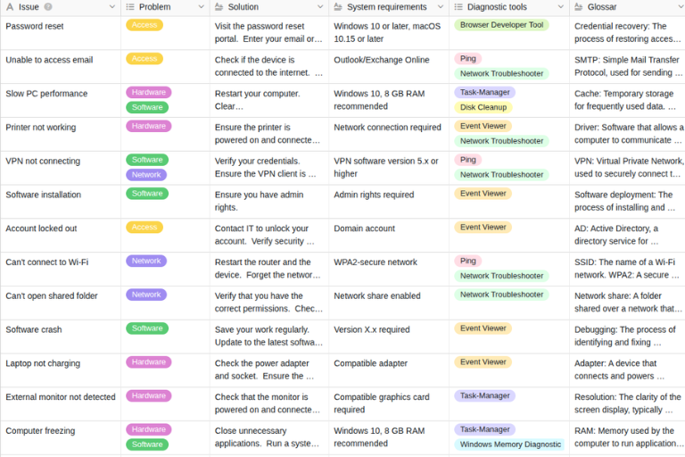

## Como o RAG está a transformar a recuperação de conhecimento  

Os agentes de IA não devem limitar-se a encontrar o conhecimento da empresa, mas sim traduzi-lo de forma fiável em decisões e ações. Para tal, raramente basta vetorizar páginas da Wiki e enviar os trechos de texto mais semelhantes a um LLM. Um sistema RAG produtivo necessita, para além da pesquisa semântica, de uma base de dados na qual as entidades, as relações, os estados e as regras de acesso sejam preservados e permaneçam reconhecíveis pela IA.

### Factos-chave:

*   **Os limites dos dados não estruturados**: Por que razão as bases de dados vetoriais e as ferramentas orientadas para o texto, como o Notion, o Obsidian ou o Confluence, podem contribuir para a perda de contexto em agentes de IA complexos.
    
*   **A estrutura como fator de qualidade**: Como, com bases de dados estruturadas «no-code» como única fonte de verdade, pode permitir consultas precisas e respostas de IA amplamente reproduzíveis.
    
*   **Arquitetura do futuro**: Quais são os papéis que a «Retrieval-Augmented Generation», os agentes de IA e os servidores MCP (Model Context Protocol) assumem na gestão do conhecimento de IA da sua empresa.
    
*   **Controlo de custos e de dados**: Como melhorar a governação e o controlo de custos através da filtragem de metadados, da recuperação direcionada e de uma maior eficiência de tokens.
    

## O que significa RAG?

A sigla RAG significa **Retrieval-Augmented Generation** e designa um padrão específico para ligar modelos de linguagem a fontes de conhecimento externas, como bases de dados empresariais. Em vez de recorrer exclusivamente ao conhecimento de treino, o sistema RAG procura, em primeiro lugar, informações relevantes e transmite-as como contexto ao modelo de IA utilizado. Este princípio tornou a IA RAG um elemento central dos atuais assistentes empresariais específicos de cada domínio. A pesquisa vetorial permite, neste contexto, procurar conteúdos semanticamente semelhantes em grandes bases de dados e reduzir significativamente o contexto efetivamente processado.

Para as empresas, isto significa que não têm de retreinar os seus modelos de linguagem após cada alteração nos documentos internos. Em vez disso, uma gestão de conhecimento RAG com IA moderna consulta fontes atualizadas e **disponibiliza dinamicamente conhecimento especializado**. A partir da documentação passiva, surgem assim, potencialmente, os chamados **dados acionáveis**, com base nos quais os agentes de IA RAG acedem a outras ferramentas ou desencadeiam processos.

{{< warning headline="O que significa pesquisa semântica ou pesquisa vetorial?" text="A pesquisa semântica procura o significado do conteúdo, em vez de se limitar a palavras-chave idênticas. Para tal, um modelo de embedding (também denominado modelo de vetorização) converte textos ou consultas de pesquisa em sequências numéricas – os chamados vetores ou embeddings. A pesquisa vetorial compara, em seguida, a sua semelhança matemática e, assim, encontra também conteúdos com significado relacionado, mesmo que utilizem termos diferentes. A pesquisa por palavras-chave, por outro lado, funciona com palavras concretas." />}}

## O ponto fraco dos sistemas clássicos

No entanto, a qualidade de um sistema RAG depende, em grande medida, dos dados que são efetivamente indexados e da forma como **o chunking e a indexação** funcionam. Frequentemente, os sistemas tratam praticamente todo o conhecimento armazenado da mesma forma: O conteúdo é extraído, dividido em «chunks» — ou seja, em unidades mais pequenas —, vetorizado e armazenado numa base de dados RAG. Este procedimento funciona bem para perguntas específicas que procuram formulações semelhantes ou passagens de texto adequadas. No entanto, assim que formular uma pergunta mais complexa, para a qual o seu agente de IA tenha de recorrer a relações em vários níveis entre dados, filtros exatos ou agregações, torna-se mais difícil, numa configuração deste tipo, obter **respostas de IA determinísticas** fiáveis.

É certo que, dependendo do fornecedor, pode efetuar filtragens e agregações limitadas através de uma API. No entanto, o problema da falta de relações é assim apenas parcialmente resolvido e fica dependente da qualidade da filtragem da API. Além disso, a utilização de uma API implica, em alguns casos, custos adicionais; custos desnecessários, uma vez que pode efetuar as mesmas consultas diretamente numa [base de dados de conhecimento]() relacional.

### Bases de dados vetoriais: Fortes em termos de semelhança, fracas em termos de exatidão

As bases de dados vetoriais, como o Pinecone e o Chroma, armazenam embeddings e estão otimizadas para reconhecer rapidamente semelhanças entre fragmentos. No entanto, isto não significa que sejam desprovidas de estrutura. Para além de vetores, também podem gerir IDs, textos e metadados. No entanto, uma desvantagem das bases de dados vetoriais típicas é que **não modelam automaticamente a integridade referencial**.

Tomemos como exemplo uma configuração típica de CRM. Um sistema RAG clássico pode, com base numa base de dados vetorial, responder, por exemplo, à pergunta: «Que pedidos de apoio são semelhantes a este ticket?». Uma pergunta que, no entanto, exige a integração contextualizada de várias informações, como, por exemplo: «Que clientes ativos no país X, com um volume de negócios anual superior a Y, apresentaram um pedido de apoio nos últimos 12 meses?», requer, por outro lado, ligações e filtros exatos, para os quais o sistema RAG tem de ser combinado com uma base de conhecimento SQL.

### Notion, Obsidian e Confluence: eliminam o caos documental, mas não oferecem dados estruturados

Mesmo os sistemas baseados em Markdown ou em blocos, como o Obsidian, o [Notion]() ou o Confluence, não são, por definição, desestruturados. É mais preciso referir-se a eles como sistemas semiestruturados:

*   As bases de dados do Notion suportam propriedades tipadas
 
*   O Obsidian suporta propriedades baseadas em YAML
 
*   O Confluence pode armazenar propriedades JSON
    

Como base para a sua gestão do conhecimento com IA na empresa, estes sistemas são apenas parcialmente adequados devido à sua estrutura baseada em páginas. Muitas vezes, continuam a ser utilizados como uma mera coleção de páginas, como um wiki empresarial com metadados em falta, lógicas de nomenclatura diferentes, propriedades inconsistentes e entradas duplicadas. Se basear a gestão do conhecimento em IA num sistema deste tipo, o caos habitual do wiki não desaparece nem se torna subitamente estruturado. Torna-se apenas pesquisável semanticamente.

## O problema da perda de contexto: por que razão os LLMs podem «alucinar» sem uma estrutura de dados clara

Por que razão a falta de contexto constitui um problema? Durante o processamento de documentos ou de bases de dados de conhecimento internas, a estrutura pode perder-se em vários pontos. O principal fator de risco em bases de dados não estruturadas ou semiestruturadas é a chamada **transformação com perdas**: um documento de origem ou uma informação é dividido em fragmentos, cada fragmento é vetorizado separadamente e, em consultas posteriores, é utilizado principalmente com base na semelhança semântica para a tarefa em questão. As tabelas transformam-se em texto, os títulos são separados da secção a que pertencem, as ligações entre afirmações relacionadas são enfraquecidas e as ligações entre objetos são reduzidas a meras palavras. Se, posteriormente, o seu sistema RAG encontrar apenas fragmentos isolados, o RAG poderá transmitir ao LLM afirmações que, em si, podem estar corretas. No entanto, o contexto que limita a sua validade perde-se.

Um exemplo: tem clientes em diferentes regiões com condições contratuais distintas. Sem o contexto completo, um agente pode recuperar uma informação factualmente correta, mas que, devido a fatores específicos, não se aplica à localização em questão ou ao cliente em particular.

A perda de contexto pode ocorrer em vários pontos:

*   **Ingest**: tabelas, propriedades, ligações ou hierarquias de blocos são reduzidas a texto contínuo.
 
*   **Chunking**: informações inter-relacionadas acabam por ficar em diferentes «chunks»
    
*   **Incorporação**: é representada a semelhança de significado, mas não são representadas automaticamente as relações lógicas ou causais. 
 
*   **Recuperação**: uma pesquisa puramente vetorial encontra passagens semanticamente semelhantes, mas não necessariamente toda a informação relevante.
    
*   **Prompting**: os metadados e as relações não são fornecidos, ou os conteúdos relevantes perdem-se num contexto demasiado extenso.
    

{{< warning headline="Alucinação clássica vs. erro de recuperação" text="Em sentido estrito, trata-se, num caso como este, de um **erro de recuperação ou de fundamentação** e não de uma alucinação clássica, em que o LLM inventa informações. Esta distinção é relevante e deve ter-se em conta, por exemplo, quando utiliza a IA na gestão de riscos ou para análises. Pois, enquanto as alucinações clássicas são geralmente evitadas por modelos mais potentes, um modelo de IA de maior dimensão não consegue estabelecer automaticamente as relações em falta." />}}

### Por que razão janelas de contexto maiores não impedem a perda de contexto

Para prevenir alucinações ou erros de recuperação, pode fornecer à IA o máximo de contexto possível na consulta. No entanto, esta não é uma solução fiável. Isto porque, com janelas de contexto maiores, aumenta o chamado **«risco de perda no meio»**. Estudos demonstram que, dependendo da sua posição em janelas de contexto extensas, as informações podem ser utilizadas com diferentes graus de fiabilidade. Além disso, observaram-se regularmente perdas de desempenho decorrentes apenas de entradas mais longas.

Carregar o máximo de informação possível, ou mesmo documentos inteiros, no prompt não só prejudica a sua eficiência de tokens como também pode gerar mais distração, caso o LLM tenha de processar uma grande quantidade de informação. Os custos aumentam normalmente com o número de tokens processados — não necessariamente de forma exponencial —, uma vez que os fornecedores de API cobram os tokens de entrada e saída com base nos volumes. A **Otimização da Recuperação de Conhecimento** significa, em vez disso, fornecer o mínimo de contexto possível, mas totalmente relevante.

## Que vantagens oferecem as bases de dados estruturadas, relacionais e no-code para o RAG?

Uma base de dados estruturada, relacional e no-code pode, por exemplo, armazenar informações de clientes, produtos, ativos ou contratos em tabelas separadas. As ligações entre as tabelas representam as relações, e os tipos de dados unívocos e os campos obrigatórios reduzem a ambiguidade. Desta forma, surgem **dados estruturados e contextualizados que o seu agente de IA pode filtrar, ordenar, interligar e agregar**, em vez de ter de adivinhar ligações a partir de fragmentos de texto.

É esta arquitetura de dados que permite respostas de IA determinísticas, ou seja, reproduzíveis: a sua consulta à base de dados fornece o mesmo resultado com um conjunto de dados idêntico e condições idênticas. O seu LLM formula este resultado em linguagem natural. 

No entanto, isso não significa que todas as respostas sejam corretas. A IA generativa pode continuar a cometer erros, mesmo que forneça dados estruturados para soluções de IA. **No entanto, os factos críticos provêm de uma consulta rastreável e não de uma estimativa de semelhança**.

Neste contexto, uma solução «no-code» representa uma vantagem organizacional para a sua gestão do conhecimento baseada em IA: **Os departamentos especializados criam e mantêm eles próprios os modelos de dados e os processos**, sem terem de delegar qualquer alteração ao departamento de TI.



Inscreva-se na nossa newsletter e receba regularmente **informações e dicas sobre IA, «no-code» e gestão de dados**.



## Vetorização vs. estruturação: os sistemas RAG necessitam de uma estrutura híbrida

Em primeiro lugar, a questão da vetorização ou da estruturação não é uma escolha rígida entre uma ou outra. A vetorização revela semelhanças de significado; a estruturação permite-lhe consultar factos e relações de forma explícita. Um sistema RAG eficaz e moderno deve combinar ambos os princípios. Se a sua base de dados de conhecimento interna já fornecer informações estruturadas, os sistemas RAG obtêm resultados mais determinísticos do que quando os dados e as informações têm de ser primeiro filtrados e estruturados através da API. Por isso, deve **armazenar as informações essenciais estruturadas numa base de dados relacional**. Pode armazenar documentos em sistemas de conteúdo adequados; por exemplo, pode ser a mesma base de dados relacional, caso esta seja adequada para o efeito.

| **Requisito** | **Tipo de acesso adequado** | **Exemplo** |
|-----------------|---------------------------|--------------|
| Semelhança semântica | Pesquisa vetorial | Encontrar casos de suporte semelhantes |
| Condição exata | SQL ou API filtrada | Contratos ativos de um plano tarifário |
| Listar relações | Ligação relacional | Atribuir tickets ao cliente correto |
 Agregação | Consulta à base de dados | Contar tickets críticos por segmento de clientes |
 | Consulta livre de documentos | Pesquisa híbrida | Encontrar diretrizes ou passagens de texto adequadas |

Os componentes RAG LLM recebem fragmentos semânticos quando o significado é determinante e resultados de consulta estruturados quando se trata de factos e cálculos. A filtragem de metadados reduz o espaço de pesquisa, por exemplo, por idioma, estado, tipo de documento ou data de criação. Isto resulta em contextos mais curtos para a IA do RAG e em custos controláveis.

## Servidor MCP e agentes de IA: a arquitetura moderna para a pesquisa empresarial

O Model Context Protocol padroniza a ligação entre aplicações de IA e recursos ou ferramentas externas. Na arquitetura MCP, um anfitrião gere clientes individuais, cada um dos quais está ligado a um servidor MCP. O seu agente de IA com arquitetura RAG identifica bases de dados relevantes através de um servidor MCP e efetua uma consulta direcionada. O sistema RAG carrega apenas as linhas ou passagens de documentos necessárias e, desde que lhe conceda autorização para tal, também executa ações como atualizações ou alterações.

No entanto, o MCP, por si só, não gera automaticamente respostas corretas nem garante acessos seguros. O seu servidor deve disponibilizar sistemas adequados e claramente delimitados; o anfitrião deve controlar autorizações, diretrizes e ligações. Só assim é que **a gestão de conhecimento estática baseada em IA se transforma numa interação dinâmica com sistemas operacionais** para um apoio controlado aos processos.

## O SeaTable como «Single Source of Truth» para a gestão do conhecimento baseada em IA

O **SeaTable** é uma moderna [base de dados de IA no-code]() com um forte enfoque na **flexibilidade, interoperabilidade e máxima proteção de dados**. Numa arquitetura RAG AI descrita acima, o SeaTable assume a camada de conhecimento estruturado. Tabelas, colunas tipificadas e ligações representam entidades e relações. Com colunas de ligação, pode modelar relações 1:n, n:1 e n:m. Isto permite-lhe gerir dados estruturados para a sua gestão de conhecimento de IA de forma mais próxima dos processos especializados do que num índice de texto puramente baseado em vetores. **Direitos de acesso e edição granulares** na própria base de dados apoiam a conformidade e a governação.

O [Servidor SeaTable MCP]() liga assistentes de IA compatíveis com MCP a uma base de dados partilhada. Desta forma, o seu sistema RAG pode recuperar registos de dados atualizados de forma específica, em vez de ter de vetorizar regularmente novas exportações completas. O servidor SeaTable MCP é alojado, tal como toda a infraestrutura SeaTable, em servidores de empresas europeias na Alemanha. As empresas com requisitos particularmente elevados em matéria de proteção de dados e conformidade podem também **alojar o SeaTable e o servidor SeaTable MCP nas suas próprias instalações**. Desta forma, o SeaTable assume, na vossa arquitetura RAG AI, o papel de «fonte única de verdade» para dados relacionais e variáveis.

## Governação de dados LLM: consolidar a segurança e o controlo de acesso na empresa

Uma arquitetura de agentes produtiva tem de responder às mesmas questões fundamentais que outros sistemas empresariais: quem pode ler, alterar ou exportar quais dados e para que fim? A governança de dados LLM começa, portanto, pela classificação de dados e pelas identidades, e não apenas no prompt.

Para cada sistema RAG, devem ser definidos, no mínimo, os seguintes controlos:  

*   uma fonte principal e um proprietário de dados responsável por cada entidade,
 
*   regras de acesso baseadas em funções ou atributos,
 
*   direitos de leitura e escrita separados, de acordo com o princípio do privilégio mínimo,
    
*   filtragem antes da recuperação, em vez de após a saída do modelo,
 
*   registos de consultas, fontes, chamadas de ferramentas e alterações,
 
*   controlo de versões, conceitos de eliminação e prazos de conservação definidos,
 
*   Testes contra injeção de prompts, fuga de dados e ações não autorizadas,
 
*   Aprovações «human-in-the-loop» para etapas irreversíveis ou críticas para a segurança.
 

Um sistema RAG não pode aceder a dados de terceiros apenas através da adivinhação de um identificador. Por conseguinte, as autorizações devem ser sempre aplicadas tanto ao nível da base de dados como no sistema RAG. Através de uma recuperação direcionada, reforça-se ainda o controlo de custos. A filtragem de metadados e as consultas estruturadas reduzem os tokens de entrada irrelevantes, e o armazenamento em cache pode tornar o contexto recorrente mais económico.

## Conclusão: dados estruturados como alicerce para a gestão do conhecimento com IA

Uma **gestão do conhecimento com IA fiável começa com uma base de dados estruturada e no-code**. Enquanto «fonte única de verdade», esta constitui a base sobre a qual um sistema RAG pode fornecer respostas exatas. Tabelas, campos definidos e ligações tornam as relações explícitas. Os agentes de IA já não precisam de as reconstruir a partir de fragmentos de texto.

Através de um servidor MCP, os agentes acedem a estes dados de forma controlada, filtram-nos com base em metadados e recuperam apenas os registos relevantes. Isto **aumenta a precisão, reduz o consumo de tokens e reforça a governação de dados do LLM**, uma vez que os direitos de acesso se aplicam ao modelo de dados.

Isto não impede totalmente as alucinações, uma vez que o LLM continua a formular com base na probabilidade. No entanto, os factos são reproduzíveis e verificáveis. Quem utiliza agentes de IA na empresa deve, por isso, criar primeiro a base de dados estruturada.

## Perguntas frequentes – Gestão do conhecimento com IA


Uma base de dados vetorial procura, principalmente, semelhanças semânticas. Isto é ideal para passagens de documentos relacionadas, mas não representa automaticamente entidades únicas, relações referenciais, conjuntos completos ou regras de negócio. Quando um agente precisa de verificar várias condições, ligar registos de dados ou calcular somas, as bases de dados relacionais permitem resultados mais fiáveis. Uma boa arquitetura de IA RAG inclui, por isso, uma base de dados estruturada e relacional como elemento central para a gestão do conhecimento baseada em IA.



Um servidor MCP disponibiliza dados e operações como recursos ou ferramentas padronizadas, tornando possível, pela primeira vez, a gestão do conhecimento baseada em IA. Desta forma, o agente pode verificar estruturas de tabelas de forma específica, filtrar registos de dados ou executar alterações aprovadas, em vez de copiar conjuntos de dados completos para um prompt. Isto melhora a interoperabilidade e pode reduzir a quantidade de contexto transmitida. No entanto, a segurança não decorre apenas do MCP: a autorização, as permissões mínimas, a conceção das ferramentas, o registo e as aprovações têm de ser implementados corretamente.

    

Com uma base de dados «no-code», torna as entidades, os estados e as relações dominais legíveis por máquinas, sem ter de reprogramar cada alteração ao modelo. Os departamentos especializados podem gerir conteúdos e processos, enquanto o departamento de TI define normas, integrações e autorizações para evitar a [TI paralela](). As bases de dados «no-code» são particularmente adequadas para dados operacionais que necessitam de ser filtrados com precisão, enquanto os manuais são consultados de forma complementar através de pesquisa de texto completo ou vetorial.


 
Não, não automaticamente. Os custos diminuem quando, através da recuperação, são removidos conteúdos irrelevantes, o número de resultados é limitado e o contexto recorrente é armazenado em cache de forma eficiente. O que é decisivo não é a utilização da IA RAG em si, mas sim a qualidade da lógica de recuperação e encaminhamento no seu sistema RAG.



A principal vantagem das respostas determinísticas da IA reside no facto de entradas e condições de dados idênticas conduzirem a resultados reproduzíveis. Ao disponibilizar dados estruturados para os agentes de IA, os processos apoiados pela IA tornam-se mais fiáveis, verificáveis e fáceis de controlar. Se o seu LLM puder aceder à sua base de dados através do RAG e recuperar dados estruturados, aumenta a probabilidade de obter uma resposta determinística.
