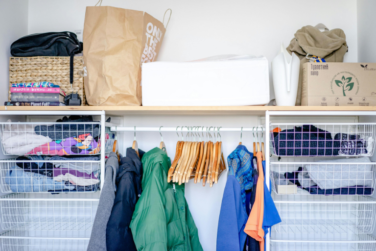

Aufräumen gehört für viele nicht zu den Lieblingsbeschäftigungen - dennoch ist es immer wieder notwendig. Besonders den Kleiderschrank zu organisieren wird häufig aufgeschoben, obwohl genau hier großes Potenzial für mehr Struktur im Alltag liegt. Der Kleiderschrank ist ein zentraler Bestandteil Ihrer täglichen Routine und beeinflusst maßgeblich, wie entspannt oder stressig Ihr Start in den Tag verläuft.

Im Laufe der Zeit sammeln sich Kleidungsstücke an, die Sie nur selten oder gar nicht tragen. Saisonale Teile bleiben hängen, obwohl sie aktuell nicht gebraucht werden, und kleine Unordnungen summieren sich schnell zu einem unübersichtlichen Gesamtbild. Das kostet Sie nicht nur Platz, sondern auch Zeit und Nerven.

### Key Take-aways

- Unordnung im Kleiderschrank kostet Zeit, Nerven und Geld, weil die Suche nach Outfits länger dauert und Fehlkäufe sowie doppelte Teile entstehen.

- Struktur im Kleiderschrank schafft Klarheit und Ruhe, erleichtert Entscheidungen und sorgt für eine entspannte Morgenroutine.

- Methoden wie Marie Kondo oder Capsule Wardrobe verbessern die Nutzung der Kleidung, fördern nachhaltigen Konsum und unterstützen den persönlichen Stil.

- Digitale Tools ergänzen die physische Ordnung, ermöglichen Inventarisierung, Outfitplanung und Analyse des Trageverhaltens und machen die Garderobe langfristig übersichtlich und funktional.

## Wenn der Kleiderschrank zum Stressfaktor wird

Ein unorganisierter Kleiderschrank bleibt selten ohne Folgen. Was zunächst nur nach etwas Unordnung aussieht, kann sich schnell zu einem echten Stressfaktor für Sie entwickeln. Unübersichtlichkeit sorgt dafür, dass Ihre Lieblingsstücke in Vergessenheit geraten oder schwer auffindbar sind. Sie übersehen Kleidung, bringen Stapel durcheinander und das Gesamtbild wirkt chaotisch. Dadurch entsteht das Gefühl, dass Sie nichts Passendes besitzen, obwohl Ihr Schrank eigentlich gut gefüllt ist. 

Doppelte Teile sind eine weitere Konsequenz fehlender Struktur. Wenn Ihnen der Überblick fehlt, kaufen Sie  ähnliche Basics vielleicht mehrfach. So sammeln sich beispielsweise mehrere weiße Shirts oder schwarze Hosen an, während andere Kleidungsstücke kaum von Ihnen getragen werden. Auch Fehlkäufe bleiben häufiger, wenn kein klares Ordnungssystem in Ihrem Kleiderschrank herrscht. Teile, die nicht richtig passen oder sich schlecht kombinieren lassen, nehmen dauerhaft Platz ein, obwohl Sie diese kaum nutzen.

Hinzu kommt Zeitverlust am Morgen. Die Suche nach einem passenden Outfit dauert länger, **Entscheidungen fallen Ihnen schwerer und Ihr Start in den Tag wird unnötig hektisch**. Gleichzeitig wächst der Anteil ungetragener Kleidung. Stücke, die Sie seit Monaten oder sogar Jahren nicht mehr tragen und wertvollen Raum blockieren. Eine gezielte Organisation hilft Ihnen dabei, genau diese Probleme zu erkennen und langfristig zu vermeiden.

## Die unterschätzten Vorteile eines perfekt organisierten Kleiderschranks

Wenn Sie Ihren Kleiderschrank strukturiert organisieren, profitieren Sie in mehrfacher Hinsicht. Der erste spürbare Effekt ist mehr Überblick. Sie sehen auf einen Blick, welche Kleidungsstücke vorhanden sind, was häufig getragen wird und was kaum zum Einsatz kommt. Das schafft Klarheit und erleichtert Entscheidungen. Mit dem besseren Überblick geht automatisch weniger Stress einher. Sie sparen sich langes Suchen, vermeiden spontane Fehlentscheidungen und starten ruhiger in den Tag. Ein aufgeräumter Kleiderschrank sorgt für eine entspanntere Morgenroutine.

Darüber hinaus fördern Sie nachhaltigen Konsum. Wenn Sie genau wissen, was Sie besitzen, kaufen Sie bewusster ein. Unnötige Doppelkäufe und spontane Fehlkäufe werden seltener, weil Sie Ihre Garderobe realistisch einschätzen können. Das wirkt sich auch positiv auf Ihr [Budget]() aus. Wer gezielt ergänzt statt wahllos neu zu kaufen, spart Geld und investiert bewusster in hochwertige Stücke, die langfristig getragen werden.

Nicht zuletzt ermöglichen klare Strukturen bessere Outfit-Kombinationen. Sie erkennen schneller, welche Teile sich miteinander kombinieren lassen, entdecken neue Styling Möglichkeiten und nutzen Ihre bestehende Garderobe deutlich effektiver.

## Clevere Methoden und Trends für mehr Ordnung im Kleiderschrank

Da uns das Thema "Kleiderschrank organisieren" alle betrifft, haben sich in den letzten Jahren zahlreiche Strategien etabliert, die den Alltag deutlich erleichtern. Im Folgenden stellen wir Ihnen die bekanntesten und aktuellsten Ansätze vor, die Sie direkt umsetzen können.

### Marie Kondo Methode

Mit der Marie Kondo Methode beginnen Sie damit, Ihre Kleidung bewusst zu prüfen. Fragen Sie sich bei jedem Teil, ob es Ihnen wirklich Freude bereitet. Alles, was Sie nicht glücklich macht, darf gehen. Ergänzend sorgt die platzsparende Falttechnik und vertikale Aufbewahrung für maximale Übersicht über den Bestand.

Darüber hinaus verfolgt diese Methode einen klaren Grundgedanken. Sie konzentrieren sich nicht auf das Wegwerfen, sondern auf das bewusste Behalten. Dieser Perspektivwechsel **erleichtert Entscheidungen und reduziert das Gefühl von Verzicht**. Indem Sie jedes Kleidungsstück einzeln in die Hand nehmen, setzen Sie sich aktiv mit Ihrem Stil, Ihren Bedürfnissen und Ihrem Alltag auseinander. Langfristig entsteht ein aufgeräumter Kleiderschrank, der nicht nur strukturiert ist, sondern auch Ihren persönlichen Stil klar widerspiegelt.

### Capsule Wardrobe

Die Capsule Wardrobe hilft Ihnen, Ihre Garderobe zu minimieren und sinnvoll zu kombinieren. Sie wählen eine kleine Anzahl an hochwertigen, aufeinander abgestimmten Kleidungsstücken aus, die sich leicht miteinander kombinieren lassen. Im Kern geht es darum, **Qualität vor Quantität zu stellen**. Sie definieren eine klare Farbpalette und setzen auf zeitlose Schnitte, die vielseitig tragbar sind. Dadurch entsteht ein stimmiges Gesamtbild, das Ihren Stil unterstreicht und gleichzeitig flexibel bleibt.

Eine reduzierte Garderobe erleichtert nicht nur die tägliche Outfit-Wahl, sondern schafft auch mentale Klarheit. Sie investieren bewusster in langlebige Materialien und reduzieren Impulskäufe. Gleichzeitig erkennen Sie schneller, welche Teile tatsächlich fehlen und welche Anschaffungen überflüssig wären. So entsteht ein nachhaltigeres Konsumverhalten und ein Kleiderschrank, der funktional und ästhetisch zugleich ist.

### Kleiderschrank digital organisieren

Ein weiterer Trend ist der digitale Kleiderschrank. Sie erfassen Ihre Teile in einer App, stellen Outfits virtuell zusammen und erkennen sofort, welche Kleidungskategorien dominieren. Das spart Zeit, unterstützt bewusstes Einkaufen und macht es einfacher, Ihre Garderobe effizient zu nutzen. Durch die digitale Erfassung gewinnen Sie zusätzlich wertvolle Einblicke in Ihr Trageverhalten. Diese Transparenz schafft eine **datenbasierte Grundlage für zukünftige Kaufentscheidungen**.

Digitale Tools ermöglichen es Ihnen außerdem, Outfits im Voraus zu planen und besondere Anlässe zu berücksichtigen. Sie behalten den Überblick über saisonale Wechsel und können Ihre Garderobe gezielt anpassen. Besonders hilfreich ist die Möglichkeit, Bilder zu hinterlegen. Dadurch entsteht eine visuelle Übersicht, die das Kombinieren erleichtert und neue Styling-Ideen fördert. Ein digital organisierter Kleiderschrank verbindet Ordnung mit Analyse und unterstützt Sie langfristig bei einem strukturierten und bewussten Umgang mit Ihrer Kleidung.

## 10 Hacks, wie Sie Ihren Kleiderschrank organisieren können

Ein Ordnungssystem für den Kleiderschrank wirkt nur so lange überwältigend, bis man weiß, wo man anfangen soll. Deshalb haben wir für Sie 10 praktische Hacks zusammengestellt, mit denen Sie Ihren Kleiderschrank im Nu aufräumen können.

### 1. Starten Sie mit einem komplett leeren Kleiderschrank
   
Der erste Schritt ist konsequent und besonders wirkungsvoll. Räumen Sie Ihren Kleiderschrank vollständig aus und legen Sie jedes Kleidungsstück gut sichtbar aus. So erkennen Sie auf einen Blick, wie umfangreich Ihre Garderobe tatsächlich ist. Diese Bestandsaufnahme schafft Klarheit und hilft Ihnen zu verstehen, welche Teile Sie regelmäßig tragen und welche bislang kaum Beachtung gefunden haben.

### 2. Sortieren Sie aus nach der Marie Kondo Methode 
   
Nehmen Sie jedes Kleidungsstück einzeln in die Hand und prüfen Sie ehrlich, ob es noch zu Ihrem Stil und Ihrem Alltag passt. Behalten Sie nur Stücke, die Sie gerne tragen und in denen Sie sich wohlfühlen. Alles andere darf gehen. Sie können Kleidung verkaufen, spenden oder recyceln.

### 3. Bilden Sie klare Kategorien 
   
Struktur ist die Grundlage für dauerhafte Ordnung. Teilen Sie Ihre Kleidung in sinnvolle Gruppen wie Oberteile, Hosen, Kleider, Jacken, Schuhe und Accessoires ein. Innerhalb dieser Gruppen behalten Sie leichter den Überblick. Eine feste Einteilung sorgt dafür, dass jedes Teil seinen Platz hat und nach dem Tragen problemlos wieder eingeordnet werden kann.

### 4. Ordnen Sie nach Farben oder Stilrichtungen
   
Sobald Ihre Kategorien stehen, können Sie zusätzliche Übersicht schaffen, indem Sie innerhalb der Gruppen nach Farben sortieren. Eine Anordnung von hell nach dunkel wirkt harmonisch und erleichtert das Zusammenstellen von Outfits. Alternativ können Sie nach Stilrichtungen ordnen, etwa elegant, sportlich oder casual. Dadurch erkennen Sie schneller passende Kombinationen und schaffen ein ruhiges Gesamtbild im Schrank.

### 5. Reduzieren Sie Ihre Garderobe im Sinne einer Capsule Wardrobe 
   
Eine überschaubare Auswahl hochwertiger und gut kombinierbarer Kleidungsstücke bringt mehr Klarheit in Ihren Alltag. Konzentrieren Sie sich auf zeitlose Basics und ausgewählte Lieblingsstücke, die vielseitig einsetzbar sind. Mit weniger Teilen entstehen oft mehr stimmige Kombinationen. Gleichzeitig vermeiden Sie unnötige Käufe und entwickeln einen klareren persönlichen Stil.

### 6. Rotieren Sie Ihre Kleidung je nach Saison 
   
Lagern Sie saisonale Kleidung außerhalb Ihres Hauptschranks, wenn sie aktuell nicht benötigt wird. Wenn sich nur passende Stücke für die jeweilige Jahreszeit im Schrank befinden, wirkt dieser automatisch aufgeräumter. Zudem gewinnen Sie Platz und vermeiden, dass einzelne Teile zwischen unpassenden Kleidungsstücken untergehen. Ein saisonaler Wechsel bietet außerdem die Gelegenheit für eine erneute Durchsicht.

### 7. Nutzen Sie durchdachte Aufbewahrungslösungen 
   
Einheitliche Kleiderbügel schaffen ein ruhiges Erscheinungsbild und sparen Platz. Boxen und Einsätze helfen dabei, kleinere Teile ordentlich zu verstauen. Wichtig ist, dass jedes Kleidungsstück und jedes Accessoire einen festen Platz erhält. Ein klar definiertes System erleichtert es, Ordnung dauerhaft beizubehalten und verhindert, dass sich Unordnung erneut einschleicht.

### 8. Planen Sie Ihre Outfits im Voraus 
   
Wer seine Outfits für die Woche vorab zusammenstellt, startet entspannter in den Tag. Hängen Sie passende Kombinationen nebeneinander oder legen Sie sie griffbereit bereit. So vermeiden Sie hektisches Suchen und unnötiges Umräumen. Gleichzeitig erkennen Sie, welche Teile besonders vielseitig sind und häufig kombiniert werden können.

### 9. Halten Sie Ihre Lieblingsoutfits fest 
   
Halten Sie gelungene Kombinationen fest, zum Beispiel mit Fotos auf Ihrem Smartphone oder in einer Notizliste. So entsteht mit der Zeit eine persönliche Sammlung bewährter Looks. Diese Übersicht spart Zeit bei spontanen Anlässen und zeigt Ihnen, welche Kleidungsstücke besonders oft zum Einsatz kommen.

### 10.  Führen Sie einen digitalen Kleiderschrank 
   
Erfassen Sie Ihre Kleidungsstücke in einer App oder einem digitalen Tool. So behalten Sie den Überblick, vermeiden unnötige Doppelkäufe und planen Ihre Garderobe effizienter. Zusätzlich erhalten Sie eine statistische Auswertung über die Nutzung Ihrer Kleidung. Sie erkennen, welche Teile Sie besonders häufig tragen und welche kaum zum Einsatz kommen. Diese Daten helfen Ihnen, zukünftige Kaufentscheidungen bewusster zu treffen und Ihre Garderobe gezielt zu optimieren.

##  Kleiderschrank organiseren und digitalisieren mit SeaTable

Wenn Sie das Thema Kleiderschrank organisieren konsequent angehen möchten, lohnt sich ein Blick auf das passende [Template]() der [KI No-Code-Plattform]() SeaTable. Es verbindet Struktur, Übersicht und Analyse in einem System und **ergänzt Ihre physische Ordnung um eine digitale Ebene**. Erfassen Sie Ihre gesamte Garderobe digital mit relevanten Informationen und Bildern und schaffen so eine visuelle und inhaltliche Übersicht. Das hilft Ihnen nicht nur beim Planen von Outfits, sondern auch dabei, Ihren tatsächlichen Bestand realistisch einzuschätzen. 



Ein besonderer Vorteil liegt in der intelligenten **Verknüpfung Ihrer Kleidung mit konkreten Outfits**. Sie sehen, welche Teile Sie häufig kombinieren und welche kaum zum Einsatz kommen. Durch die integrierten Ansichten wie Galerie oder Kalender planen Sie Looks strukturiert im Voraus und berücksichtigen Termine oder besondere Anlässe frühzeitig. Auch in Bezug auf bewussten Konsum bietet das Template klare Mehrwerte. Mit einer digitalen Wunschliste priorisieren Sie geplante Anschaffungen und vermeiden spontane Fehlkäufe. Gleichzeitig liefern statistische Auswertungen wertvolle Einblicke in Ihre Nutzung. Sie erkennen beispielsweise, welche Kategorien dominieren oder wo Sie Ihre Garderobe sinnvoll ergänzen können.

Die integrierte App bündelt **alle Funktionen in einem übersichtlichen Dashboard**. Sie können neue Teile mobil per Webformular erfassen, Ihre Outfits analysieren und Ihre Garderobe flexibel verwalten. So entsteht ein durchdachtes System, das Ihnen langfristig Zeit spart, Kaufentscheidungen fundierter macht und die Ordnung im Kleiderschrank auf ein neues Niveau hebt.

## FAQs

Wenn Sie Ihren Kleiderschrank organisieren möchten, beginnen Sie idealerweise mit einem vollständigen Ausräumen. Verschaffen Sie sich einen Überblick über alle Kleidungsstücke und sortieren Sie konsequent aus, was nicht mehr passt oder nicht mehr getragen wird. Anschließend bilden Sie klare Kategorien wie Oberteile, Hosen oder Accessoires und ordnen diese beispielsweise nach Farben oder Stilrichtungen. Saisonale Kleidung können Sie separat lagern, um dauerhaft Übersicht zu behalten.



Die Marie Kondo Methode hilft Ihnen, wenn Sie den Kleiderschrank aufräumen, indem Sie jedes Kleidungsstück bewusst prüfen und nur behalten, was Ihnen wirklich Freude bereitet. Durch diesen klaren Entscheidungsprozess reduzieren Sie Überflüssiges und schaffen eine Garderobe, die zu Ihrem Stil und Alltag passt. Die vertikale Falttechnik sorgt zusätzlich für bessere Übersicht und eine strukturierte, dauerhafte Ordnung im Kleiderschrank.



Als Ordnungssystem für den Kleiderschrank haben sich verschiedene Methoden bewährt. Die Marie Kondo Methode setzt auf bewusstes Behalten und eine vertikale Falttechnik für mehr Sichtbarkeit. Die Capsule Wardrobe reduziert Ihre Garderobe auf ausgewählte, gut kombinierbare Stücke pro Saison und erleichtert dadurch tägliche Entscheidungen. Ergänzend helfen feste Kategorien, hochwertige Kleiderbügel und durchdachte Aufbewahrungslösungen dabei, den Kleiderschrank zu organisieren und langfristige Ordnung zu halten.



Ein digitaler Kleiderschrank ist die moderne Erweiterung Ihrer physischen Ordnung. Dabei erfassen Sie Ihre Kleidung in einer App oder einer Datenbank, dokumentieren Details und Bilder und kombinieren Outfits virtuell. So behalten Sie jederzeit den Überblick, erkennen ungenutzte Teile und vermeiden Doppelkäufe. Wenn Sie Ihren Kleiderschrank organisieren und zusätzlich statistisch auswerten möchten, bietet ein digitaler Ansatz besonders viel Transparenz und unterstützt bewusste Kaufentscheidungen.



Damit dauerhaft Struktur entsteht, reicht es nicht aus, den Kleiderschrank einmalig zu organisieren. Entscheidend sind klare Routinen im Alltag. Planen Sie beispielsweise bei jedem Saisonwechsel einen festen Termin ein, um Ihre Garderobe zu prüfen, neu zu sortieren und gegebenenfalls auszusortieren. So verhindern Sie, dass sich unnötige Teile erneut ansammeln.

Hilfreich ist außerdem eine einfache Regel bei Neuanschaffungen. Kaufen Sie bewusst ein und prüfen Sie vorab, ob das neue Kleidungsstück zu mehreren vorhandenen Teilen passt. So bleibt Ihre Garderobe stimmig und überschaubar.

Zusätzlich unterstützt ein digitaler Überblick dabei, die Nutzung Ihrer Kleidung regelmäßig zu reflektieren. Wenn Sie erkennen, welche Teile selten getragen werden, können Sie gezielt nachjustieren. Mit festen Gewohnheiten, klaren Kategorien und bewussten Kaufentscheidungen bleibt Ihr Kleiderschrank dauerhaft organisiert und alltagstauglich.

