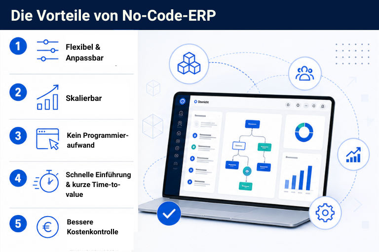

## Modern und flexibel: Was ein passendes ERP für den Mittelstand leisten muss

Ein ERP-System für den Mittelstand ist das digitale Rückgrat des gesamten Unternehmens. Doch herkömmliche Systeme wurden für stabile Prozesse entwickelt, nicht für agile Anpassungen und dynamische Workflows. Zudem bilden solche Systeme häufig die Anforderungen großer Unternehmen ab, mit gut ausgestatteten IT-Abteilungen, die sich um die Administration kümmern. Gerade KMU müssen in einem sich stetig verändernden Marktumfeld und schärfer werdenden Wettbewerb agil reagieren können. Als ERP-System für kleine Unternehmen mit begrenzten IT-Ressourcen oder den Mittelstand sind **herkömmliche Lösungen häufig zu unflexibel, zu überdimensioniert und oft auch zu teuer**.

Doch der Markt wandelt sich seit einigen Jahren und es gibt inzwischen **moderne, flexible Alternativen**. Mit [No-Code- und Low-Code-Lösungen]() erstellen auch Unternehmen ohne großes IT-Team maßgeschneiderte ERP-Systeme selbst. Mitarbeiter in den Fachabteilungen, sogenannte [Citizen Developer](), können **eigenständig neue Prozesse aufsetzen und Anpassungen vornehmen**. Und es gibt noch einen weiteren Vorteil: Die Anschaffungskosten für Ihr ERP-System sinken mit No-Code/Low-Code-Lösungen signifikant.

### Key Facts:

*   KMU benötigen heute flexible, skalierbare ERP-Systeme.
    
*   No-Code- und Low-Code-Tools ermöglichen es dem Mittelstand, ERP-Systeme ohne externe Entwickler oder große IT-Abteilung selbst zu bauen.
    
*   Mit einem No-Code-ERP-Builder wie SeaTable bauen Sie Ihr eigenes ERP-System in wenigen Schritten.
    
*  Entscheidend für die Wahl des richtigen No-Code-Tools ist eine gründliche Planung und Analyse der eigenen Prozesse und Anforderungen.
    

## Cloud oder on-premises? Was ist die beste Wahl für Ihr Unternehmen

Eine zentrale Frage bei der Auswahl neuer Software-Lösungen ist heute immer die Wahl des passenden Deployments. Und auch wenn Sie Ihr ERP mit [No-Code-Tools]() erstellen möchten, können Sie bei einigen Anbietern zwischen Cloud-Lösungen und einer on-premise Installation wählen. Beide Optionen haben ihre Berechtigungen und was für Ihr Unternehmen passt, hängt vor allem von den jeweiligen Anforderungen ab. Schauen wir uns die Vor- und Nachteile der beiden Möglichkeiten im Folgenden einmal genauer an.

### Cloud-ERP-Software: Flexibel, skalierbar, schnell

Ein Cloud-ERP-System überzeugt vor allem durch geringe Einstiegskosten, schnelle Implementierung und automatische Updates. Der Anbieter betreibt die gesamte Infrastruktur und kümmert sich um den Service, so dass Sie Ihre Ressourcen wirklich nur für die eigentliche Arbeit einplanen können.

Zudem lassen sich viele Cloud-Lösungen **leicht skalieren und flexibel anpassen**, sobald das Unternehmen wächst, ohne dass das gesamte System angepasst werden muss.

Insbesondere die entfallenden IT-Folgekosten sind ein oft unterschätzter Vorteil. Denn viele Unternehmen, insbesondere Einzelunternehmen und kleine Unternehmen, sehen bei der Wahl eines ERP-Systems vor allem den Implementierungsaufwand. Doch für eine reibungslose Integration mit ihren Tool-Stacks müssen API-Schnittstellen oder Webhooks eingerichtet sowie regelmäßige Sicherheitsupdates installiert werden.

**Die Vorteile eines Cloud-ERP-Systems:**

*   Keine Kosten für eigene Server oder Systemmaintenance
    
*   Automatische Updates und Support durch den Anbieter
    
*   Einfache Skalierbarkeit bei Unternehmenswachstum
    

### On-premise ERP: Maximale Kontrolle

Eine klassische on-premise Installation bietet vor allem **maximale Datenkontrolle** und – zumindest bei open-source oder open-core Lösungen – tiefergehende Individualisierungs- und Brandingmöglichkeiten als eine Cloud-Lösung. Dieses Deployment ist daher besonders für Unternehmen mit strengen Compliance-Vorgaben geeignet, etwa bei ERP-Systemen im [öffentlichen Dienst]() oder in stark regulierten Bereichen wie dem Gesundheitswesen. Diese Vorteile haben jedoch einen Preis: Die Kosten sind eventuell höher, eigene IT-Ressourcen werden benötigt und Updates müssen selbst durchgeführt werden.

**Die Vorteile einer on-premise Lösung:**

*   Maximale Datenkontrolle
    
*   Selbst bei strengsten Compliance-Vorgaben möglich
    
*   Mehr Individualisierungs- und Brandingoptionen
    

## ERP-System-Aufbau mit No-Code oder Low-Code? Die Vorteile für KMU

Laut einer Gartner-Studie beinhalteten 2024 bereits 65 Prozent aller Anwendungsentwicklungen No-Code oder Low-Code, mit steigender Tendenz. Ein Trend, der sich auch für mittelständische ERP-Systeme beobachten lässt. Doch was genau bedeuten No-Code und Low-Code eigentlich?

### Was sind No-Code- und Low-Code-Anwendungen

Mit No-Code-Tools entwickeln Anwender **maßgeschneiderte Lösungen ohne Programmierkenntnisse** oder Code schreiben zu müssen. Solche Systeme bieten entweder eine visuelle Benutzeroberfläche, auf der per drag-and-drop die gewünschten Elemente platziert werden oder basieren auf einer **individuell anpassbaren Datenbankstruktur** mit Tabellenoberfläche. Einige Anbieter wie SeaTable bieten eine Kombination aus beidem, mit einer [relationalen Datenbank]() als Tabelle und einem visuellen [App Builder]({< relref "posts/20250318-app-erstellen" >}). Von einem Low-Code-Tool wird dann gesprochen, wenn No-Code-Plattformen bei Bedarf durch eigenen Code ergänzt werden können.

### Strategische Vorteile von No-Code-ERP im Überblick

Der entscheidende Unterschied zu klassischen ERP-Projekten liegt in der Geschwindigkeit und Eigenständigkeit, die Sie durch No-Code-Tools gewinnen. Wo traditionelle Systeme entweder überhaupt keine Anpassungen erlaubten oder dafür monatelange Projekte erforderlich waren, erledigt ein versierter Mitarbeiter in Ihrer Fachabteilung dieselbe Aufgabe in wenigen Stunden.

*   **Flexibilität und Anpassbarkeit**: Ihre Fachabteilungen erweitern und verändern ihre jeweiligen Prozesse und Abläufe eigenständig, ohne dafür auf IT-Unterstützung oder externe Dienstleister zu warten.
    
*   **Prozessautomatisierung ohne Entwicklungsaufwand**: Integrierte Automationen erlauben schlanke, automatische Workflows für wiederkehrende Datenpflegeprozesse oder automatische Benachrichtigungen.
    
*   **Schnelle Einführung und kurze Time-to-value**: Statt Monaten ist ein No-Code-ERP-System nach wenigen Wochen produktiv. Änderungen werden iterativ im laufenden Betrieb durchgeführt, ohne Systemunterbrechungen.
    
*   **Kostenkontrolle**: Mit einem No-Code-ERP-Builder sparen Sie externe Entwickler und Beraterkosten. Transparente Nutzergebühren erlauben eine belastbarere Kostenplanung als schwankende Projektbudgets.
    
*   **Skalierbarkeit mit dem Unternehmenswachstum**: No-Code-Systeme wie SeaTable wachsen mit Ihrem Unternehmen mit, ohne Extrakosten für zusätzliche Datenpakete, starre Datenlimits oder Add-ons. Berechtigungsstrukturen lassen sich granular anpassen und neue Lizenzen dazubuchen, sobald Teams wachsen.
    

## No-Code-ERP in der Praxis: So bauen Sie ein ERP-System mit SeaTable

Der folgende ERP-System-Aufbau mit SeaTable zeigt exemplarisch, wie einfach Sie mit No-Code- und Low-Code-Lösungen ein individuelles und flexibles ERP-System für Einzelunternehmen und den Mittelstand erstellen. *Einfach* ist hier jedoch nicht mit *schnell* oder *leicht* gleichzusetzen. Entgegen weit [verbreiteter Irrtümer](), erfordert ein solides ERP-System mit No-Code wie alle Software- und Anwendungsprojekte eine sorgfältige Analyse und Planung.

### Schritt 1: Prozessanalyse

Dieser Schritt ist bei jeder ERP-System Umstellung zwingend, um ein belastbares Pflichtenheft zu erstellen. Doch bei No-Code-Lösungen sollten Sie hier noch sorgfältiger vorgehen, denn anders als bei üblichen SaaS-Lösungen, müssen Sie in einem No-Code-Tool Ihre Prozesse nicht an den vordefinierten Rahmen des Systems anpassen. Im Gegenteil können Sie Ihr ERP-System passend zu Ihren Prozessen aufbauen – und sollten diese entsprechend vorher genau kennen. 

### Schritt 2: Datenstruktur definieren

Definieren Sie nun Ihre Datenstruktur. In SeaTable legen Sie dafür Tabellen an, die Ihre Unternehmensbereiche abbilden. Sie können beliebig viele Tabellen innerhalb einer Base erzeugen und miteinander verknüpfen. Ein einfaches ERP-System für kleine Unternehmen könnte z. B. aus den Tabellen Kunden, Lieferanten, Produkte, Bestellungen, Lagerbestände und Rechnungen bestehen. Durch die Verknüpfungen entsteht ein **konsistentes Datenmodell**. Als Ausgangspunkt für Ihr ERP finden Sie bei SeaTable verschiedene Vorlagen, die Sie flexibel erweitern und anpassen können.

### Schritt 3: CRM-Modul aufbauen

Eine verknüpfte Tabelle für Kontakte, Kommunikationshistorie, Angebotsstatus und Kundensegmentierung reicht als CRM-Fundament häufig schon aus. Wenn Sie granularer strukturierte CRM-Daten abbilden möchten, finden Sie bei SeaTable verschiedene Vorlagen, u. a. auch für ein [CRM-Tool](), die sich problemlos in Ihr ERP integrieren lassen.

### Schritt 4: Warenwirtschaft integrieren

Produkt- und Lagertabellen mit **automatisierten Bestandsberechnungen** bilden Ihre Warenwirtschaft ab. Verknüpfungen zu den Bestelldaten aus Ihren CRM-Tabellen sorgen dafür, dass Sie jederzeit mit echten Daten arbeiten. Auch für die [Lagerhaltung]() und Bestandskontrolle finden Sie bei SeaTable eine Vorlage.

### Schritt 5: Einkauf und Bestellwesen

Um Ihren Einkauf transparent und schlank abzubilden, nutzen Sie in SeaTable am besten **integrierte Formulare**. Damit können Ihre Mitarbeiter Bestellungen oder Bedarfe unkompliziert melden und es werden neue Einträge in Ihrer Tabelle erzeugt. 

### Schritt 6: Automatisierungen

SeaTables [integrierte KI-unterstützte Automatisierungen]() ersetzen manuelle Routineaufgaben. Versenden Sie automatisiert Zahlungserinnerungen per E-Mail, informieren Sie Kunden unmittelbar über Statusänderungen oder erzeugen Sie Bestandswarnungen, sobald definierte Mindestbestände unterschritten werden. In SeaTable funktioniert dies über einen **intuitiven Automation-Editor**.

### Schritt 7: Reporting-Dashboards und Self-Service-Portale

Mit SeaTables integriertem App Builder erstellen Sie ansprechende Echtzeit-Dashboards mit Umsatzübersichten, offenen Posten, Lagerbeständen oder Warendurchlauf. Darüber hinaus bauen Sie auch **rollenbasierte Self-Service-Portale**: Mitarbeitende, Kunden oder Lieferanten erhalten über eine individuelle App-Oberfläche gezielten Zugriff auf genau die Daten, die für sie relevant sind – **ohne Einblick in die zugrundeliegende Datenbankstruktur**.

### Schritt 8: Integration und Datenmigration

Über die **SeaTable API und native Integrationen** z. B. für E-Mail-Clients oder Google Kalender binden Sie bestehende Systeme wie Shopsysteme, Buchhaltung und externe Zahlungsdienstleister oder Lieferantenbestellsysteme direkt an Ihr ERP an. Bestehende Daten migrieren Sie ganz einfach per CSV-Export oder ebenfalls über die API. So findet Ihre **ERP-System-Umstellung reibungslos ohne Datenverlust und Systemunterbrechung** statt.



## 6 No-Code-ERP-Builder im Vergleich

Der Markt für No-Code-ERP-Systeme für den Mittelstand und Einzelunternehmen ist in den letzten Jahren stark gewachsen. Dadurch sind KMU in der komfortablen Situation, aus einem breiten Angebot leistungsfähiger Anbieter zu wählen. Hier lohnt sich ein genauer Blick, denn die **Unterschiede in Flexibilität, Preis, Skalierbarkeit, Datenschutz und Benutzerfreundlichkeit sind teils erheblich**. Im Folgenden stellen wir Ihnen die sechs wichtigsten Anbieter kurz vor.

*   **SeaTable**: SeaTable ist eine [KI No-Code-Lösung]() mit Sitz in Deutschland, die speziell **für Unternehmen mit hohem Datenschutzbewusstsein und komplexen Prozessanforderungen** entwickelt  wurde.Tabellen, Formulare, Workflows und Dashboards lassen sich vollständig visuell konfigurieren; offene API-Schnittstellen ermöglichen die Integration bestehender Tools. SeaTable bietet sowohl eine **DSGVO-konforme Cloud** mit deutschem Rechenzentrum als auch eine **Self-Hosting-Option**. Das Preismodell basiert auf einer monatlichen Lizenz pro Nutzer, ohne Add-ons und kostenpflichtige Plugins oder Datenpakete. Dadurch ist SeaTable problemlos skalierbar. Ein weiterer Pluspunkt ist SeaTables **integrierter App Builder** für benutzerfreundliche Anwendungen und Frontends.
    
*   **Ninox**: Ninox ist eine ebenfalls in Deutschland entwickelte Low-Code-Datenbankplattform. Komplexe **relationale Datenmodelle und individuelle Businesslogik** lassen sich über eine eigene Skriptsprache umsetzen, was allerdings schon wieder zumindest **rudimentäre Coding-Kenntnisse** erfordert. Auch Ninox bietet Cloud-Betrieb und Self-Hosting in Deutschland an, jedoch keine kostenfreie on-premises Version.
    
*   **Airtable**: Die No-Code-Lösung Airtable überzeugt mit Benutzerfreundlichkeit und einer großen Vorlagen-Bibliothek. Für Unternehmen mit DSGVO-Anforderungen ist Airtable jedoch kritisch zu bewerten: Als **US-amerikanischer Anbieter** ohne self-hosting Option liegen alle Daten auf amerikanischen Servern. Zudem ist Airtable **im Vergleich teurer** als andere Anbieter und bietet nur eine eingeschränkte Free-Version.
      
*   **Adalo**: Adalo ermöglicht die visuelle Erstellung nativer Mobile- und Web-Apps und eignet sich für einfache, datengetriebene Anwendungen. Für komplexe ERP-Prozesse mit umfangreichen Automatisierungen und großen Datensätzen **stößt die Plattform jedoch an Grenzen**. Adalo ist eher als **Einstiegslösung** für Einzelunternehmer denn als vollwertiger ERP-No-Code-Builder zu verstehen.
    
*   **AppMaster**: AppMaster generiert aus visuellen Modellen echten Backend-Code und ermöglicht damit deutlich komplexere Architekturen als reine No-Code-Tools. Die Plattform eignet sich  besonders **für KMU mit technischen Ressourcen**, die ein skalierbares, individuelles ERP-System aufbauen möchten. Der deutlich höhere Preis und die steilere Lernkurve machen AppMaster jedoch **unattraktiv für Einsteiger und Unternehmen mit begrenzten IT-Ressourcen**.
    
*   **Xentral**: Xentral ist streng genommen kein freier ERP-Builder, sondern ein **modular erweiterbares No-Code-ERP-System** für Handel, E-Commerce und Produktion. Die Stärke liegt in der sofortigen Einsatzbereitschaft mit breiter Funktionsabdeckung; die Schwäche in der **geringeren Flexibilität** bei unternehmensindividuellen Prozessen. Für KMU, die ihre Prozesse lieber am System ausrichten als umgekehrt, ist Xentral eine solide Wahl. Im Vergleich ist Xentral zudem **deutlich teurer** und bietet **keine on-premises Lösung** an.    

| | **Flexibilität** | **Usability** | **DSGVO** | **Preis/ Monat** | **Free-Plan?** | **Self-hosting** |
| ------ | --------------------- | --------------------- | ----------- | --------- | -------| --- |
| **SeaTable**  | 5/5 | 5/5 | 5/5 | ab € 7 /Nutzer |  |  |
| **Ninox**     | 4/5 | 4/5 | 5/5 | ab € 25 /Nutzer |  |  |
| **Airtable**  | 4/5 | 5/5 | 2/5 | ab ca. € 17 /Nutzer |  |  | 
| **Adalo**     | 3/5 | 4/5 | 3/5 | ab ca. € 30 /Nutzer |  |  |
| **AppMaster** | 5/5 | 3/5 | 3/5 | ab ca. € 166 |  |  (Enterprise) |
| **Xentral**   | 3/5 | 3/5 | 5/5 | ab ca. € 99 |  |  |

## Fazit

Das ideale ERP-System für den Mittelstand und kleine Unternehmen existiert nicht. Es entsteht erst durch die richtige Kombination aus Plattform, Deployment-Modell und der möglichst passgenauen Darstellung der eigenen Prozesse. Noch vor wenigen Jahren mussten Unternehmen entweder aufwendig und für viel Geld eigene Systeme entwickeln oder die eigenen Prozesse an starre Systemlösungen anpassen. Dank No-Code- und Low-Code-Tools hat sich die Situation jedoch grundlegend geändert.

Heute können auch Sie als mittelständisches Unternehmen maßgeschneiderte ERP-Lösungen selbst bauen, anpassen und skalieren. So reagieren Sie schneller auf sich ändernde Marktbedinungen und Kundenanforderungen und **gewinnen einen Vorteil gegenüber Ihren Wettbewerbern**.

**SeaTable** bietet dabei einen besonders niedrigschwelligen Einstieg: als DSGVO-konforme KI No-Code-Lösung in der Cloud oder als selbst gehostete Lösung, die vollständige Datenkontrolle gewährleistet. Wer die Digitalisierung seines Unternehmens selbst in die Hand nehmen möchte, findet hier eine **leistungsfähige, flexible und skalierbare Basis**.

## FAQs – No-Code-ERP-System für den Mittelstand

 No-Code-ERP-Builder funktionieren ohne Code schreiben zu müssen. Alle Anpassungen werden über Tabellenstrukturen oder visuelle Drag-and-Drop-Editoren durchgeführt. Low-Code ergänzt No-Code-Lösungen um die Option, bei Bedarf eigenen Code einzubinden. Erfahrungsgemäß ist für die meisten ERP-Systeme für den Mittelstand ein No-Code-Ansatz völlig ausreichend.


 Das hängt vom Anbieter ab. Wenn Ihnen hoher Datenschutz wichtig ist, dann sollten Sie diesen Punkt jedenfalls besonders sorgfältig prüfen. SeaTable ist z. B. eine vollkommen DSGVO-konforme Lösung. Alle Unternehmens- und Cloud-Daten werden auf Servern der Schweizer Anbieters Exoscale in Frankfurt gehostet, die SeaTable KI wir auf Servern des deutschen Anbieters Hetzner gehostet. Alternativ bietet SeaTable auch eine on-premises Lösung für maximale Kontrolle.


 Nachdem Ihre Prozessanalyse abgeschlossen ist, bauen Sie ein einfaches ERP-System für kleine Unternehmen in wenigen Tagen oder Wochen auf. Umfangreichere Systeme mit mehreren Tabellen und Verknüpfungen, automatisierten Workflows und API-Integrationen können ein paar Wochen oder auch wenige Monate brauchen. 


 Ja, grundsätzlich schon. In Einzelfällen oder sehr stark regulierten Branchen können reine No-Code-Lösungen jedoch an Grenzen stoßen. Für solche Fälle empfiehlt sich ein Low-Code-Ansatz, der in SeaTable dank integrierter Skripte problemlos abgebildet werden kann. 


 Ja, wenn Sie Ihr ERP-System wechseln und das neue System mit bestehenden weiteren Tools integrieren muss, dann ist No-Code tatsächlich eine hervorragende Wahl. Die meisten modernen No-Code-Tools wie SeaTable bieten leistungsfähige API-Schnittstellen und native Integrationen. 


 Ja, Lösungen wie SeaTable eigen sich auch als ERP-System im öffentlichen Dienst und können strukturierte Antragsverfahren, mehrstufige Genehmigungsworkflows und Ressourcenplanung im behördlichen Kontext abbilden. Voraussetzung ist eine Self-Hosting-Option und nachgewiesene DSGVO-Konformität, da öffentliche Stellen häufig zur internen Datenhaltung verpflichtet sind.
