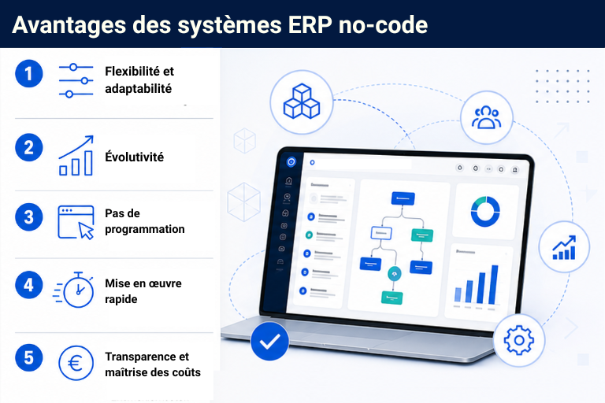

## Moderne et flexible : ce que doit offrir un système ERP adapté aux petites et moyennes entreprises

Un système ERP destiné aux petites et moyennes entreprises constitue la colonne vertébrale numérique de l’ensemble de l’entreprise. Cependant, les systèmes traditionnels ont été conçus pour des processus stables, et non pour des ajustements agiles et des flux de travail dynamiques. De plus, ces systèmes répondent souvent aux besoins des grandes entreprises dotées de services informatiques bien équipés qui se chargent de l’administration. Les PME, en particulier, doivent être en mesure de réagir avec agilité dans un environnement de marché en constante évolution et face à une concurrence de plus en plus féroce. En tant que système ERP destiné aux petites entreprises disposant de ressources informatiques limitées ou aux PME, **les solutions traditionnelles sont souvent trop rigides, trop lourdes et fréquemment trop coûteuses**.

Cependant, le marché évolue depuis plusieurs années et il existe désormais **des alternatives modernes et flexibles**. Grâce aux [solutions no-code et low-code](), même les entreprises ne disposant pas d’une grande équipe informatique peuvent créer elles-mêmes des systèmes ERP sur mesure. Les employés des services opérationnels, appelés [développeurs citoyens](), peuvent **mettre en place de nouveaux processus et effectuer des ajustements de manière autonome**. Et il y a un autre avantage : les coûts d’acquisition de votre système ERP diminuent considérablement avec les solutions no-code et low-code.

### Faits marquants :

*   Aujourd’hui, les PME ont besoin de systèmes ERP flexibles et évolutifs.
 
*   Les outils no-code et low-code permettent aux PME de créer leurs propres systèmes ERP sans avoir recours à des développeurs externes ni à un service informatique important.
 
*  Avec un générateur d’ERP no-code comme SeaTable, vous pouvez créer votre propre système ERP en quelques étapes seulement.
 
*  Une planification et une analyse approfondies de vos propres processus et besoins sont essentielles pour choisir le bon outil no-code.
 

## Cloud ou sur site ? Quel est le meilleur choix pour votre entreprise ?

De nos jours, le choix du modèle de déploiement approprié est toujours une question clé lors de la sélection de nouvelles solutions logicielles. Et même si vous souhaitez créer votre ERP à l’aide d’[outils no-code](), certains fournisseurs vous permettent de choisir entre des solutions cloud et une installation sur site. Les deux options présentent des avantages, et celle qui convient le mieux à votre entreprise dépend principalement de vos besoins spécifiques. Examinons de plus près les avantages et les inconvénients de ces deux options ci-dessous.

### Logiciel ERP dans le cloud : flexible, évolutif, rapide

Un système ERP dans le cloud se distingue principalement par ses faibles coûts initiaux, sa mise en œuvre rapide et ses mises à jour automatiques. Le fournisseur gère l’ensemble de l’infrastructure et se charge de la maintenance, ce qui vous permet de concentrer vos ressources uniquement sur votre cœur de métier.

De plus, de nombreuses solutions cloud peuvent être **facilement évolutives et adaptées de manière flexible** à mesure que l’entreprise se développe, sans nécessiter une refonte complète du système.

En particulier, la suppression des coûts informatiques récurrents est un avantage souvent sous-estimé. En effet, de nombreuses entreprises, notamment les entreprises individuelles et les petites entreprises, se concentrent principalement sur l’effort de mise en œuvre lorsqu’elles choisissent un système ERP. Cependant, pour une intégration transparente avec leurs piles d’outils, des interfaces API ou des webhooks doivent être configurés, et des mises à jour de sécurité régulières doivent être installées.

**Les avantages d’un système ERP dans le cloud :**

*   Aucun coût lié à vos propres serveurs ou à la maintenance du système
 
*   Mises à jour automatiques et assistance fournie par le fournisseur
 
*   Évolutivité aisée à mesure que l'entreprise se développe
 

### ERP sur site : contrôle maximal

Une installation traditionnelle sur site offre avant tout un **contrôle maximal des données** et, du moins avec les solutions open source ou open-core, des options de personnalisation et de branding plus poussées qu'une solution cloud. Ce type de déploiement est donc particulièrement adapté aux entreprises soumises à des exigences de conformité strictes, comme les systèmes ERP du [secteur public]() ou dans des secteurs hautement réglementés tels que la santé. Cependant, ces avantages ont un coût : les dépenses peuvent être plus élevées, des ressources informatiques internes sont nécessaires et les mises à jour doivent être effectuées en interne.

**Les avantages d’une solution sur site :**

*   Contrôle maximal des données
 
*   Compatible même avec les exigences de conformité les plus strictes
 
*   Plus d’options de personnalisation et de branding
 

## Développer un système ERP avec une approche no-code ou low-code? Les avantages pour les PME

Selon une étude de Gartner, d’ici 2024, 65 % de tout le développement d’applications impliquera déjà le no-code ou le low-code, et cette tendance est à la hausse. Cette tendance est également évidente dans les systèmes ERP destinés aux petites et moyennes entreprises. Mais que signifient exactement les termes no-code et low-code?

### Que sont les applications no-code et low-code?

Grâce aux outils no-code, les utilisateurs peuvent développer **des solutions personnalisées sans connaissances en programmation** ni avoir à écrire de code. Ces systèmes proposent soit une interface utilisateur visuelle où les éléments souhaités sont placés par glisser-déposer, soit une **structure de base de données personnalisable** avec une interface tabulaire. Certains fournisseurs, tels que SeaTable, proposent une combinaison des deux, avec une [base de données relationnelle]() sous forme de tableau et un [App Builder]() visuel. Un outil est qualifié d’outil low-codelorsque les plateformes no-code peuvent être complétées par du code personnalisé selon les besoins.

### Aperçu des avantages stratégiques de l’ERP no-code

La principale différence par rapport aux projets ERP traditionnels réside dans la rapidité et l’autonomie que vous gagnent grâce aux outils no-code. Alors que les systèmes traditionnels ne permettaient aucune personnalisation ou nécessitaient des projets de plusieurs mois pour y parvenir, un collaborateur compétent de votre service opérationnel peut accomplir la même tâche en quelques heures seulement.

*   **Flexibilité et adaptabilité** : vos services opérationnels peuvent étendre et modifier de manière autonome leurs processus et workflows respectifs sans avoir à attendre l’assistance informatique ou des prestataires de services externes.
 
*   **Automatisation des processus sans effort de développement** : l’automatisation intégrée permet des flux de travail allégés et automatisés pour les processus récurrents de maintenance des données ou les notifications automatiques.
 
*   **Mise en œuvre rapide et retour sur investissement rapide** : au lieu de plusieurs mois, un système ERP no-code est opérationnel en quelques semaines seulement. Les modifications sont mises en œuvre de manière itérative pendant les opérations en cours, sans interruption du système.
 
*   **Maîtrise des coûts** : grâce à un générateur d’ERP no-code, vous réalisez des économies sur les coûts liés aux développeurs et consultants externes. La transparence des frais d’utilisation permet une planification des coûts plus fiable que les budgets de projet fluctuants.
 
*   **Évolutivité au fur et à mesure de la croissance de votre entreprise** : les systèmes no-code comme SeaTable s’adaptent à votre entreprise sans coûts supplémentaires liés à des packs de données supplémentaires, à des limites de données rigides ou à des modules complémentaires. Les structures d’autorisations peuvent être personnalisées en détail, et de nouvelles licences peuvent être ajoutées à mesure que les équipes s’agrandissent.
 

## L’ERP no-code en pratique : comment créer un système ERP avec SeaTable

La configuration du système ERP suivante avec SeaTable montre à quel point il est facile de créer un système ERP personnalisé et flexible pour les entreprises individuelles et les PME à l’aide de solutions no-code et à faible code. Cependant, le terme « simple » ne doit pas être assimilé à « rapide » ou « facile ». Contrairement aux [idées reçues courantes](), un système ERP no-code robuste, comme tous les projets logiciels et applicatifs, nécessite une analyse et une planification minutieuses.

### Étape 1 : Analyse des processus

Cette étape est essentielle pour toute migration vers un système ERP afin de créer un cahier des charges solide. Cependant, avec les solutions no-code, vous devez procéder avec encore plus de prudence à ce stade, car contrairement aux solutions SaaS standard, vous n’avez pas à adapter vos processus au cadre prédéfini du système dans un outil no-code. Au contraire, vous pouvez construire votre système ERP pour qu’il s’adapte à vos processus — et vous devez donc en avoir une compréhension précise au préalable. 

### Étape 2 : Définir la structure des données

Définissez maintenant votre structure de données. Dans SeaTable, vous créez des tableaux qui représentent vos domaines d'activité. Vous pouvez créer autant de tableaux que vous le souhaitez au sein d'une base et les relier entre eux. Un système ERP simple destiné aux petites entreprises pourrait, par exemple, se composer de tableaux pour les clients, les fournisseurs, les produits, les commandes, les stocks et les factures. Ces liens créent un **modèle de données cohérent**. Pour vous aider à démarrer avec votre ERP, SeaTable propose divers modèles que vous pouvez étendre et personnaliser de manière flexible.

### Étape 3 : Configurer le module CRM

Une table reliée pour les contacts, l’historique des communications, le statut des devis et la segmentation de la clientèle suffit souvent comme base CRM. Si vous souhaitez cartographier des données CRM structurées de manière plus granulaire, SeaTable propose divers modèles, dont un pour un [outil CRM](), qui peut être facilement intégré à votre ERP.

### Étape 4 : Intégrer la gestion des stocks

Les tableaux de produits et de stocks avec **calculs automatisés des stocks** constituent la base de votre gestion des stocks. Les liens vers les données de commande issues de vos tableaux CRM vous garantissent de toujours travailler avec des données en temps réel. SeaTable propose également un modèle pour la [gestion d'entrepôt]() et le contrôle des stocks.

### Étape 5 : Gestion des achats et des commandes

Pour cartographier votre processus d’achat de manière transparente et efficace, il est préférable d’utiliser les **formulaires intégrés** de SeaTable. Cela permet à vos employés de soumettre facilement des commandes ou des demandes, et de nouvelles entrées sont automatiquement créées dans votre tableau. 

### Étape 6 : Automatisations

Les [automatisations intégrées basées sur l'IA]() de SeaTable remplacent les tâches routinières manuelles. Envoyez automatiquement des rappels de paiement par e-mail, informez immédiatement les clients des changements de statut ou générez des alertes de stock dès que les niveaux de stock tombent en dessous des minimums définis. Dans SeaTable, cela s’effectue à l’aide d’un **éditeur d’automatisation intuitif**.

### Étape 7 : Tableaux de bord de reporting et portails en libre-service

Grâce à l’App Builder intégré de SeaTables, vous pouvez créer des tableaux de bord en temps réel attrayants présentant des aperçus des ventes, des postes non soldés, les niveaux de stock ou la rotation des stocks. De plus, vous pouvez créer des **portails en libre-service basés sur les rôles** : les employés, les clients ou les fournisseurs bénéficient d’un accès ciblé aux données qui les concernent précisément via une interface d’application personnalisée, **sans avoir à connaître la structure de la base de données sous-jacente**.

### Étape 8 : Intégration et migration des données

Grâce à l’**API SeaTable et aux intégrations natives** — par exemple, pour les clients de messagerie ou Google Agenda —, vous pouvez connecter des systèmes existants tels que des plateformes de commerce électronique, des logiciels de comptabilité, des prestataires de paiement externes ou des systèmes de commande fournisseurs directement à votre ERP. Vous pouvez facilement migrer les données existantes via une exportation CSV ou via l’API. Cela garantit que la **migration de votre système ERP se déroule sans heurts, sans perte de données ni interruption de service**.



## Comparaison de 6 créateurs d'ERP no-code

Le marché des systèmes ERP no-code destinés aux petites et moyennes entreprises ainsi qu'aux entreprises individuelles a connu une croissance significative ces dernières années. Les PME ont ainsi la chance de pouvoir choisir parmi un large éventail de fournisseurs compétents. Il vaut la peine d’y regarder de plus près, car les **différences en matière de flexibilité, de prix, d’évolutivité, de protection des données et de convivialité sont parfois substantielles**. Nous vous présentons ci-dessous brièvement les six principaux fournisseurs.

*   **SeaTable** : SeaTable est une [solution IA no-code]() basée en Allemagne, développée spécifiquement **pour les entreprises très soucieuses de la protection des données et ayant des exigences de processus complexes**. Les tableaux, formulaires, workflows et tableaux de bord peuvent être configurés de manière entièrement visuelle ; des interfaces API ouvertes permettent l’intégration d’outils existants. SeaTable propose à la fois un **cloud conforme au RGPD** avec un centre de données allemand et une **option d’auto-hébergement**. Le modèle tarifaire repose sur une licence mensuelle par utilisateur, sans modules complémentaires, plugins payants ni forfaits de données. Cela rend SeaTable facilement évolutif. Un autre atout est le **générateur d’applications intégré** de SeaTable, qui permet de créer des applications et des interfaces utilisateur conviviales.
 
*   **Ninox** : Ninox est une plateforme de base de données low-code également développée en Allemagne. Des **modèles de données relationnelles complexes et une logique métier personnalisée** peuvent être mis en œuvre à l’aide d’un langage de script propriétaire, bien que cela nécessite au moins des **connaissances de base en programmation**. Ninox propose également des options cloud et d’auto-hébergement en Allemagne, mais ne fournit pas de version sur site gratuite.
 
*   **Airtable** : La solution no-code Airtable se distingue par sa convivialité et sa vaste bibliothèque de modèles. Pour les entreprises soumises aux exigences du RGPD, Airtable mérite toutefois une attention particulière : en tant que **fournisseur basé aux États-Unis** ne proposant pas d’option d’auto-hébergement, toutes les données sont stockées sur des serveurs américains. De plus, Airtable est **relativement plus cher** que d’autres fournisseurs et ne propose qu’une version gratuite limitée.
      
*   **Adalo** : Adalo permet la création visuelle d’applications mobiles et web natives et convient aux applications simples, axées sur les données. Pour les processus ERP complexes impliquant une automatisation poussée et de grands ensembles de données, **la plateforme atteint toutefois ses limites**. Adalo doit être considéré davantage comme une **solution d’entrée de gamme** pour les entrepreneurs individuels que comme un générateur d’ERP no-code à part entière.
    
*   **AppMaster** : AppMaster génère du code backend réel à partir de modèles visuels, ce qui permet des architectures nettement plus complexes que les outils no-code purs. La plateforme est particulièrement adaptée **aux PME disposant de ressources techniques** qui souhaitent développer un système ERP évolutif et personnalisé. Cependant, son prix nettement plus élevé et sa courbe d’apprentissage plus raide rendent AppMaster **peu attractif pour les débutants et les entreprises aux ressources informatiques limitées**.
    
*   **Xentral** : À proprement parler, Xentral n’est pas un générateur d’ERP gratuit, mais un **système ERP no-code, modulaire et extensible** destiné au commerce de détail, au commerce électronique et à l’industrie manufacturière. Son atout réside dans sa disponibilité immédiate et sa large couverture fonctionnelle ; son point faible est sa **flexibilité moindre** lorsqu’il s’agit de processus spécifiques à l’entreprise. Pour les PME qui préfèrent adapter leurs processus au système plutôt que l'inverse, Xentral constitue un choix solide. En comparaison, Xentral est également **nettement plus cher** et **ne propose pas de solution sur site**. 

| | **Flex.** | **UX** | **RGPD** | **Prix/mois** | **Gratuite ?** | **Auto-hébergement** |
| ------ | --------------------- | --------------------- | ----------- | --------- | -------| --- |
| **SeaTable**  | 5/5 | 5/5 | 5/5 | dès 7 €/utilisateur |  |  |
| **Ninox**     | 4/5 | 4/5 | 5/5 | dès 25 €/utilisateur |  |  |
| **Airtable**  | 4/5 | 5/5 | 2/5 | dès env. 17 €/utilisateur |  |  | 
| **Adalo**     | 3/5 | 4/5 | 3/5 | dès env. 30 €/utilisateur |  |  |
| **AppMaster** | 5/5 | 3/5 | 3/5 | dès env. 166 € |  |  (Entreprise) |
| **Xentral**   | 3/5 | 3/5 | 5/5 | dès env. 99 € |  |  |

## Conclusion

Il n’existe pas de système ERP idéal pour les petites et moyennes entreprises. Celui-ci ne peut être créé qu’à travers la combinaison adéquate d’une plateforme, d’un modèle de déploiement et de la représentation la plus précise des processus propres à l’entreprise. Il y a encore quelques années, les entreprises devaient soit développer leurs propres systèmes à grands frais, soit adapter leurs processus à des solutions logicielles rigides. Grâce aux outils no-code et low-code, la situation a toutefois radicalement changé.

Aujourd’hui, même en tant que petite ou moyenne entreprise, vous pouvez créer, personnaliser et faire évoluer vous-même des solutions ERP sur mesure. Cela vous permet de réagir plus rapidement à l’évolution des conditions du marché et des exigences des clients, et de **gagner un avantage sur vos concurrents**.

**SeaTable** offre un point d’entrée particulièrement accessible : sous la forme d’une solution IA no-code conforme au RGPD dans le cloud ou d’une solution auto-hébergée garantissant un contrôle total des données. Ceux qui souhaitent prendre en main la transformation numérique de leur entreprise trouveront ici une **base puissante, flexible et évolutive**.

## FAQ – Système ERP no-code pour les petites et moyennes entreprises

 Les générateurs d'ERP no-code fonctionnent sans qu'il soit nécessaire d'écrire du code. Toutes les personnalisations s'effectuent via des structures de tableaux ou des éditeurs visuels de type glisser-déposer. Le low-code complète les solutions no-code en offrant la possibilité d'intégrer du code personnalisé si nécessaire. L'expérience montre qu'une approche no-code est tout à fait suffisante pour la plupart des systèmes ERP destinés aux petites et moyennes entreprises.


 Cela dépend du fournisseur. Si une protection solide des données est importante pour vous, vous devriez absolument examiner ce point très attentivement. SeaTable, par exemple, est une solution entièrement conforme au RGPD. Toutes les données de l'entreprise et du cloud sont hébergées sur des serveurs appartenant au fournisseur suisse Exoscale à Francfort (Allemagne), tandis que SeaTable AI est hébergé sur des serveurs appartenant au fournisseur allemand Hetzner. SeaTable propose également une solution sur site pour un contrôle maximal.


 Une fois votre analyse des processus terminée, vous pouvez mettre en place un système ERP simple pour les petites entreprises en quelques jours ou quelques semaines. Les systèmes plus complexes, comportant plusieurs tables et liens, des workflows automatisés et des intégrations d'API, peuvent prendre quelques semaines, voire quelques mois. 


 Oui, en principe. Cependant, dans certains cas spécifiques ou dans des secteurs fortement réglementés, les solutions purement no-code peuvent atteindre leurs limites. Dans de tels cas, une approche low-code est recommandée, laquelle peut être facilement mise en œuvre dans SeaTable grâce à des scripts intégrés. 


 Oui, si vous changez de système ERP et devez intégrer le nouveau système à d'autres outils existants, le no-code est en réalité un excellent choix. La plupart des outils no-code modernes, tels que SeaTable, offrent des interfaces API puissantes et des intégrations natives. 


 Oui, des solutions telles que SeaTable conviennent également comme systèmes ERP dans le secteur public et peuvent cartographier des procédures de demande structurées, des workflows d'approbation en plusieurs étapes et la planification des ressources dans un contexte gouvernemental. Cela nécessite une option d'auto-hébergement et une conformité avérée au RGPD, car les organismes publics sont souvent tenus de stocker les données en interne.
