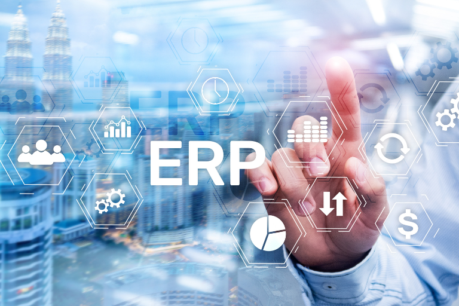
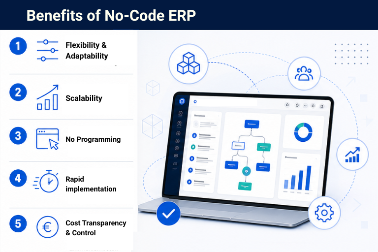

## Moderno e flexível: o que o sistema ERP adequado para pequenas e médias empresas deve oferecer

Um sistema ERP para pequenas e médias empresas funciona como a espinha dorsal digital de toda a empresa. No entanto, os sistemas tradicionais foram concebidos para processos estáveis, e não para ajustes ágeis e fluxos de trabalho dinâmicos. Além disso, esses sistemas atendem frequentemente às necessidades de grandes empresas com departamentos de TI bem dotados de recursos que se encarregam da administração. As PME, em particular, precisam de ser capazes de reagir com agilidade num ambiente de mercado em constante mudança e numa concorrência cada vez mais acirrada. Como sistema ERP para pequenas empresas com recursos de TI limitados ou para PME, **as soluções tradicionais são frequentemente demasiado inflexíveis, demasiado complexas e, muitas vezes, demasiado caras**.

No entanto, o mercado tem vindo a mudar há vários anos e existem agora **alternativas modernas e flexíveis**. Com [soluções no-code e low-code](), mesmo as empresas sem uma grande equipa de TI podem criar elas próprias sistemas ERP personalizados. Os colaboradores dos departamentos de linha de negócio, conhecidos como [desenvolvedores cidadãos](), podem **configurar novos processos e fazer ajustes de forma independente**. E há outra vantagem: os custos de aquisição do seu sistema ERP diminuem significativamente com as soluções no-code/low-code.

### Factos-chave:

*   Atualmente, as PME necessitam de sistemas ERP flexíveis e escaláveis.
 
*   As ferramentas no-code e de low-code permitem que as PME criem os seus próprios sistemas ERP sem recorrer a programadores externos ou a um grande departamento de TI.
 
*   Com um construtor de ERP no-code como o SeaTable, pode criar o seu próprio sistema ERP em apenas alguns passos.
    
*  Um planeamento e uma análise minuciosos dos seus próprios processos e requisitos são cruciais para escolher a ferramenta no-code certa.
 

## Na nuvem ou no local? Qual é a melhor escolha para a sua empresa

Uma questão fundamental na seleção de novas soluções de software hoje em dia é sempre a escolha do modelo de implementação certo. E mesmo que pretenda criar o seu ERP com [ferramentas no-code](), alguns fornecedores permitem-lhe escolher entre soluções na nuvem e uma instalação local. Ambas as opções têm as suas vantagens, e o que funciona melhor para a sua empresa depende principalmente dos seus requisitos específicos. Vamos analisar mais detalhadamente as vantagens e desvantagens de ambas as opções abaixo.

### Software ERP na nuvem: flexível, escalável, rápido

Um sistema ERP na nuvem destaca-se principalmente pelos seus baixos custos iniciais, implementação rápida e atualizações automáticas. O fornecedor gere toda a infraestrutura e encarrega-se da manutenção, permitindo-lhe concentrar os seus recursos exclusivamente no seu negócio principal.

Além disso, muitas soluções na nuvem podem ser **facilmente escaladas e adaptadas de forma flexível** à medida que a empresa cresce, sem exigir uma reformulação completa do sistema.

Em particular, a eliminação dos custos contínuos de TI é uma vantagem frequentemente subestimada. Isto porque muitas empresas, especialmente empresas unipessoais e pequenas empresas, concentram-se principalmente no esforço de implementação ao escolherem um sistema ERP. No entanto, para uma integração perfeita com o seu conjunto de ferramentas, é necessário configurar interfaces API ou webhooks, e instalar atualizações de segurança regulares.

**As vantagens de um sistema ERP na nuvem:**

*   Sem custos com servidores próprios ou manutenção do sistema
 
*   Atualizações automáticas e suporte do fornecedor
 
*   Fácil escalabilidade à medida que o negócio cresce
 

### ERP no local: controlo máximo

Uma instalação tradicional no local oferece, acima de tudo, **controlo máximo dos dados** e — pelo menos com soluções de código aberto ou open-core — opções de personalização e branding mais aprofundadas do que uma solução na nuvem. Esta implementação é, por isso, particularmente adequada para empresas com requisitos de conformidade rigorosos, tais como sistemas ERP no [setor público]() ou em setores altamente regulamentados, como os cuidados de saúde. No entanto, estas vantagens têm um preço: os custos podem ser mais elevados, são necessários recursos de TI internos e as atualizações têm de ser realizadas internamente.

**As vantagens de uma solução no local:**

*   Controlo máximo dos dados
 
*   Viável mesmo com os requisitos de conformidade mais rigorosos
 
*   Mais opções de personalização e branding
 

## Construir um sistema ERP com No-Code ou Low-Code? Os benefícios para as PME

De acordo com um estudo da Gartner, até 2024, 65% de todo o desenvolvimento de aplicações já envolverá No-Code ou Low-Code, com a tendência em ascensão. Esta tendência é também evidente nos sistemas ERP para pequenas e médias empresas. Mas o que significam exatamente No-Code e Low-Code?

### O que são aplicações no-code e com low-code

Com ferramentas no-code, os utilizadores podem desenvolver **soluções personalizadas sem conhecimentos de programação** ou sem ter de escrever código. Esses sistemas oferecem uma interface de utilizador visual, na qual os elementos desejados são colocados através de arrastar e largar, ou baseiam-se numa **estrutura de base de dados personalizável** com uma interface tabular. Alguns fornecedores, como a SeaTable, oferecem uma combinação de ambos, com uma [base de dados relacional]() na forma de tabela e um [App Builder]() visual. Uma ferramenta é designada como ferramenta de low-code quando as plataformas no-code podem ser complementadas com código personalizado, conforme necessário.

### Vantagens estratégicas do ERP no-code num relance

A principal diferença em relação aos projetos de ERP tradicionais reside na velocidade e autonomia que obtém através das ferramentas no-code. Enquanto os sistemas tradicionais ou não permitiam qualquer personalização ou exigiam projetos com duração de meses para o fazer, um colaborador qualificado do seu departamento de negócios pode concluir a mesma tarefa em apenas algumas horas.

*   **Flexibilidade e adaptabilidade**: Os seus departamentos de negócios podem expandir e modificar de forma independente os seus respetivos processos e fluxos de trabalho sem terem de esperar pelo apoio de TI ou por prestadores de serviços externos.
 
*   **Automação de processos sem esforço de desenvolvimento**: A automação integrada permite fluxos de trabalho enxutos e automatizados para processos recorrentes de manutenção de dados ou notificações automáticas.
 
*   **Implementação rápida e curto tempo de retorno**: Em vez de meses, um sistema ERP no-code fica operacional em apenas algumas semanas. As alterações são implementadas de forma iterativa durante as operações em curso, sem tempo de inatividade do sistema.
 
*   **Controlo de custos**: Com um construtor de ERP no-code, poupa nos custos com programadores e consultores externos. As taxas de utilização transparentes permitem um planeamento de custos mais fiável do que orçamentos de projeto flutuantes.
 
*   **Escalabilidade à medida que o seu negócio cresce**: Sistemas no-code, como o SeaTable, adaptam-se ao seu negócio sem custos adicionais com pacotes de dados, limites rígidos de dados ou complementos. As estruturas de permissões podem ser personalizadas em detalhe e novas licenças podem ser adicionadas à medida que as equipas crescem.
 

## ERP no-code na prática: como construir um sistema ERP com o SeaTable

A seguinte configuração de sistema ERP com o SeaTable demonstra a facilidade com que pode criar um sistema ERP personalizado e flexível para empresas individuais e PME utilizando soluções no-code e de low-code. No entanto, *simples* aqui não deve ser equiparado a *rápido* ou *fácil*. Ao contrário de [equívocos comuns](), um sistema ERP no-code robusto, tal como todos os projetos de software e aplicações, requer uma análise e um planeamento cuidadosos.

### Passo 1: Análise de Processos

Este passo é essencial para qualquer migração de sistema ERP, a fim de criar uma especificação de requisitos robusta. No entanto, com soluções no-code, deve proceder com ainda mais cuidado nesta fase, porque, ao contrário das soluções SaaS padrão, não tem de adaptar os seus processos à estrutura predefinida do sistema numa ferramenta no-code. Pelo contrário, pode construir o seu sistema ERP de forma a adequá-lo aos seus processos — e deve, por isso, ter uma compreensão precisa dos mesmos antecipadamente. 

### Passo 2: Definir a Estrutura de Dados

Defina agora a sua estrutura de dados. No SeaTable, cria-se tabelas que representam as suas áreas de negócio. Pode criar quantas tabelas desejar dentro de uma base e ligá-las entre si. Um sistema ERP simples para pequenas empresas poderia, por exemplo, consistir em tabelas para Clientes, Fornecedores, Produtos, Encomendas, Inventário e Faturas. Estas ligações criam um **modelo de dados consistente**. Como ponto de partida para o seu ERP, o SeaTable oferece vários modelos que pode expandir e personalizar de forma flexível.

### Passo 3: Configure o módulo CRM

Uma tabela interligada para contactos, histórico de comunicação, estado de orçamentos e segmentação de clientes é frequentemente suficiente como base de CRM. Se pretender mapear dados de CRM com uma estrutura mais granular, o SeaTable oferece vários modelos, incluindo um para uma [ferramenta de CRM](), que pode ser facilmente integrado no seu ERP.

### Passo 4: Integrar a gestão de inventário

As tabelas de produtos e inventário com **cálculos de stock automatizados** constituem a base da sua gestão de inventário. As ligações aos dados de encomendas a partir das suas tabelas de CRM garantem que trabalha sempre com dados em tempo real. O SeaTable também oferece um modelo para [gestão de armazém]() e controlo de inventário.

### Passo 5: Gestão de compras e encomendas

Para mapear o seu processo de compras de forma transparente e eficiente, é melhor utilizar **formulários integrados** no SeaTable. Isto permite que os seus colaboradores submetam facilmente encomendas ou pedidos, e novas entradas são criadas automaticamente na sua tabela. 

### Passo 6: Automatizações

As [automatizações integradas com tecnologia de IA]() do SeaTable substituem as tarefas rotineiras manuais. Envie automaticamente lembretes de pagamento por e-mail, notifique os clientes imediatamente sobre alterações de estado ou gere alertas de inventário assim que os níveis de stock caírem abaixo dos mínimos definidos. No SeaTable, isto é feito utilizando um **editor de automatização intuitivo**.

### Passo 7: Painéis de relatórios e portais de autoatendimento

Com o App Builder integrado do SeaTable, pode criar painéis envolventes em tempo real com visões gerais de vendas, itens em aberto, níveis de inventário ou rotação de inventário. Além disso, pode criar **portais de autoatendimento baseados em funções**: Colaboradores, clientes ou fornecedores obtêm acesso direcionado exatamente aos dados que lhes são relevantes através de uma interface de aplicação personalizada — **sem terem acesso à estrutura subjacente da base de dados**.

### Passo 8: Integração e migração de dados

Utilizando a **API do SeaTables e integrações nativas** — por exemplo, para clientes de e-mail ou o Google Calendar — pode ligar sistemas existentes, tais como plataformas de comércio eletrónico, software de contabilidade, prestadores de serviços de pagamento externos ou sistemas de encomendas de fornecedores, diretamente ao seu ERP. Pode migrar facilmente os dados existentes através da exportação em CSV ou da API. Isto garante que a **migração do seu sistema ERP decorre sem problemas, sem perda de dados nem tempo de inatividade do sistema**.



## Comparação de 6 criadores de ERP no-code

O mercado de sistemas ERP no-code para pequenas e médias empresas e empresas unipessoais cresceu significativamente nos últimos anos. Como resultado, as PME encontram-se na posição privilegiada de poderem escolher entre uma vasta gama de fornecedores competentes. Vale a pena analisar esta questão mais de perto, uma vez que as **diferenças em termos de flexibilidade, preço, escalabilidade, proteção de dados e facilidade de utilização são, por vezes, substanciais**. A seguir, apresentamos brevemente os seis fornecedores mais importantes.

*   **SeaTable**: O SeaTable é uma [solução de IA no-code]() sediada na Alemanha, desenvolvida especificamente **para empresas com um elevado nível de consciência em matéria de proteção de dados e requisitos de processos complexos**. Tabelas, formulários, fluxos de trabalho e painéis podem ser configurados inteiramente de forma visual; interfaces API abertas permitem a integração de ferramentas existentes. O SeaTable oferece tanto uma **nuvem em conformidade com o RGPD** com um centro de dados alemão como uma **opção de auto-hospedagem**. O modelo de preços baseia-se numa licença mensal por utilizador, sem complementos, plugins pagos ou pacotes de dados. Isto torna o SeaTable facilmente escalável. Outra vantagem é o **App Builder integrado** do SeaTable para aplicações e interfaces de utilizador intuitivas.
 
*   **Ninox**: O Ninox é uma plataforma de base de dados de low-code também desenvolvida na Alemanha. **Modelos de dados relacionais complexos e lógica de negócio personalizada** podem ser implementados utilizando uma linguagem de script proprietária, embora isto exija, no mínimo, **conhecimentos básicos de programação**. O Ninox também oferece opções baseadas na nuvem e de auto-hospedagem na Alemanha, mas não disponibiliza uma versão local gratuita.
 
*   **Airtable**: A solução no-code Airtable destaca-se pela sua facilidade de utilização e pela extensa biblioteca de modelos. Para empresas com requisitos do RGPD, no entanto, a Airtable merece uma análise crítica: como **fornecedor sediado nos EUA** sem opção de auto-hospedagem, todos os dados são armazenados em servidores nos EUA. Além disso, a Airtable é **relativamente mais cara** do que outros fornecedores e oferece apenas uma versão gratuita limitada.
      
*   **Adalo**: O Adalo permite a criação visual de aplicações móveis e web nativas e é adequado para aplicações simples e orientadas por dados. Para processos ERP complexos com automatização extensiva e grandes conjuntos de dados, **no entanto, a plataforma atinge os seus limites**. O Adalo deve ser visto mais como uma **solução de nível básico** para empresários em nome individual do que como um construtor de ERP no-code completo.
    
*   **AppMaster**: O AppMaster gera código backend real a partir de modelos visuais, permitindo arquiteturas significativamente mais complexas do que as ferramentas no-code puras. A plataforma é particularmente adequada **para PME com recursos técnicos** que pretendam construir um sistema ERP escalável e personalizado. No entanto, o preço significativamente mais elevado e a curva de aprendizagem mais acentuada tornam o AppMaster **pouco atraente para principiantes e empresas com recursos de TI limitados**.
    
*   **Xentral**: Em sentido estrito, o Xentral não é um construtor de ERP gratuito, mas sim um **sistema ERP modular e expansível no-code** para o retalho, o comércio eletrónico e a indústria transformadora. O seu ponto forte reside na disponibilidade imediata para utilização com uma ampla cobertura funcional; o seu ponto fraco é a **menor flexibilidade** no que diz respeito a processos específicos da empresa. Para as PME que preferem alinhar os seus processos com o sistema, em vez do contrário, o Xentral é uma escolha sólida. Em comparação, o Xentral é também **significativamente mais caro** e **não oferece uma solução no local**. 

| | **Flex.** | **UX** | **RGPD** | **Preço/Mês** | **Plano gratuito?** | **Auto-hospedagem** |
| ------ | --------------------- | --------------------- | ----------- | --------- | -------| --- |
| **SeaTable**  | 5/5 | 5/5 | 5/5 | desde 7 € por utilizador |  |  |
| **Ninox**     | 4/5 | 4/5 | 5/5 | desde 25 € por utilizador |  |  |
| **Airtable**  | 4/5 | 5/5 | 2/5 | desde aprox. 17 € por utilizador |  |  | 
| **Adalo**     | 3/5 | 4/5 | 3/5 | desde aprox. 30 € por utilizador |  |  |
| **AppMaster** | 5/5 | 3/5 | 3/5 | desde aprox. 166 € |  |  (Enterprise) |
| **Xentral**   | 3/5 | 3/5 | 5/5 | desde aprox. 99 € |  |  |

## Conclusão

Não existe um sistema ERP ideal para pequenas e médias empresas. Este só é criado através da combinação certa entre plataforma, modelo de implementação e a representação mais precisa dos processos próprios da empresa. Ainda há poucos anos, as empresas tinham de desenvolver os seus próprios sistemas a um custo elevado ou adaptar os seus processos a soluções de sistema rígidas. Graças às ferramentas no-code e low-code, no entanto, a situação mudou radicalmente.

Hoje, mesmo sendo uma pequena ou média empresa, pode criar, personalizar e escalar soluções ERP à medida por si próprio. Isto permite-lhe responder mais rapidamente às condições de mercado em constante mudança e aos requisitos dos clientes, bem como **obter uma vantagem sobre os seus concorrentes**.

O **SeaTable** oferece um ponto de entrada com barreiras particularmente baixas: como uma solução de IA no-code em conformidade com o RGPD na nuvem ou como uma solução auto-hospedada que garante controlo total dos dados. Quem quiser assumir o controlo da transformação digital do seu negócio encontrará aqui uma **base poderosa, flexível e escalável**.

## Perguntas frequentes – Sistema ERP no-code para pequenas e médias empresas

 Os criadores de ERP no-code funcionam sem a necessidade de escrever código. Todas as personalizações são realizadas através de estruturas de tabelas ou editores visuais de arrastar e largar. O low-code complementa as soluções no-code com a opção de integrar código personalizado, conforme necessário. A experiência mostra que uma abordagem no-code é inteiramente suficiente para a maioria dos sistemas ERP destinados a pequenas e médias empresas.


 Isso depende do fornecedor. Se uma forte proteção de dados é importante para si, deve, sem dúvida, analisar este ponto com muito cuidado. O SeaTable, por exemplo, é uma solução totalmente em conformidade com o RGPD. Todos os dados da empresa e da nuvem são alojados em servidores pertencentes ao fornecedor suíço Exoscale em Frankfurt (Alemanha), enquanto o SeaTable AI é alojado em servidores pertencentes ao fornecedor alemão Hetzner. Em alternativa, o SeaTable também oferece uma solução no local para um controlo máximo.


 Assim que a sua análise de processos estiver concluída, pode configurar um sistema ERP simples para pequenas empresas numa questão de dias ou semanas. Sistemas mais abrangentes, com várias tabelas e ligações, fluxos de trabalho automatizados e integrações de API, podem demorar algumas semanas ou mesmo alguns meses. 


 Sim, em princípio. No entanto, em casos específicos ou em setores altamente regulamentados, as soluções puramente no-code podem atingir os seus limites. Para esses casos, recomenda-se uma abordagem de low-code, que pode ser facilmente implementada no SeaTable graças a scripts integrados. 


 Sim, se estiver a mudar de sistema ERP e precisar de integrar o novo sistema com outras ferramentas existentes, então o no-code é, na verdade, uma excelente escolha. A maioria das ferramentas no-code modernas, como o SeaTable, oferece interfaces API poderosas e integrações nativas. 


 Sim, soluções como o SeaTable também são adequadas como sistemas ERP no setor público e podem mapear procedimentos de candidatura estruturados, fluxos de trabalho de aprovação em várias etapas e planeamento de recursos num contexto governamental. Isto requer uma opção de auto-hospedagem e conformidade comprovada com o RGPD, uma vez que as agências públicas são frequentemente obrigadas a armazenar dados internamente.
