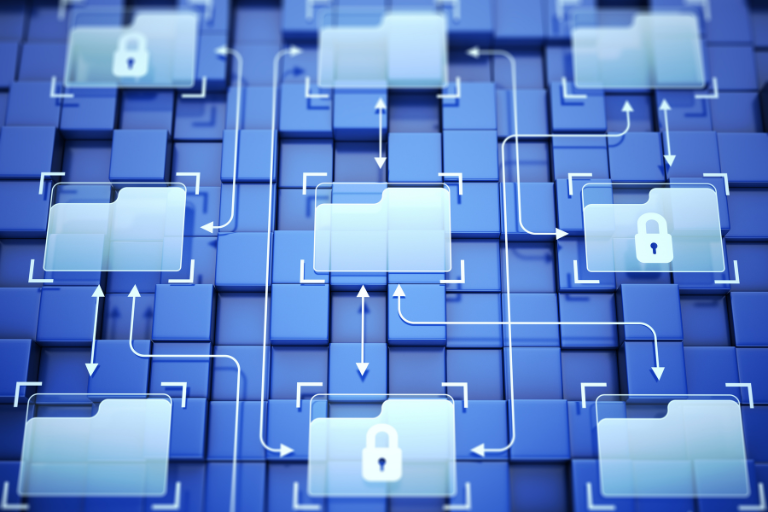

## Aplicações «no-code» escaláveis: moda passageira ou realidade?

Será que os sistemas «no-code» conseguem realmente escalar infinitamente dentro de uma empresa? A maioria dos fornecedores de plataformas «no-code» — incluindo nós, na SeaTable — promove esta promessa abstrata. E, tecnicamente, é verdade. No entanto, persiste o [mito do no-code]() de que tais soluções só conseguem lidar com processos e bases de dados simples. À medida que as equipas crescem ou que surgem casos de utilização múltiplos ou complexos, os sistemas no-code deixam de ser escaláveis.

A aparente contradição entre promessa e realidade é facilmente explicada: um sistema não se expande simplesmente porque é tecnicamente possível. No fim de contas, ele expande-se apenas na medida em que foi concebido, modelado e mantido. Se a arquitetura de um sistema de base de dados for mal concebida, não se expandirá mesmo com a melhor ferramenta. Por outro lado, aqueles que planeiam minuciosamente, esclarecem as responsabilidades desde o início e antecipam requisitos futuros lançam as bases para aplicações no-code escaláveis. Compilámos **dez dicas concretas** para si sobre este tema.

### Factos-chave

*   A escalabilidade no-code resulta de um planeamento cuidadoso, não apenas da ferramenta.
 
*  Compreenda primeiro os sistemas e os processos, depois construa: quem inverte esta ordem acaba por investir o dobro mais tarde.
 
*  Conceitos de autorização que são adicionados apenas a posteriori causam esforço desnecessário e riscos de segurança.
 
*  As automatizações e integrações devem ser planeadas como parte da arquitetura do sistema desde o início.
    
*   A falta de documentação transforma rapidamente os sistemas no-code numa caixa negra, especialmente quando ocorrem mudanças de pessoal.

 

## Arquitetura de sistema resiliente: primeiro a arquitetura do sistema no-code, depois a base

Muitos projetos no-code fracassam logo no início porque a implementação começa demasiado cedo. O resultado é frequentemente uma base de dados assente em suposições, que reflete responsabilidades pouco claras e não tem em conta casos especiais. Isto leva a inconsistências, colunas duplicadas e soluções alternativas que são difíceis de eliminar mais tarde.

Em contrapartida, aqueles que **primeiro mapeiam processos, estados, responsabilidades e dependências** lançam as bases para uma arquitetura de sistema escalável. Este trabalho de base ajuda a modelar a arquitetura de sistema de uma base de dados não só para as necessidades atuais, mas também para futuras expansões. Antes de construir os seus sistemas no-code, deve, portanto, dar prioridade à definição dos seus requisitos e à modelagem de um projeto de base de dados que já tenha em conta, pelo menos, as próximas fases de crescimento planeadas da sua empresa.

## Ferramentas escaláveis: comece pequeno e expanda gradualmente

Muitas equipas pretendem utilizar uma única base de dados para abranger imediatamente [CRM](), gestão de projetos, apoio ao cliente, relatórios e processos de aprovação. Este desejo é perfeitamente compreensível, uma vez que uma das principais vantagens das soluções no-code, flexíveis e personalizáveis, reside precisamente no facto de permitirem eliminar silos de dados e a proliferação de software. No entanto, esta abordagem resulta frequentemente em soluções que rapidamente se tornam tão complexas que já ninguém compreende as dependências. Mesmo as mais pequenas alterações têm então efeitos secundários inesperados. Em última análise, isto apenas aumenta a frustração e atrasa a transição para a nova ferramenta.

Uma **implementação gradual**, na qual se implementam primeiro processos simples e claramente definidos, reduz o atrito. A vantagem é clara: pode **testar as premissas estabelecidas durante o processo de planeamento de forma controlada** e verificar a coerência e resiliência da arquitetura do seu sistema no-code — o modelo de dados, a lógica de gestão de utilizadores, as visualizações e as automatizações. Só depois de a arquitetura do sistema da sua base de dados ter sido aperfeiçoada e de você e a sua equipa terem adquirido experiência prática é que serão gradualmente implementados casos de utilização mais complexos. Isto resulta em aplicações no-code escaláveis que crescem organicamente, em vez de sucumbirem imediatamente à sua própria complexidade.

## Uma arquitetura de sistema escalável para a sua base de dados: considere as permissões dos utilizadores

Os sistemas de bases de dados atingem os seus limites de escalabilidade não só devido a volumes excessivos de dados, mas também, frequentemente, devido a permissões de acesso e edição pouco claras. Assim que vários departamentos trabalham com a mesma base de dados, os colaboradores passam subitamente a ver informações a que não deveriam ter acesso, ou faltam permissões de edição importantes onde são necessárias. A gestão granular de permissões pode ser ajustada a qualquer momento e até implementada retroativamente. Mas, nessa altura, o dano geralmente já está feito, e foram modificados ou eliminados registos que não deveriam ter sido editados.

A arquitetura de sistema de ferramentas escaláveis deve, portanto, ser sempre entendida como um **modelo de segurança e governança**. Comece por levar muito a sério o princípio do privilégio mínimo e submeta as permissões dos utilizadores a revisões regulares. Pois se integrar uma estratégia de permissões na arquitetura do sistema da sua base de dados desde o início, reduzirá os riscos de segurança e o caos de dados, ao mesmo tempo que simplifica as auditorias.

## Garantir a consistência e a qualidade dos dados: documente a estrutura dos seus sistemas no-code

Muitos sistemas no-code falham não por causa da ferramenta ou da configuração, mas devido à falta de conhecimento dos colaboradores sobre a estrutura de dados subjacente. Colunas e valores de campos são adicionados arbitrariamente, relações são alteradas retroativamente, fórmulas são definidas por utilizadores individuais e as automatizações são configuradas sem uma visão geral centralizada. Se a pessoa que criou originalmente a base de dados não estiver disponível, uma [base de dados relacional]() estruturada transforma-se rapidamente numa folha de cálculo desorganizada. Dados consistentes e uma única fonte de verdade tornam-se então uma coisa do passado.

Para além de uma gestão clara de direitos, necessita, portanto, também de uma boa documentação para evitar exatamente isso. Na maioria dos casos, basta uma tabela adicional na sua base de dados, na qual as tabelas, a lógica das colunas, as ligações, as permissões, as automatizações, as integrações e, eventualmente, as convenções de nomenclatura sejam registadas de forma transparente. Isto torna a arquitetura do sistema no-code da sua base de dados rastreável e garante que esta se mantém resiliente mesmo quando várias equipas trabalham com ela ou quando os colaboradores mudam de equipa.

## Arquitetura de Sistemas de TI Sustentável: Integre a sua TI em Projetos No-Code

À primeira vista, pode parecer contraditório envolver a TI em projetos no-code, que, afinal, não requerem suporte de TI. No entanto, é outro mito acreditar que a sua TI não desempenha qualquer papel nos sistemas no-code. Pelo contrário, deve encarar **os departamentos de TI e de negócios como uma «equipa de desenvolvimento» conjunta** que reúne a lógica de negócios e os conhecimentos técnicos: os departamentos de negócios definem os requisitos do sistema e determinam a arquitetura da base de dados, enquanto a TI atua como um **parceiro técnico** em questões de segurança, requisitos de governança e conformidade, arquitetura do sistema de TI e lógica de integração. Isto impede que [desenvolvedores cidadãos]() de criarem os seus próprios sistemas no-code sem o envolvimento da TI, o que poderia levar ao surgimento de [TI paralela](). E assegure-se de que a sua ferramenta, perfeitamente escalável em termos técnicos e estruturais, não falhe devido a problemas de conformidade ou de backup.  

## Modelo de dados, flexibilidade, interoperabilidade: compreenda os pontos fortes e fracos da ferramenta

Nem todas as [ferramentas no-code]() são igualmente adequadas para todos os casos de utilização. Um erro comum é uma equipa começar a utilizar uma ferramenta sem avaliar de forma realista as suas limitações em termos de escalabilidade, proteção de dados, flexibilidade ou governança, ou sem conhecer, por exemplo, os limites de API ou de linhas existentes. O que começa por ser uma solução rápida pode mais tarde transformar-se num sistema que só funciona com soluções alternativas ou que é imediatamente descontinuado devido a riscos de conformidade.

Analise as capacidades e limitações de uma plataforma numa fase inicial e preste especial atenção às **opções de implementação**, modelos de acesso, capacidades de integração, suporte e documentação. Aproveite também as **versões de avaliação gratuita ou básicas** para testes iniciais. Muitos fornecedores, como o SeaTable, podem disponibilizar funcionalidades pagas durante períodos de avaliação limitados.

## Reduza o esforço manual: pense na automatização

Muitas equipas criam inicialmente apenas tabelas e vistas, sem fluxos de trabalho automatizados nem notificações. O tempo é sempre escasso; o sistema precisa apenas de ficar operacional e, afinal, algumas colunas podem ser rapidamente mantidas manualmente. No entanto, assim que este sistema cresce, os problemas acumulam-se sob a forma de etapas intermédias manuais cada vez mais extensas, verificações duplicadas e estados de dados inconsistentes. Quanto mais um sistema cresce, mais dispendiosas se tornam essas perturbações, porque desperdiçam tempo valioso e multiplicam os erros.

É por isso que a automatização deve ser considerada desde o início como parte da arquitetura do sistema no-code. Quem também planeia notificações automáticas, aprovações, alterações de estado, validações ou reconciliações de dados cria soluções no-code escaláveis que não geram automaticamente mais trabalho à medida que o volume cresce.

## Considere o conjunto de ferramentas: incorpore integrações diretamente na arquitetura do sistema da sua base de dados

E-mail, comércio eletrónico, prestadores de serviços de pagamento, BI ou ferramentas de análise: por melhor que seja a sua solução no-code, provavelmente haverá ainda outra ferramenta que precise de ser integrada. E quanto mais equipas trabalharem com ela, mais ferramentas existem. É por isso que a integração não é um complemento posterior, mas sim parte de uma arquitetura de sistema escalável. Ao selecionar uma plataforma e projetar a base de dados, deve avaliar desde o início quais as interfaces e métodos de autenticação necessários atualmente e no futuro, e se a utilização da API é limitada.

## Considere o fator humano: forme os seus colaboradores

Mesmo a melhor estrutura perde a sua eficácia se os utilizadores utilizarem o sistema de forma inconsistente ou não tiverem conhecimento suficiente do mesmo. O resultado são registos de dados mantidos incorretamente, processos ignorados, colunas adicionais improvisadas ou mal-entendidos relativamente a relações e filtros. Este problema agrava-se quando se espera que novos colaboradores e equipas trabalhem com a ferramenta e são formados por utilizadores existentes que, eles próprios, não compreendem totalmente o sistema. Por isso, planeie desde o início recursos para formar os seus colaboradores na utilização do novo sistema, seja através de sessões de formação ou de tempo de integração suficiente. Isto não só aumenta a utilização e a aceitação entre os colaboradores, como também melhora diretamente a escalabilidade da arquitetura do sistema da sua base de dados, uma vez que os processos são aplicados de forma consistente e são criadas menos soluções alternativas.

## Conceber Ferramentas Escaláveis: Considere Casos de Utilização Futuros

A última dica está intimamente relacionada com a Dica 1: considere outros possíveis casos de utilização desde o início, em vez de implementar uma solução que apenas responda às necessidades atuais. Afinal, uma versão que funciona para uma equipa e um processo não funciona automaticamente para outros casos de utilização ou para a colaboração entre várias equipas. Mas é precisamente aí que se torna claro se uma solução é verdadeiramente escalável.

Isto não significa que deva construir tudo de imediato — lembre-se da dica 2. No entanto, faz sentido modelar a arquitetura do sistema da sua base de dados desde o início de forma a permitir que novos casos de utilização ou simplesmente mais colaboradores sejam adicionados posteriormente de forma integrada, sem ter de alterar a estrutura. Desta forma, desenvolve um sistema resiliente que cresce com a sua empresa — em vez de um protótipo.

## O SeaTable como plataforma escalável

A escalabilidade em [no-code e low-code]() não é uma promessa do produto, mas uma questão de arquitetura. Uma solução só se mantém viável a longo prazo se os processos forem primeiro compreendidos, as permissões forem claramente modeladas, as integrações estiverem preparadas, as automatizações forem bem pensadas e os colaboradores estiverem envolvidos. Esta é precisamente a diferença entre uma ferramenta construída rapidamente e uma arquitetura de sistemas de TI resiliente que se mantém estável mesmo à medida que o negócio cresce.

Quem quiser implementar estes princípios de forma consistente precisa de uma plataforma que não se torne um obstáculo. A [base de dados SeaTable no-code e com IA]() foi desenvolvida especificamente como um sistema flexível, personalizável e escalável, e oferece **colaboração em tempo real, automatizações integradas, notificações automáticas**, e [funcionalidades de IA integradas]() para manutenção, categorização e análise de dados. Através da API e de **integrações nativas**, pode ligar facilmente o SeaTable às suas outras ferramentas.

Comece com a **versão gratuita permanente** e mude para o SeaTable Plus ou [SeaTable Enterprise]() apenas quando precisar de mais licenças de utilizador, maior volume de dados ou mais funcionalidades. Isto cria **uma solução no-code escalável que cresce com as necessidades do seu negócio**, sem ter de ser recalculada ou reconstruída de raiz a cada passo.



Inscreva-se na nossa newsletter e receba dicas regulares sobre no-code e gestão de dados.



## Perguntas frequentes – Soluções no-code escaláveis


As aplicações no-code escaláveis caracterizam-se pelo facto de não só funcionarem com um pequeno número de registos de dados e utilizadores, como também se manterem estáveis à medida que os volumes aumentam, são adicionadas equipas e os processos se tornam mais complexos. Os fatores-chave aqui não são apenas as funcionalidades da plataforma, mas, acima de tudo, uma modelação clara, uma governação bem definida, modelos de permissão adequados e uma lógica de integração com visão de futuro. Uma arquitetura de sistema escalável tem, portanto, em conta os dados, os processos, as funções, as interfaces e as considerações operacionais desde o início.



Uma ferramenta poderosa é um pré-requisito para soluções escaláveis, mas não substitui um bom planeamento. Se as colunas forem criadas de forma desestruturada, os processos forem modelados de forma pouco clara ou as permissões forem adicionadas apenas posteriormente, surgem perdas por atrito que aumentam com o crescimento. Com base na nossa própria experiência de muitos anos, sabemos que as limitações da plataforma, a governança e a qualidade do planeamento determinam o sucesso a longo prazo.



A TI não deve apenas aprovar projetos no-code, mas também apoiá-los ativamente. A TI possui conhecimentos especializados em segurança, conformidade, gestão de identidades, integração de sistemas e avaliação de riscos. Especialmente ao lidar com dados sensíveis e processos críticos para o negócio, a colaboração com a TI ajuda-o a desenvolver uma arquitetura de sistema robusta para a sua base de dados, integrada na [infraestrutura de TI]() da empresa. Isto permite-lhe não só criar soluções de negócio robustas, mas também garantir a escalabilidade da sua TI.



Uma documentação transparente da arquitetura do seu sistema no-code esclarece como as tabelas, colunas, relações, automatizações e permissões estão interligadas. Se esta documentação estiver em falta, no pior dos cenários — na sequência de rotatividade de pessoal —, após alguns meses, ninguém na equipa saberá por que razão a estrutura de dados é como é ou o que significam as colunas individuais.



Assim que várias equipas começam a trabalhar com uma solução, os requisitos de proteção de dados, controlo de acesso e responsabilização aumentam significativamente. Sem modelos de funções claros, surgem riscos de segurança, erros nos processos de aprovação, dados inconsistentes e elevados custos administrativos.



As plataformas no-code são frequentemente [soluções na nuvem]() que funcionam numa infraestrutura partilhada à qual não tem acesso. À medida que os volumes de dados crescem, as consultas tornam-se mais lentas porque medidas individuais, tais como índices, otimizações de consultas ou armazenamento em cache, não são acessíveis em segundo plano. A isto juntam-se limites rígidos no número de registos e chamadas de API, que rapidamente se tornam pontos de estrangulamento nos processos automatizados. No entanto, o fator decisivo é frequentemente um problema de arquitetura: um modelo de dados desestruturado que cresceu sem um conceito claro multiplica a sobrecarga das consultas com cada linha adicional. Quem considera a arquitetura do sistema e a escalabilidade desde o início — ou seja, quem modela de forma clara tabelas, relações e automatizações — pode evitar a maioria destes estrangulamentos, independentemente da ferramenta escolhida.


---