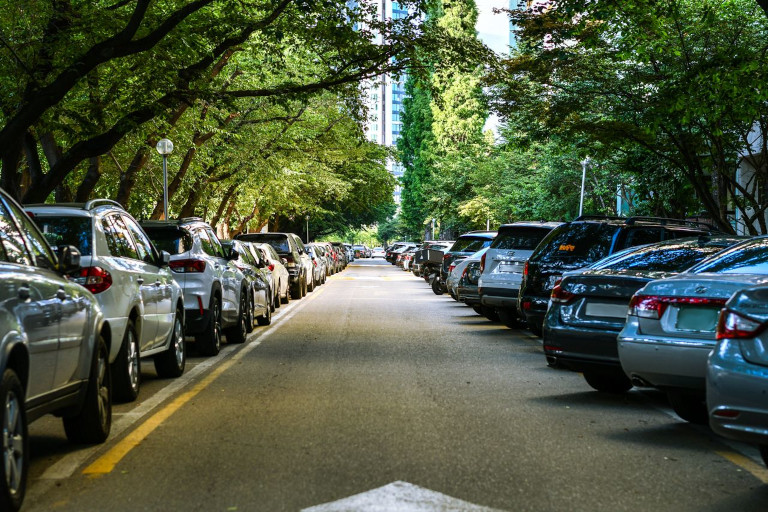
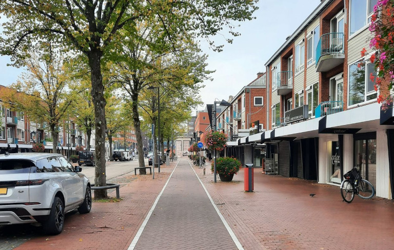
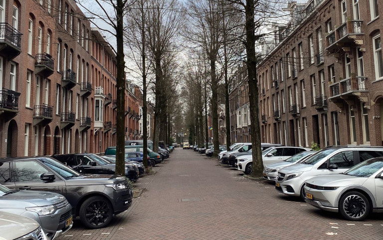
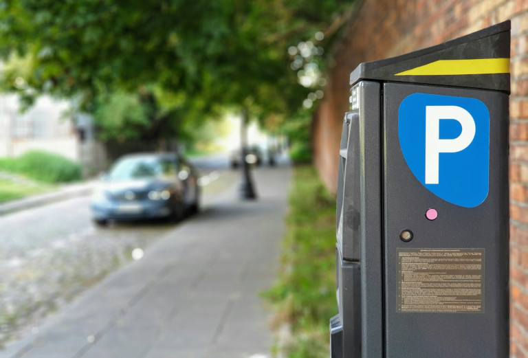
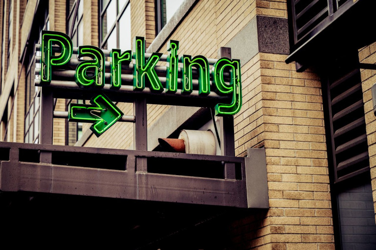
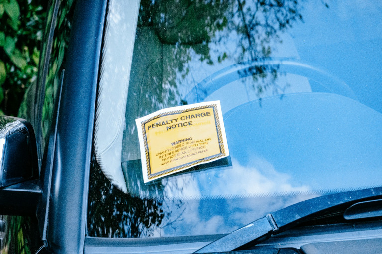
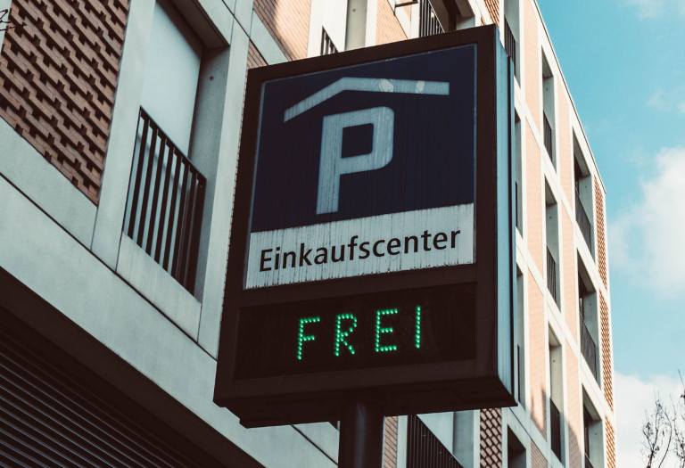
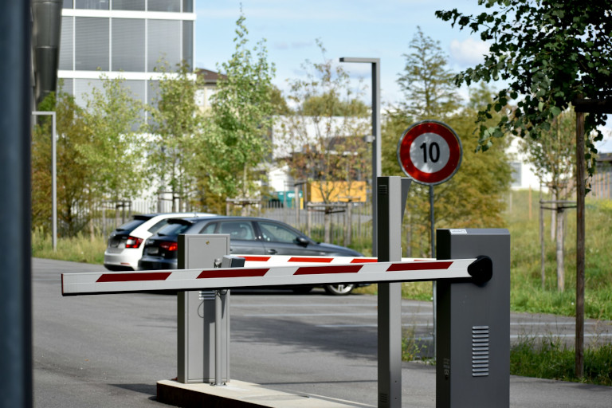
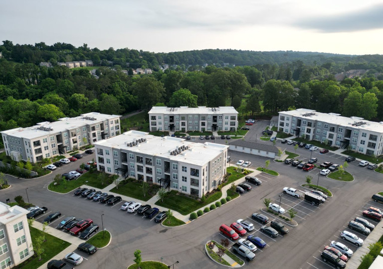
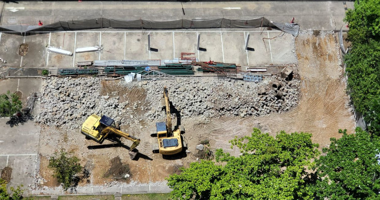

## Die größten Herausforderungen der Parkraumbewirtschaftung auf einen Blick

- **Steigende Fahrzeugdichte**: Immer öfter besitzt ein Haushalt mehrere Autos und noch dazu größere Modelle wie SUVs, was die Stellplatzkapazitäten in dicht besiedelten Wohnvierteln sprengt.
- **Kampf um den Bordstein**: Zugunsten von Fahrradinfrastruktur, Gehwegen, Grünflächen und Außengastronomie verschwinden Parkplätze auf den Straßen, was den Mangel zusätzlich verschärft.
- **Der Haken am Bewohnerparken**: Ein Anwohnerparkausweis berechtigt in der Regel zur Nutzung bestimmter Bewohnerparkgebiete, garantiert aber keinen freien Stellplatz. 
- **Fremdparker und Parkkosten**: Hohe Parkgebühren für Parkhäuser und öffentliche Parkplätze führen dazu, dass Fremdparker in Wohngebiete ausweichen und diese überlasten.
- **Frustration und Parksuchverkehr**: Viele Anwohner finden keinen Parkplatz in ihrem Viertel und verursachen frustrierenden Parksuchverkehr.
- **Falschparker und Staus**: Zu viele und falsch parkende Autos behindern den fließenden Verkehr und sorgen oft für verstopfte Straßen in den Städten.
- **Hoher Verwaltungsaufwand**: Analoge Kontrollen von Parkausweisen, Parkscheinen und Ausnahmegenehmigungen können Ordnungsämter überlasten.

## Was bedeutet Parkraumbewirtschaftung genau?

Die Aufgabe der Parkraumbewirtschaftung besteht darin, **die Nachfrage nach öffentlichem Parkraum bei begrenztem Angebot zu steuern**. Dies kann durch Maßnahmen wie Bewohnerparken, Parkgebühren oder die Beschränkung der Parkdauer geschehen. Die Parkraumbewirtschaftung ist dabei Teil des Parkraummanagements und beschäftigt sich vor allem mit dem **Abstellen von Fahrzeugen auf öffentlichen Flächen**. Generell unterscheidet man zwischen On-Street- und Off-Street-Parking:

- **On-Street-Parking** umfasst alle Parkplätze, die barrierefrei auf öffentlichen Straßen und Flächen zur Verfügung stehen.
- Unter **Off-Street-Parkplätzen** versteht man Parkraum, der beispielsweise durch Schranken oder Tore vom allgemeinen Straßenverkehr abgetrennt ist.

## Weniger Motoren, mehr Aufenthaltsqualität: Ziele der Parkraumbewirtschaftung

Kaum ein Thema ist in der Kommunalpolitik so umstritten wie die Parkraumbewirtschaftung. Wenn es darum geht, **den begrenzten öffentlichen Raum möglichst effizient, gerecht und verkehrspolitisch sinnvoll zu nutzen**, gehen die Meinungen schnell auseinander. Je nachdem, was politisch gewollt ist, kann die Parkraumbewirtschaftung verschiedene Ziele verfolgen:

- genug Parkraum für Gewerbetreibende und Anwohner in den Innenstädten bereitstellen 
- die Einnahmen aus Parkgebühren und Bußgeldern maximieren
- den motorisierten Individualverkehr sowie die Lärm- und Umweltbelastung senken
- die Attraktivität des öffentlichen Personennahverkehrs (ÖPNV) erhöhen
- Parkraum zugunsten von nachhaltiger Mobilität (z. B. E-Ladesäulen) umgestalten
- die Aufenthaltsqualität durch Verkehrsberuhigung, Begrünung oder Spielbereiche steigern

## Kampf um den Bordstein: Interessenkonflikte rund um die Parkraumbewirtschaftung

Der Bordstein ist längst mehr als die Grenze zwischen Fahrbahn und Gehweg. Er markiert eine der am stärksten umkämpften Flächen im urbanen Raum. Ob **Radfahrer, Fußgänger, öffentlicher Nahverkehr, Lieferverkehr, Ladeinfrastruktur, Grünflächen, Außengastronomie oder Pkw** – sie alle konkurrieren um die kostbaren Quadratmeter am Straßenrand. Gleichzeitig erwarten Bewohner, Gewerbetreibende und Besucher eine gute Erreichbarkeit der Gebäude.

Genau hier setzt die Parkraumbewirtschaftung an. Ihr Ziel besteht nicht allein darin, Parkplätze zu bewirtschaften, also z. B. Nutzungsgebühren zu erheben. Vielmehr geht es um die strategische Frage, wie der vorhandene öffentliche Raum sinnvoll und **im Einklang mit den kommunalen Mobilitätskonzepten** genutzt werden kann. Eine moderne städtische Parkraumbewirtschaftung sollte deshalb verschiedene Interessen berücksichtigen und zusammenführen.

Dafür gilt es zunächst, die **Ursachen des Parkdrucks** objektiv zu analysieren.

## Warum klassische Parkraumbewirtschaftung in Städten an ihre Grenzen stößt

Eine zentrale Ursache des Parkplatzmangels ist das Missverhältnis zwischen verfügbarer Fläche und Fahrzeugbestand. **Schrumpfender Parkraum** auf den Straßen trifft auf eine **steigende Anzahl und Größe von Fahrzeugen**. Da immer mehr Autos pro Haushalt dazukommen, übersteigt die Zahl der Parkplatzsuchenden regelmäßig die Zahl der verfügbaren Stellplätze.

### Wachsender Fuhrpark trifft auf veränderte Nutzung des Straßenraums

Besonders in dicht bebauten Quartieren lässt sich der öffentliche Raum nicht beliebig erweitern. **Neue Radwege, Busspuren oder Ladestationen** können verkehrspolitisch sinnvoll sein, reduzieren unter Umständen aber die Zahl der Pkw-Stellplätze am Straßenrand. So kann das Angebot die Nachfrage des stetig wachsenden privaten Fuhrparks nicht auffangen. Gleichzeitig stehen Kommunen unter Druck, eine vielseitigere Nutzung des Straßenraums, etwa durch **Grünflächen und Außengastronomie**, zu ermöglichen, um die Aufenthaltsqualität und Attraktivität bestimmter Stadtteile zu verbessern.

### Die Paradoxie des Bewohnerparkens: Parkausweise ohne Stellplatzgarantie

Das Bewohnerparken ist ein klassisches Instrument, um **den Parkdruck der Anwohner in besonders belasteten Wohngebieten zu verringern**. Sie können unter bestimmten Voraussetzungen einen Anwohnerparkausweis erhalten und privilegiert in ihrem Bewohnerparkgebiet parken. Dies kann die Nutzung des vorhandenen Parkraums zugunsten der Anwohner gewichten und Fremdparken reduzieren. Das Problem: **Ein Anwohnerparkausweis garantiert keinen Stellplatz**. Ist das Bewohnerparkgebiet vollständig ausgelastet, müssen selbst Anwohner mit einem gültigen Ausweis lange nach einem Parkplatz suchen oder finden keinen. Das Bewohnerparken löst also nicht den strukturellen Parkplatzmangel.

### Fremdparker, Falschparker und Parksuchverkehr als Störfaktoren

Jedes abgestellte Fahrzeug, das keinem Halter aus dem jeweiligen Viertel gehört, gilt als **Fremdparker**. Gerade zu bestimmten Tageszeiten können Fremdparker den Parkdruck deutlich erhöhen, etwa wenn **Unternehmen, Geschäfte, Behörden oder Schulen in der Nähe** liegen. Denn viele Menschen fahren mit dem Auto einkaufen, zur Arbeit oder ihre Kinder zur Schule – und oft reicht der dort für Besucher verfügbare Parkraum nicht aus. Gleichzeitig können **teure, enge oder schlecht gelegene Parkhäuser** dazu führen, dass Autofahrer den Straßenraum bevorzugen.

Wer keinen Stellplatz findet und es eilig hat, lässt sein Auto vielleicht sogar im Parkverbot stehen. Solche **Falschparker** behindern im schlimmsten Fall andere Verkehrsteilnehmer und müssen abgeschleppt werden. Weitere temporäre Belastungen können durch **Baustellen und Umzüge** entstehen, die den Parkraum auf der Straße weiter verknappen, oder durch **Veranstaltungen**, die punktuell die Nachfrage explodieren lassen.

Hinzu kommt der **Parksuchverkehr**: Bis Autofahrer endlich einen Parkplatz finden, fahren sie um den Block, wenden oder halten mitten auf der Straße an. Dadurch entstehen zusätzliche Beeinträchtigungen des fließenden Verkehrs und vermeidbare Lärm- und Abgasemissionen. Eine moderne Parkraumbewirtschaftung sollte deshalb nicht nur die Frage klären, wo man parken darf, sondern ebenso, **wie Autofahrer schnell einen geeigneten Stellplatz finden**.

## Klassische Lösungsansätze der Parkraumbewirtschaftung

Jeder Autofahrer kennt sie: Parkscheiben, Parkuhren und Parkscheinautomaten. Diese stehen symbolisch für einige klassische Lösungsansätze der Parkraumbewirtschaftung. Insgesamt lassen sich die Möglichkeiten grob danach einordnen, ob sie das Angebot erhöhen oder die Nachfrage senken sollen.

### Steuerung der Nachfrage: Parkgebühren, Bewohnerparken, P&R-Konzepte

Durch die **Einführung von Parkgebühren** können Kommunen den motorisierten Individualverkehr und die Nachfrage nach Parkraum in bestimmten Gebieten senken. Das Angebot des **ÖPNV, Radfahren oder Laufen erscheinen dann attraktiver** und mehr Menschen nutzen diese alternativen Fortbewegungsarten, um in die bewirtschaftete Zone zu gelangen. So stehen den verbleibenden Fahrzeugen mehr (kostenpflichtige) Parkplätze zur Verfügung und der Suchverkehr nimmt ab.

Auch **dynamische Preisanpassungen**, zum Beispiel unterschiedliche Preise je nach Tageszeit und Auslastung der Parkplätze, sind denkbar. Das Ziel ist dabei nicht zwangsläufig, die Einnahmen zu maximieren, sondern den knappen Parkraum entsprechend der tatsächlichen Nachfrage zu bewirtschaften.

Um Gewerbetreibende und Anwohner in Gebieten mit bewirtschaftetem Parkraum zu entlasten, können Kommunen bestimmte Sonderregelungen wie **Lieferzonen** oder das bereits erwähnte **Bewohnerparken** schaffen. Allerdings sollte die Anzahl ausgegebener Ausweise nicht die tatsächlich verfügbaren Stellplätze übersteigen. Um den Anreiz für mehrere Fahrzeuge pro Haushalt abzuschwächen, erheben einige Kommunen auch für Anwohnerparkausweise saftige Gebühren.



Derzeit ist ein Bewohnerparkausweis mit 360 Euro pro Jahr in Bonn am teuersten, während er in Berlin nur rund 10 Euro kostet. Weitere Spitzenreiter in Deutschland sind Tübingen, Münster, Mainz und Freiburg.



Auch Park-and-Ride-Konzepte können eine wichtige Rolle spielen, um einen Teil des motorisierten Individualverkehrs aus den Städten herauszuhalten. Gut erreichbare **P&R-Parkplätze am Stadtrand** können dazu beitragen, dass Autofahrer von außerhalb nicht bis in dicht bewohnte Innenstädte fahren, wo der Parkraum knapp ist, sondern **für die letzten Kilometer auf öffentliche Verkehrsmittel umsteigen**. Damit P&R-Angebote funktionieren, müssen sie allerdings attraktiver und günstiger als das Parken in der Stadt sein. Das heißt: Sie sollten eine schnelle Anreise über Autobahnen und einen unkomplizierten Umstieg auf einen dicht getakteten ÖPNV ermöglichen.

### Steuerung des Angebots: Tiefgaragen, Quartiersgaragen, Kurzparken

Das Steuern der Nachfrage allein löst den Parkplatzmangel nicht. Deshalb sollten Kommunen das Parkraummanagement immer mit der baulichen Entwicklung eines Quartiers verbinden. Bei Neubauprojekten können **Tiefgaragen** dazu beitragen, parkende Fahrzeuge aus dem öffentlichen Straßenraum auf private Grundstücke zu verlagern. Dazu sind meist Anpassungen von **Stellplatzvorgaben im Bebauungsplan** nötig. Ein modernes Stellplatzmanagement sollte dabei nicht isoliert auf einzelne Gebäude schauen, sondern auch die Förderung von gemeinschaftlich genutzten **Quartiersgaragen** erwägen.

Da in dicht bebauten Innenstädten nur selten neuer Parkraum entsteht, versuchen Kommunen in stark frequentierten Gebieten durch die **Senkung der Höchstparkdauer** (meist zwischen 15 Minuten und 2 Stunden) die Nachfrage zu bewältigen. Indem häufiger Parkplätze frei werden und sich die Fluktuation verbessert, also **die Anzahl der Parkvorgänge pro Stellplatz steigt**, können mehr Autos bei gleichem Parkplatzangebot in die bewirtschaftete Zone und der Parkdruck nimmt ab. Dieses Konzept bezeichnet man als **Kurzparken** und ist in der Nähe von Bahnhöfen, Verwaltungs- und Geschäftszentren beliebt. Es kann sowohl kostenpflichtig als auch gebührenfrei sein. Je nachdem können Parkuhren, Parkscheinautomaten oder Parkscheiben zum Einsatz kommen.

### Kontrolle des Parkraums

Um die Einhaltung der Parkregeln und die Einnahmen aus Parkgebühren sicherzustellen, ist die Kontrolle des bewirtschafteten Parkraums und die Sanktionierung von Verstößen unerlässlich. Der Kontrollaufwand schmälert jedoch den Ertrag, weshalb die Überwachung möglichst effizient ablaufen sollte. Während Off-Street-Parkangebote meist eine **Schrankenanlage** oder ein **digitales Parksystem** mit automatischer Kennzeichenerkennung nutzen, setzen Kommunen zur Überwachung des ruhenden Verkehrs im Straßenraum meist noch **Mitarbeiter im öffentlichen Dienst** ein.

## Wie ein modernes Parkraummanagement Kommunen entlasten kann

Eine wesentliche Grundlage für eine vorausschauende Parkraumbewirtschaftung bilden aktuelle [Daten](). Statt ausschließlich die **Anzahl vorhandener Stellplätze** zu betrachten, können Kommunen beispielsweise **die tatsächliche Auslastung, die durchschnittliche Parkdauer und die Herkunft der Fahrzeuge** erfassen. Das schafft die Grundlage für ein strategisches Parkplatzmanagement, das nicht zu spät auf Überlastungen reagiert, sondern Entwicklungen frühzeitig erkennt und steuert.

### Sensorgestütztes Parken und Echtzeit-Verkehrssteuerung

Beim sensorgestützten Parken liefern Bodensensoren, Kameras oder andere Erfassungstechnologien **aktuelle Daten über die Belegung von Stellplätzen**, z. B. in Parkhäusern. Die Information, ob ein Parkangebot ausgelastet ist oder wie viele Stellplätze frei sind, wird dabei an Navigationssysteme sowie digitale Hinweistafeln vor Ort weitergeleitet. Diese **Leit- und Informationssysteme navigieren den Parksuchverkehr in Echtzeit zu freien Parkplätzen**, um die Parkplatzsuche zu verkürzen und den Parkraum effizienter zu nutzen.

Für die Kommune entsteht durch die Daten außerdem ein wesentlich genaueres Bild der Parksituation als durch punktuelle Erhebungen. So lassen sich **Belegungsverläufe über längere Zeiträume analysieren** und der Parkraum gezielter optimieren. Kommunen können beispielsweise erkennen, ob eine Parkzone dauerhaft überlastet ist oder ob die hohe Auslastung lediglich zu bestimmten Zeiten auftritt.

### Digitale Parkraumüberwachung

Dank fortgeschrittener Technologien ergeben sich auch für die digitale Parkraumüberwachung neue Möglichkeiten. Vor allem die **automatische Kennzeichenerkennung** kann den Personalbedarf für Kontrollen stark reduzieren und Informationen zentral in digitalen Systemen bereitstellen. Beim Off-Street-Parken (z. B. in Parkhäusern) funktioniert dies mit stationären Kameras, welche die Kennzeichen der Fahrzeuge bei der Ein- und Ausfahrt scannen und exakt die Parkdauer erfassen. Nutzer können die Parkgebühren dann direkt digital bezahlen.

Um das On-Street-Parken flächendeckend zu kontrollieren, nutzen viele europäische Städte bereits spezielle Fahrzeuge, sogenannte **Scan Cars**, die durch die Straßen fahren und die Kennzeichen der parkenden Fahrzeuge aufnehmen. Das System gleicht die Kennzeichen in Echtzeit mit einer [Datenbank]() für Parkscheine, Bewohnerparkausweise oder Höchstparkzeiten ab. Bei zeitlicher Überschreitung oder fehlender Parkberechtigung wird ein Verstoß dokumentiert und automatisch ein Bußgeldverfahren eingeleitet. Ansonsten werden die Daten zum Kennzeichen einfach wieder gelöscht. Wichtig ist dabei eine **rechtssichere Ausgestaltung im Einklang mit der Datenschutz-Grundverordnung (DSGVO)** und den jeweiligen kommunalen Vorgaben.

## Datenbasiertes Parkraummanagement als Teil Ihrer Smart City

Für eine leistungsfähige Parkraumbewirtschaftung brauchen Sie zunächst klare Strukturen. Dazu gehören eindeutig definierte Parkangebote mit verständlichen Beschilderungen vor Ort, **digitale Verwaltungsprozesse in den zuständigen Behörden** und aktuelle Informationen über Stellplätze und Nutzungsberechtigungen. Anstatt Parkscheine, Bewohnerparkausweise und Parkzonen über unterschiedliche analoge Prozesse zu verwalten, sollten Sie die Daten digitalisieren und zentral zusammenführen. Das erleichtert die **Auswertung des Parkdrucks in bestimmten Gebieten** und schafft die Grundlage für ein strategisches Parkraummanagement. Kommunen und Politik können darüber hinaus besser nachvollziehen, welche Parkplätze besonders stark ausgelastet sind und wo eine Anpassung der Bewirtschaftung sinnvoll sein könnte.

Ein modernes Parkplatzmanagement betrachtet dabei die **Auslastung von Parkplätzen, alternative Mobilitätsangebote und die Entwicklung der Fahrzeugzahlen** gemeinsam. Die entscheidende Frage lautet nicht mehr nur, wie viele Parkplätze eine Stadt besitzt, sondern wie intelligent sie den vorhandenen Raum bewirtschaftet, den Verkehr steuert und verschiedene Interessen miteinander in Einklang bringt. Gerade in dicht besiedelten Vierteln muss ein **nachhaltiges Parkraummanagement** unterschiedliche Nutzungsansprüche koordinieren – von Radfahrern und Fußgängern über motorisierten Individual- und Lieferverkehr bis hin zu Außengastronomie und Grünflächen.

Die Digitalisierung eröffnet die Möglichkeit, das Parkplatzmanagement mit anderen Bereichen der **Stadtentwicklung** zu verknüpfen. Daten zu Verkehrsströmen, Parkdauer und Fahrzeugbestand lassen Schlussfolgerungen zu, **wo neue Stellplätze geschaffen werden sollten** oder der Parksuchverkehr besser gesteuert werden kann. Parkhäuser und Quartiersgaragen lassen sich besser auslasten, wenn ihre Kapazitäten sichtbar sind. Nicht zuletzt können Kommunen modellieren, wie es sich auswirken würde, wenn Parkflächen zugunsten anderer Nutzungsarten wegfallen oder alternative Angebote (zum Beispiel im ÖPNV, Carsharing oder Radverkehr) entstehen. So untermauert ein datenbasiertes Parkraummanagement die **Mobilitätsstrategie Ihrer Smart City** und hilft, politische Entscheidungen besser zu begründen.

## Mit SeaTable die digitale Parkraumbewirtschaftung meistern

Für [digitale Verwaltungsprozesse]() benötigen Sie eine leistungsstarke, benutzerfreundliche Datenbank. Hier kommt SeaTable ins Spiel. Mit dieser [KI No-Code-Datenbank]() können Sie beispielsweise **Anwohnerparkausweise digital vergeben und speichern**, nachdem Bürger über ein Formular einen entsprechenden Antrag gestellt haben. So können Mitarbeiter im Außendienst **direkt per App nachschauen, ob für ein Kennzeichen eine Parkberechtigung vorliegt**. Ebenso schafft SeaTable die Grundlage für automatische Kontrollen per Scan Car, welches die erfassten Kennzeichen sofort in der Datenbank abfragen kann.

Für ein übergreifendes Parkraummanagement können Sie in SeaTable zum Beispiel **Parkzonen auswerten**, indem Sie den Fahrzeugbestand der Anwohner und das Verkehrsaufkommen von Fremdparkern mit dem Angebot an öffentlichen Parkplätzen sowie Stellplatzkapazitäten in privater Hand vergleichen. Dadurch gewinnen Sie einen strukturierten Überblick und können Handlungsempfehlungen für die Parkraumbewirtschaftung ableiten.



Die [SeaTable Cloud]() wird DSGVO-konform in sicheren deutschen Rechenzentren gehostet und eignet sich dadurch hervorragend für hohe Datenschutzanforderungen im öffentlichen Sektor. Zudem können Kommunen auch die volle [Datenhoheit]() behalten, indem Sie [SeaTable Server]() auf ihrer eigenen [Infrastruktur]() betreiben.

## Fazit: Von der Parkraumbewirtschaftung zur Steuerung

Die Herausforderungen der Parkraumbewirtschaftung lassen sich nicht mit einem einzelnen Instrument lösen. Das Bewohnerparken kann den Parkraum der Anwohner schützen, ändert aber nichts an der Überlastung durch steigende Fahrzeugzahlen. Parkgebühren können die Nachfrage steuern und Sensoren liefern wertvolle Daten für digitale Leitsysteme, schaffen aber auch keine neuen Stellplätze.

Je nach Kommune verspricht deshalb nur eine Kombination verschiedener Konzepte anhaltenden Erfolg: mehr Quartiers- und Tiefgaragen sowie P&R-Angebote; intelligente Verkehrsleitsysteme, die den Parksuchverkehr verringern; Bewohnerparkausweise für Wohngebiete mit vielen Fremdparkern; dynamische Gebührenmodelle und Kurzparken an hoch frequentierten Orten. Die digitale Parkraumüberwachung mit automatischer Kennzeichenerkennung kann Kommunen dabei entlasten, indem der Personalbedarf für Kontrollen sinkt.

## Häufig gestellte Fragen zur Parkraumbewirtschaftung



Ein Anwohnerparkausweis bringt keine Stellplatzgarantie mit sich. Er erlaubt den Ortsansässigen lediglich das Parken in ihrem Bewohnerparkgebiet, schafft aber keine zusätzlichen Kapazitäten. Sind alle Parkplätze im Straßenraum belegt, müssen auch Inhaber eines Ausweises nach anderen Parkmöglichkeiten suchen. Eine wirksame Parkraumbewirtschaftung sollte deshalb neben dem Bewohnerparken auch die Auslastung zu verschiedenen Tageszeiten, alternative Mobilitätsangebote für Fremdparker sowie Quartiers- und Tiefgaragen berücksichtigen.





Beim sensorgestützten Parken erfassen Sensoren, Kameras oder andere technische Systeme, ob einzelne Stellplätze oder definierte Parkbereiche belegt sind. Die Informationen lassen sich in Echtzeit an digitale Systeme weiterleiten. Für die kommunale Parkraumbewirtschaftung entstehen dadurch belastbare Daten über die Auslastung der Parkplätze. Diese können Städte beispielsweise für digitale Hinweistafeln zur Verkehrssteuerung oder die langfristige Parkraumoptimierung nutzen.





Städte können Bewohnerparkgebiete ausweisen und konsequent kontrollieren, aber diese einzelne Maßnahme reicht meist nicht aus. Um das Problem dauerhaft zu lösen, sind attraktive Alternativen für Fremdparker wie günstige Parkhäuser, ÖPNV- oder P&R-Angebote vonnöten. Wichtig ist außerdem, die Auslastung in Bewohnerparkgebieten regelmäßig zu analysieren. So lässt sich feststellen, ob Fremdparker tatsächlich die Hauptursache darstellen oder ob der Parkdruck vor allem durch die steigenden Fahrzeugzahlen pro Haushalt entsteht. Dann ließe sich das Problem nur durch mehr Parkplätze, zum Beispiel mit neuen Tiefgaragen, in den Griff bekommen.





Das Parkraummanagement betrachtet den ruhenden Verkehr als Teil des gesamten Verkehrssystems. Es umfasst beispielsweise die Definition von Parkzonen und Gebühren, die Auslastung und Kontrolle von Parkplätzen im öffentlichen Straßenraum, die Steuerung des Parksuchverkehrs und die Verknüpfung mit anderen Mobilitätsangeboten. Das Stellplatzmanagement konzentriert sich stärker auf die Schaffung neuer Stellplätze in Parkhäusern, Quartiersgaragen oder mithilfe von Stellplatzvorgaben auf Privatgrundstücken. In der Praxis sollten Sie beide Ansätze miteinander verbinden: Ein kommunales Stellplatzmanagement schafft Kapazitäten, während das Parkraummanagement deren Auslastung strategisch steuert.


