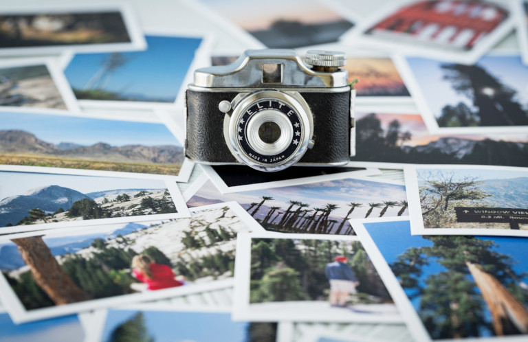
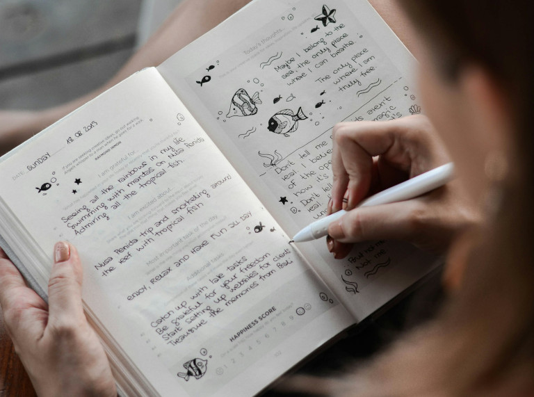
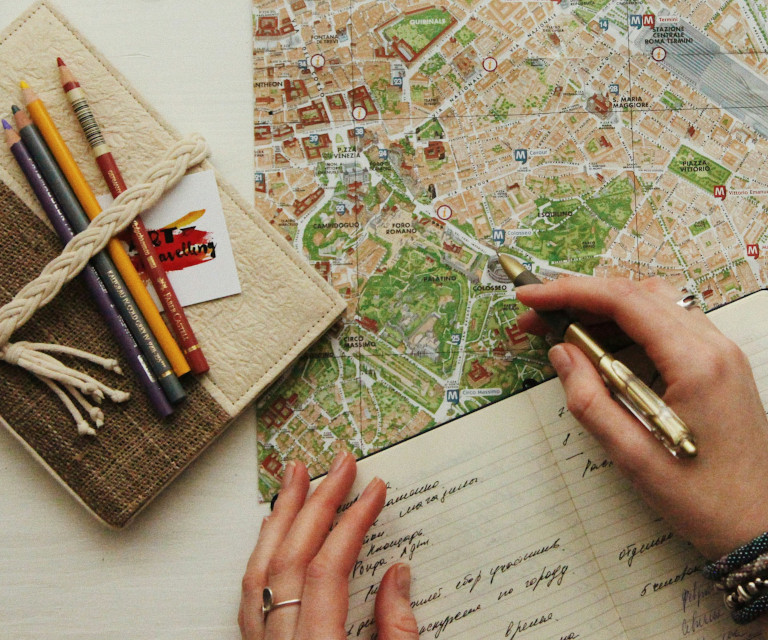
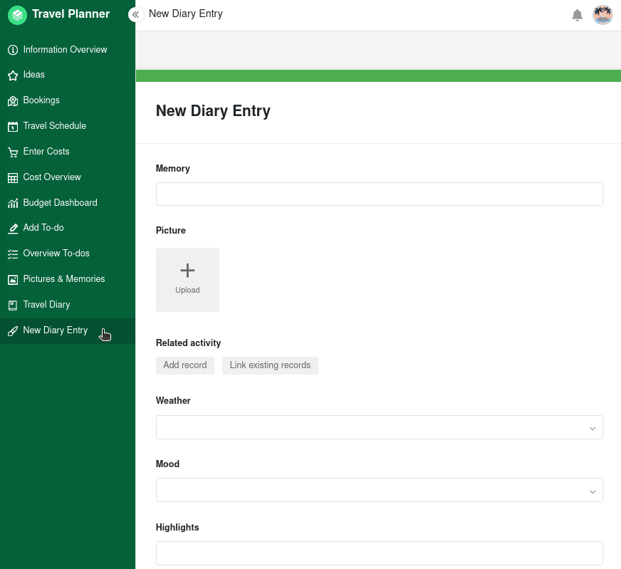

## Warum Reisetagebuch führen?

Wenn Sie schon einmal Jahre nach einer Reise durch alte Fotos gescrollt haben, kennen Sie das Problem: Man erinnert sich vielleicht noch an die spektakulärsten Sehenswürdigkeiten, aber die ebenso schönen kleinen Momente sind oft verschwunden. Wo genau war dieser Sonnenuntergang? Wie hieß dieses kleine Café? Wie habe ich mich bei dieser Wanderung gefühlt? Ein Reisetagebuch hilft Ihnen, **genau diese Erinnerungen dauerhaft zu bewahren**. Es dokumentiert nicht nur Orte und Informationen, sondern auch Gefühle, Begegnungen und spontane Abenteuer, die Ihre Reise einzigartig machen.

Darüber hinaus kann es helfen, bereits während der Reise **das Erlebte zu verarbeiten**. Wenn Sie jeden Abend in Ihr Reisetagebuch schreiben, reflektieren Sie automatisch den Tag. Dadurch bringen Sie Ordnung in Ihre Eindrücke, Emotionen und Gedanken, bekommen sie schneller aus dem Kopf und können unbeschwert in den nächsten Tag starten. Viele Weltenbummler berichten sogar, dass sie **Momente bewusster wahrnehmen** und ihre Reisen dadurch intensiver erleben.

### Die wichtigsten Vorteile auf einen Blick

*   **Erinnerungen einfangen**: Halten Sie emotionale Highlights des Tages, atemberaubende Orte und besondere Begegnungen fest, die sonst in Vergessenheit geraten würden.   
*   **Perfekt organisiert**: Speichern Sie Restaurantempfehlungen, Sehenswürdigkeiten, Routen und persönliche Geheimtipps für den nächsten Besuch.
*   **Texte, Bilder und Daten vereinen**: Verknüpfen Sie Fotos, Termine und Geodaten mit Ihren Tagebucheinträgen – alles zentral an einem Ort.
*   **Vorlage für Fotobücher**: Wenn Sie eine Reisedokumentation erstellen, können Sie Fotos später leichter ordnen und mit Kontext anreichern.

## Digitales Reisetagebuch vs. analoges Reisetagebuch

Grundsätzlich gibt es zwei Möglichkeiten, wie Sie Ihr Reisetagebuch führen können. Während die einen ein klassisches Reisetagebuch zum Ausfüllen bevorzugen, setzen andere auf digitale Lösungen wie eine Reisetagebuch App oder ein Reisetagebuch online.

### Analoge Reisetagebücher

Wenn Sie handschriftlich in Ihr Reisetagebuch schreiben, Post- und Eintrittskarten hineinkleben oder Skizzen hineinmalen, entstehen mit der Zeit persönliche Reisegeschichten, die deutlich mehr erzählen als eine digitale Fotosammlung. Das sogenannte **Scrapbooking**, bei dem Sie Ihr Reisetagebuch mit kunstvollen Elementen gestalten, bietet hier viel kreative Freiheit.

#### Vorteile

*   Kein Internet/WLAN und keine Mobilgeräte mit geladenem Akku erforderlich
*   Viel Freiraum für Kreativität dank haptischer Buchgestaltung auf Papier
*   Besonders persönlicher Charakter (durch Handschrift, Stil, Souvenirs etc.)
*   Digital Detox ohne Ablenkungsmöglichkeiten

#### Nachteile

*   Nachträgliche Änderungen sind umständlich und unschön
*   Bei Verlust oder Beschädigung sind alle Tagebucheinträge verloren
*   Fotos müssen später ausgedruckt und eingeklebt werden
*   Mehr Gewicht und weniger Platz im Gepäck
    

### Digitales Reisetagebuch

Ein digitales Reisetagebuch reichert klassische Tagebucheinträge mit weiteren Informationen, Medien und Funktionen an. Ergänzen Sie beispielsweise GPS-Daten von Orten, laden Sie Fotos und Videos hoch oder speichern Sie Audio-/Sprachaufnahmen. Wenn Sie eine sorgfältige digitale Reisedokumentation erstellen, profitieren Sie **besonders bei einem vollen Reiseprogramm mit vielen Daten** von der besseren Übersicht.

#### Vorteile

*   Multimediale Gestaltung mit Fotos, Videos, Links etc.
*   Schutz vor Verlust durch sichere Speicherung in der [Cloud]()
*   Einträge jederzeit ohne sichtbare Änderungen bearbeitbar
*   Flexible Such-, Sortier- und Filterfunktionen
*   Einfaches Teilen mit Familie und Freunden

#### Nachteile

*   Abhängigkeit von Internetverbindungen und aufgeladenen Akkus
*   Weniger DIY-Gefühl, da kein physisches Ergebnis entsteht
*   Weniger Kreativität wegen der vorgefertigten Struktur von Apps und Vorlagen
*   Weniger Konzentration und mehr Ablenkung durch andere Gerätefunktionen



Wenn Sie gerne öffentlich Inhalte posten, können Sie mit einem digitalen Reisetagebuch eine umfassende Reisedokumentation erstellen, die später als Grundlage für Social-Media-Beiträge oder Ihren Reiseblog dient. Entdecken Sie auch unseren [Social-Media-Plan]().



## Ideen und Tipps für ein Reisetagebuch zum Ausfüllen

Wenn Sie in Ihr Reisetagebuch schreiben, denken Sie vermutlich zuerst an die Erlebnisse des Tages. Dabei gibt es deutlich mehr **Reisetagebuch-Ideen**. Überlegen Sie zum Beispiel, was Ihnen besonders gut gefallen, Sie überrascht oder herausgefordert hat. Als Vorlage für Ihre Reisetagebuch Ideen könnten Sie diese thematischen Rubriken verwenden:

*   Highlights des Tages
*   Wetter und Laune
*   Landestypisches Essen
*   Persönliche Bewertungen
*   Begegnungen mit Einheimischen
*   Lustige Missgeschicke
*   Neue Wörter einer Fremdsprache
*   Lieblingsfoto des Tages
*   To-do-Liste für den nächsten Tag



Um Stimmungen besser einzufangen, können Sie einen Moment innehalten und bewusst wahrnehmen, welche Ihrer **Sinne** gerade gleichzeitig aktiviert sind. Wenn Sie zum Beispiel das Meeresrauschen, die warmen Sonnenstrahlen auf Ihrer Haut, die salzige Luft und das erfrischend-cremige Vanilleeis auf Ihrer Zunge beschreiben, wird die Erinnerung viel lebendiger, als wenn Sie nur schreiben, dass Sie am Strand waren.



Um den Überblick zu behalten, empfiehlt es sich, **die Tagebucheinträge mit dem jeweiligen Datum zu versehen oder direkt chronologisch in einen Kalender zu schreiben**. Dennoch müssen Sie nicht jeden Tag alles systematisch abarbeiten. Konzentrieren Sie sich auf die Momente und Details, die Sie wirklich in Erinnerung behalten möchten – und bleiben Sie gelassen, wenn Lücken entstehen oder Sie gerade keine Lust haben, in Ihr Reisetagebuch zu schreiben. Sie können es später noch vervollständigen oder einfach Tage weglassen. 

**Generell gilt, dass Sie mit einem Reisetagebuch nichts falsch machen können. Hauptsache, es bereitet Ihnen Freude!**

### Kreative Reisetagebuch-Ideen

Wer gerne kreativ arbeitet, findet in einem individuellen Reisetagebuch zum Ausfüllen die ideale Urlaubsbeschäftigung. **Skizzen, Collagen oder handschriftliche Texte** sind nur einige Möglichkeiten, um sich künstlerisch zu betätigen. Als Werkzeuge können Sie **Füller, Tinte, Schere, Klebeband, verschiedenfarbige Stifte und Malutensilien** mitnehmen. Nutzen Sie beispielsweise die folgenden Materialien für die Gestaltung:

*   Postkarten
*   Fotos einer Sofortbildkamera
*   Geldscheine und Münzen
*   Quittungen, Eintritts- und Fahrkarten
*   Zeitungsausschnitte
*   Flyer und Broschüren für Touristen



Auch wenn es sehr beliebt ist und harmlos scheint: Das Mitnehmen von **Muscheln, Korallen, Schneckenhäusern, Steinen und Sand** ist in vielen Urlaubsländern wie der Türkei, Ägypten und Italien streng verboten. Aus Nicht-EU-Ländern dürfen Sie ohne offizielles [Pflanzengesundheitszeugnis](https://de.wikipedia.org/wiki/Pflanzengesundheitszeugnis) auch keine **Pflanzenteile (z. B. Blätter, Blüten, Samen)** in die EU einführen. Sowohl nationale Naturschutzgesetze als auch internationale Artenschutzbestimmungen untersagen die Ausfuhr von tierischen, pflanzlichen und geologischen Proben. Verzichten Sie bei der Gestaltung Ihres Reisetagebuchs lieber auf diese Materialien. Ansonsten drohen die Beschlagnahmung durch den Zoll und empfindliche Bußgelder.

 

## Geheimtipps und wertvolle Notizen für die nächste Reise sichern

Warum blieb genau dieses Erlebnis so positiv in Erinnerung? **Was würden Sie noch einmal genauso oder vielleicht anders machen?** Beispielsweise könnten Sie zu einem kaum erschlossenen Traumstrand wandern und vor Ort bemerken, dass es wenig Schatten gibt und im Meer scharfkantiges Gestein lauert. Für mehr Aufenthaltsqualität hätten Sie beim nächsten Mal folglich einen Sonnenschirm und Badeschuhe dabei. Diese persönlichen Eindrücke und Empfehlungen lassen sich später kaum noch rekonstruieren und sind verloren, wenn Sie, Ihre Freunde oder Familienmitglieder erneut diesen Ort besuchen möchten.  

Ein strukturiertes Reisetagebuch löst genau dieses Problem. Notieren Sie beispielsweise Ihre Besuchszeiten, Eintrittspreise, persönliche Geheimtipps und rückblickende Bewertungen:

*   **Sehenswürdigkeiten und Attraktionen**: Hat sich der Besuch aus Ihrer Sicht gelohnt? War es zu dieser Uhrzeit sehr voll? Hätten Sie das Ticket vorher online kaufen können? Welches Verkehrsmittel würden Sie für die Anreise empfehlen?
*   **Restaurants, Cafés, Bars**: Wie groß war die Auswahl auf der Speisekarte? Was haben Sie probiert und wie hat es Ihnen geschmeckt? Wie fanden Sie den Service und die Atmosphäre der Location? Konnten Sie mit Karte zahlen?
*   **Strände, Wanderwege, Aussichtspunkte**: Welche Beschaffenheit hatte der Weg? War viel körperliche Fitness erforderlich? War die Natur unberührt oder der Ort bereits touristisch erschlossen? Was sollte man nicht vergessen einzupacken?

So entsteht ganz nebenbei **Ihr persönlicher Reiseführer**. Wenn Sie oder Angehörige von Ihnen später dieselbe Region besuchen, erspart Ihnen vor allem ein digitales Reisetagebuch mit Suchfunktion mühsame Recherchen. Gerade auf längeren Reisen hilft es Ihnen außerdem den Überblick zu behalten. Erlebnisse und Empfehlungen lassen sich übersichtlich dokumentieren und später jederzeit wiederfinden.

## Die All-in-one-Lösung: Mit SeaTable Reiseplaner und Reisetagebuch in einer App verknüpfen

SeaTable ist eine No-Code-Datenbank mit KI-Funktionen und integriertem App Builder. Das heißt: Sie können ohne jegliches technisches Vorwissen eine eigene Reisetagebuch App und ein **digitales Reisetagebuch** online erstellen. Legen Sie dazu in einer Tabelle alle Spaltentypen an, die Sie benötigen, um Bilder, Texte, Bewertungen, Orte, Termine und Stimmungen zu speichern. Um Ihnen den Einstieg besonders leicht zu machen, haben wir bereits eine Vorlage vorbereitet, die Sie nach Belieben an Ihre Reise anpassen können.



Ein großer Vorteil von SeaTable ist, dass Sie **Tabellen über Verknüpfungsspalten miteinander in Beziehung setzen können.** So können Sie Ihre geplanten oder gebuchten Aktivitäten im Reiseplaner (Tabelle 1) mit einer Kostenübersicht (Tabelle 2) und Ihrem Reisetagebuch (Tabelle 4) verbinden. Abgerundet wird die Vorlage von der praktischen Pack- und [To-do-Liste]() in Tabelle 3.
  
Das absolute Highlight ist aber die auf den Tabellen basierende **Reisetagebuch App**. Erfassen Sie über ein Formular auf strukturierte Weise neue Tagebucheinträge, laden Sie Bilder hoch und sehen Sie sich diese in einer übersichtlichen Galerie an oder blättern Sie mit je einer gestalteten Seite pro Eintrag durch Ihr Tagebuch. Lassen Sie mit dem [Reiseplaner]() aus Ihren Ideen verbindliche Buchungen und bleibende Erinnerungen werden!

Ideal zum Teilen mit Familie und Freunden, flexible Such-, Sortier- und Filterfunktionen, sichere Speicherung auf Cloud-Servern in Deutschland: Worauf warten Sie noch? Legen Sie sofort los – ohne versteckte Kosten. Für die Anmeldung benötigen Sie nichts als eine E-Mail-Adresse.
  


## Häufige Fragen zum Reisetagebuch, zum Ausfüllen und Vorlagen



Sie müssen nicht jeden Tag mehrere Seiten in Ihr Reisetagebuch schreiben. Oft genügen 10 Minuten am Abend oder über den Tag verteilt. Notieren Sie die Highlights des Tages in Stichpunkten, beispielsweise Sehenswürdigkeiten, Aktivitäten oder kulinarische Köstlichkeiten. In einer Reisetagebuch App können Sie mithilfe von Drop-down-Menüs und Sterne-Ratings schnell und einfach Ihre Stimmung, das Wetter und Bewertungen erfassen. Auch Ihre Lieblingsfotos sind im Handumdrehen hochgeladen.





Beides hat Vor- und Nachteile. Ein analoges Reisetagebuch überzeugt durch ein persönliches Schreibgefühl, den kreativen DIY-Charme und die Unabhängigkeit von Internetverbindungen und Akkuständen. Dahingegen bietet ein Reisetagebuch online mehr Flexibilität, Suchfunktionen und die Möglichkeit, Fotos, Videos und Links direkt einzubinden. Im Vergleich zum physischen Tagebuch sind die Erinnerungen vor Verlust und Beschädigung geschützt, Sie können jederzeit Änderungen vornehmen und Ihre Aufzeichnungen mit Familie und Freunden teilen. Wenn Sie mögen, können Sie sogar beide Varianten kombinieren, indem Sie z. B. unterwegs handschriftliche Notizen machen, die sie später in Ihr digitales Reisetagebuch übertragen.





Planen Sie am besten feste Zeiten ein – beispielsweise abends im Hotel oder während der Transferzeiten in Zügen, Bussen oder Flugzeugen. Schon wenige Minuten reichen aus, um unterwegs Stichpunkte zu notieren, die Sie später ausformulieren können. So wird das Schreiben schnell zur [Gewohnheit](), ohne wertvolle Urlaubszeit in Anspruch zu nehmen. 





Ja. Als KI No-Code-Plattform ermöglicht SeaTable es, weit mehr als nur Tagebucheinträge zu verwalten. Sie können persönliche Notizen, Fotos und Videos, aber auch eine Kostenübersicht, [Ihre Packliste und Ihre Reiseplanung]() in einem System kombinieren. Dadurch entsteht ein individuell anpassbares digitales Reisetagebuch, das sich sowohl für den nächsten Urlaub als auch für längere Weltreisen oder professionelle Reiseblogger eignet.





Ja. Die Reisetagebuch Vorlage eignet sich nicht nur für nachträgliche Erinnerungen, sondern auch für die Organisation Ihrer Reise. Ergänzen Sie beispielsweise Aktivitäten, Flug- und Hotelbuchungen oder Ihre Packliste. Die kostenlose Vorlage bietet dafür einen guten Einstieg und lässt sich individuell anpassen. So entsteht ein persönliches Reisehandbuch, das Sie vor, während und nach Ihrer Reise begleitet.



