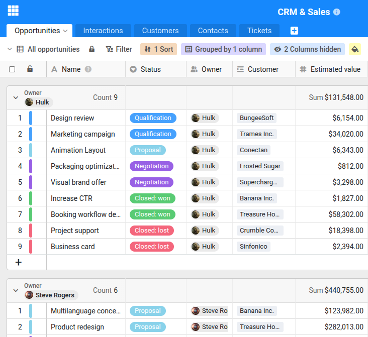

Si prefiere mantener sus datos en su propio servidor, SeaTable Server es la solución ideal. Gracias a Docker, la instalación es sencilla y se completa en pocos minutos, independientemente de la distribución Linux que utilice.

La guía completa de instalación paso a paso se encuentra en el SeaTable Admin Manual: **[Ir a la guía de instalación en admin.seatable.com](https://admin.seatable.com/installation/basic-setup/)**

A continuación descubrirá qué necesita para la instalación, cómo funciona el proceso y todo lo que SeaTable como plataforma puede ofrecerle.

## ¿Por qué alojar SeaTable en su propio servidor?

SeaTable está disponible como solución en la nube en [cloud.seatable.io](https://cloud.seatable.io). Sin embargo, muchas empresas y organizaciones prefieren operar sus datos en su propia infraestructura, ya sea por razones de protección de datos, requisitos internos de cumplimiento normativo o simplemente para mantener el control total. SeaTable Enterprise Edition hace exactamente eso posible: instala SeaTable en su propio servidor y lo configura y opera según sus necesidades.

## Qué necesita

Los requisitos para una instalación de SeaTable son manejables:

- **Un servidor Linux** con al menos 4 núcleos de CPU, 8 GB de RAM y 10 GB de almacenamiento libre (más espacio para sus datos)
- **Acceso root** al servidor, por SSH o consola
- **Un (sub)dominio** con DNS apuntando a la dirección IP de su servidor
- **Accesibilidad en los puertos 80 y 443** a través de este dominio

No importa qué distribución Linux utilice: Ubuntu, Debian, Rocky Linux u otra variante. Mientras Docker funcione en ella, SeaTable funcionará. Una dirección IPv4 estática es útil pero no imprescindible. Maximiza la accesibilidad de su servidor, ya que algunas redes móviles aún no soportan IPv6.

## Qué hay bajo el capó

SeaTable utiliza Docker para ejecutar sus servicios a través de múltiples contenedores. Además del propio SeaTable Server, se ejecutan una base de datos MariaDB para el almacenamiento de datos, Redis para caché rápida y un proxy inverso que recibe las solicitudes entrantes y las reenvía a SeaTable. Todos estos componentes se gestionan conjuntamente mediante Docker Compose: no necesita ocuparse de cada uno por separado.

Por defecto, SeaTable incluye Caddy como proxy inverso. La gran ventaja de Caddy es que solicita y renueva automáticamente los certificados HTTPS a través de Let's Encrypt. Si apunta su dominio al servidor y abre los puertos 80 y 443, obtendrá conexiones cifradas sin ninguna configuración manual.

## Cómo funciona la instalación

La instalación completa se divide en cinco pasos:

1. **Instalar Docker** – Si aún no está presente, se configura Docker en el servidor.
2. **Descargar archivos Compose** – SeaTable proporciona archivos de configuración YAML listos que definen todos los componentes necesarios.
3. **Ajustar la configuración** – En un archivo central `.env`, introduce su dominio, contraseñas y ajustes básicos.
4. **Solicitar una licencia** – SeaTable Enterprise es gratuito para hasta tres usuarios. Recibirá un archivo de licencia cómodamente por correo electrónico.
5. **Iniciar el servidor** – Un solo comando `docker compose up` inicia todos los contenedores y SeaTable está listo para usar.

Todo el proceso suele durar no más de 10 minutos.

## SeaTable detrás de su propio servidor web

Caddy es la solución recomendada y más sencilla, pero no la única. Si ya tiene un servidor web como nginx, Apache o Traefik en su servidor, también puede ejecutar SeaTable detrás de él. En ese caso, desactiva el proxy Caddy incluido y configura su servidor web existente como proxy inverso para SeaTable. El servidor web reenvía las solicitudes entrantes en el dominio de SeaTable al contenedor de SeaTable, un procedimiento habitual que la mayoría de los administradores ya conocen.

En este escenario, usted se encarga de los certificados HTTPS, por ejemplo a través de Let's Encrypt y Certbot o un certificado SSL existente de su organización. La documentación oficial describe este escenario en detalle.

## Actualizaciones fáciles

También después de la instalación se beneficia de la arquitectura Docker: las actualizaciones a una nueva versión de SeaTable se realizan con pocos comandos. Descarga la imagen Docker actual, reinicia los contenedores y listo. Sus datos y configuraciones se mantienen intactos.

## Qué puede hacer con SeaTable

SeaTable es mucho más que una base de datos. Es una plataforma con la que incluso usuarios sin experiencia en TI pueden crear soluciones propias en muy poco tiempo.

Un ejemplo práctico: una administración universitaria quiere gestionar digitalmente las solicitudes de subvención entrantes. Con SeaTable, un empleado crea una base, genera un formulario web para la presentación de solicitudes y configura una automatización con IA que extrae automáticamente la información relevante de los documentos presentados. Las notificaciones informan al equipo sobre cambios de estado, y a través de una aplicación personalizada, los solicitantes pueden consultar el estado de su solicitud en cualquier momento. Todo esto es posible sin conocimientos de programación y se configura en pocas horas.

Ya sea gestión de proyectos, inventario, CRM o planificación de eventos: las posibilidades son tan diversas como las necesidades de su organización.

## Empiece gratis

Puede utilizar SeaTable Enterprise Edition con hasta tres usuarios de forma permanente y gratuita, tanto para uso privado como comercial. La licencia gratuita se entrega cómodamente por correo electrónico.

Si necesita más usuarios, puede adquirir licencias para 10, 25 o 50 usuarios directamente en la [página de precios de SeaTable](). Para instalaciones más grandes, póngase en contacto a través del [formulario de contacto]().
