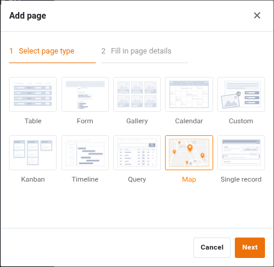
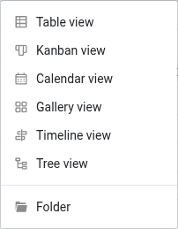
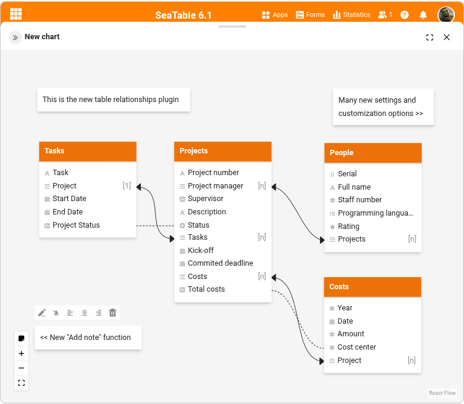

No **App Builder**, o número de [tipos de página]() aumenta para 10; o tipo de página **Map** é novo. SeaTable 6.1 expande as opções para colunas de ligação nos outros tipos de página. Pode agora configurá-las uniformemente e atribuir-lhes autorizações com um grau de precisão elevado. Os utilizadores de aplicações podem esperar uma **opção de impressão para dashboards**, bem como funções alargadas de filtragem e ordenação.

No **Base Editor**, a [coluna Ligação]() assume um papel central com uma atualização funcional: as regras de filtragem dinâmicas permitem controlar as linhas selecionáveis em função da respectiva linha de origem – cada linha obtém assim a sua própria seleção individual. Também são novos os dois [tipos de vista]() **Árvore** e **Linha cronológica**, que substituem os plugins com o mesmo nome. Nos logs da base, os filtros fornecem uma melhor visão geral das atividades em uma base.

Também aconteceu muita coisa na área das **Integrações**: SeaTable 6.1 introduz uma ligação ao Google Calendar e uma função de importação do Airtable. Juntamente com o plugin de relações entre tabelas melhorado, existe o novo [plugin de Chat IA](), que permite analisar e alterar dados utilizando linguagem natural.

SeaTable 6.1 está agora disponível para transferência no conhecido [Docker Repository](https://hub.docker.com/r/seatable/seatable-enterprise); no [Changelog](https://cloud.seatable.io/dtable/view-external-links/c9124bcd934b47bc8f30/) encontrará – como sempre – a lista completa de todas as alterações.

A nova versão será implementada no [SeaTable Cloud]() a 25 de março. A atualização é acompanhada por uma atualização das subscrições Free e Plus. **As automatizações**, anteriormente exclusivas da subscrição Enterprise, estarão também disponíveis em [Free e Plus](). As equipas Free recebem 100 execuções de automatização por mês; as equipas Plus recebem 500 execuções por mês e por membro da equipa. O preço da subscrição Plus mantém-se inalterado e a Free continua a ser gratuita.

## Aplicações mais poderosas

As distribuições espaciais podem ser visualizadas no Bases com o [map plugin](). O novo tipo de página **Mapa** também torna isto possível nas aplicações. Tal como noutras páginas, as predefinições de página podem ser utilizadas para ocultar registos de dados e limitar o âmbito dos registos de dados apresentados. Também pode configurar o valor de apresentação e o efeito de pairar.



Um **Token da API do Google** deve ser armazenado na configuração do SeaTable Server para que o tipo de página possa ser apresentado e utilizado no App Builder. Pode encontrar mais pormenores no [Manual do administrador](https://admin.seatable.com/configuration/plugins/#map-plugin).



SeaTable 6.1 normaliza as opções de definição e o conceito de autorização para **Colunas de ligação no App Builder**. Pode ativar três autorizações individualmente em páginas do tipo Galeria, Kanban, Calendário, Linha de tempo e Registo único:
- Criar e ligar novas entradas
- Ligar registos existentes
- Editar registos ligados

No SeaTable 6.2, será adicionada a quarta autorização **Remover ligações existentes**. As definições de ligação continuarão a não estar disponíveis nas páginas do painel de controlo e de consulta, uma vez que estes dois tipos de página não permitem a edição.

As **Definições de coluna para a tabela ligada** permitem que estas autorizações sejam adaptadas individualmente ao caso de utilização específico. O administrador da aplicação pode definir que colunas são apresentadas na tabela ligada, quais são editáveis e quais são campos obrigatórios.

Na nova versão, foram adicionadas **funções de seleção e filtragem** aos tipos de página Galeria, Kanban e Calendário. Estas funções permitem aos utilizadores da aplicação personalizar o âmbito dos dados apresentados e a sua apresentação – um ganho notável em termos de clareza assim que a quantidade de dados aumenta.

A **nova função de impressão na página do painel** oferece-lhe mais flexibilidade. Quando activada, permite-lhe imprimir facilmente uma página em papel.

## Base Editor mais poderoso

### Dois novos tipos de vista

O novo tipo de **Vista em árvore** apresenta os registos de dados numa estrutura hierárquica com nós expansíveis e recolhíveis – uma estrutura em árvore – e permite assim uma visualização intuitiva das relações entre os registos de dados. A **hierarquia dos registos de dados** resulta das ligações entre as tabelas. A vista em árvore é particularmente adequada para gerir categorias de produtos e organizações de projectos.


A nova vista em árvore está atualmente limitada a **três níveis hierárquicos** e não suporta ligações dentro de uma tabela.


O segundo novo tipo de **Vista de linha cronológica** organiza os registos de dados numa linha cronológica e é, por isso, a primeira escolha quando as relações e dependências temporais estão em primeiro plano.

As novas visualizações irão **substituir os plugins com o mesmo nome**. No entanto, a reimplementação como vistas é mais do que apenas uma mudança na interface do utilizador. Como vistas de pleno direito, podem ser especificamente partilhadas através de partilhas de vistas e tidas em conta em partilhas definidas pelo utilizador, o que simplesmente não é possível com um plugin. A vista em árvore também acrescenta funcionalidade. As colunas a apresentar podem ser selecionadas para cada nível hierárquico. Com o [plugin da árvore]() isto estava limitado ao nível superior.

### Regras de filtragem em colunas de ligações

Uma das novas funcionalidades mais úteis está um pouco escondida nas definições da coluna de links: A opção **Restringir ligações com uma regra de filtro**. Isto permite-lhe restringir a seleção de linhas ligadas com base em regras simples ou complexas. Os próprios filtros podem ser estáticos ou dinâmicos:
- Com um **filtro estático**, é utilizado um valor de filtro normalizado para filtrar as linhas na tabela ligada (por exemplo, apenas as linhas que não tenham o valor "arquivado" podem ser ligadas). O efeito é, portanto, semelhante ao da opção **Restringir ligações a uma vista**.
- Com um **filtro dinâmico**, o valor de filtro utilizado para filtrar as linhas na tabela ligada é um valor de coluna da linha ativa (por exemplo, apenas as linhas cujo estado é idêntico ao estado da linha ativa podem ser ligadas). **Linhas com diferentes valores de filtro** têm, portanto, diferentes linhas ligáveis.

### Opções de filtro nos Base Logs

Os administradores ficarão satisfeitos com as opções de filtro nos [Base Logs](). Os registos podem agora ser filtrados por utilizador, tabela e período de tempo. Naturalmente, também são possíveis filtros combinados. Qualquer pessoa que queira **acompanhar ou desfazer alterações** numa base com muitos utilizadores irá rapidamente apreciar a nova clareza.

## Mais integrações

Mudar do Airtable para SeaTable é mais fácil do que nunca com SeaTable 6.1: Ao criar uma nova base, basta selecionar **Importar base do Airtable**, introduzir um Airtable Base ID e um Personal Access Token na caixa de diálogo de importação e já está. SeaTable faz o resto.

A segunda nova integração diz respeito ao Google Calendar. A nova ação de automatização **Gerir compromissos no Google Calendar** torna possível criar compromissos diretamente do SeaTable num Google Calendar e atualizar os existentes.

### Atualização do plugin de relações de tabela

O [Table Relationships Plugin]() é um velho conhecido e recebe uma extensa atualização com SeaTable 6.1:
- As tabelas podem ser ocultadas individualmente
- As colunas apresentadas podem ser controladas através da seleção de uma vista
- As ligações dentro de uma tabela podem ser ocultadas
- Funções de formatação extensivas
- Função de exportação
- Função de reposição do diagrama
- Função de anotação

Isto permite-lhe criar diagramas de relações claros mesmo para bases complexas.

### Fale com inteligência artificial

O **plugin de Chat IA** é totalmente novo. Permite-lhe editar e analisar bases em linguagem natural. Crie registos de dados, altere valores, ligue linhas, crie análises – em alemão, inglês, francês e outras línguas. O plugin destaca-se realmente com análises ad-hoc que vão para além das funções padrão.

Um exemplo de pedido de análise de uma lista de dados de endereços seria: "Liste todas as pessoas da lista de dados de endereços que vivem numa cidade com mais de 1 milhão de habitantes." O modelo analisa então os endereços residenciais, determina a população do local de residência e gera a lista de resultados com base nessa informação.

Para utilizar o plugin, tem de guardar um **API token para um dos LLMs suportados** nas [Definições]() do plugin. Os [modelos suportados]() incluem os da Anthropic, OpenAI e Mistral. Outros modelos serão adicionados em breve.


O plugin de Chat IA está atualmente em fase beta. Teríamos todo o gosto em que partilhasse as suas experiências connosco no [Fórum SeaTable](https://forum.seatable.com/t/we-need-your-feedback-ai-chat-for-seatable/7265).


## E mais

- Os [Formulários]() – tanto os formulários clássicos como os das aplicações – podem agora ser concebidos com **páginas múltiplas**. Isto aumenta a clareza de forma notável assim que estiverem envolvidos muitos campos.

- [Colunas de e-mail]() permitem o armazenamento de endereços de e-mail no formato "Nome de exibição < mail@example.com >". O envio de mensagens de correio eletrónico para esses endereços falhava anteriormente – tanto nas regras de automatização como nos botões. Isto passou à história com SeaTable 6.1.

- A nova [Ação de automatização]() **Arquivo** permite-lhe automatizar a movimentação de registos de dados do Base Editor para o [Big Data backend](). A ação é oferecida para ambos os accionadores periódicos.

## Descontinuações

SeaTable 6.2 remove duas funções do SeaTable.

1. A função para **sincronização de e-mails via IMAP** será removida do SeaTable com SeaTable 6.2. Pedimos aos utilizadores afectados que repliquem a sincronização através de uma das plataformas de automatização suportadas – Make, n8n ou Zapier.
2. SeaTable 6.2 também termina o suporte para aplicações baseadas no [construtor de aplicações de galeria ou de consulta de dados]() da versão 4.3 e anterior do SeaTable. Recomendamos que migre estas aplicações para o [Universal App Builder](), que oferece consideravelmente mais opções.

Espera-se que SeaTable 6.2 seja lançado em meados/fim de maio de 2026.