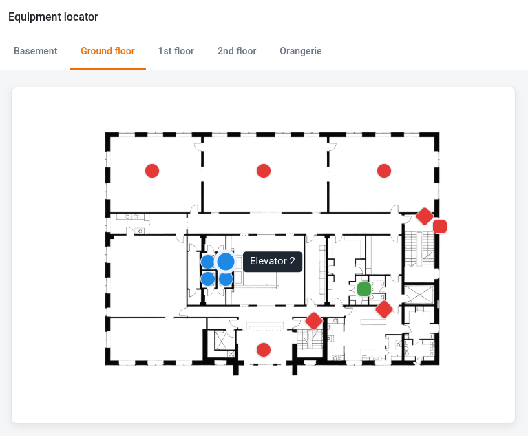
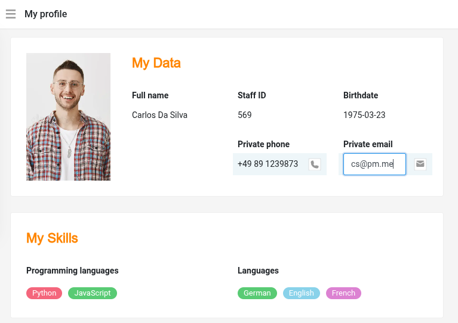
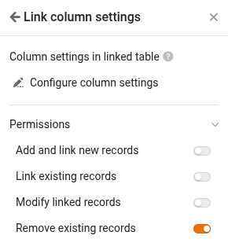
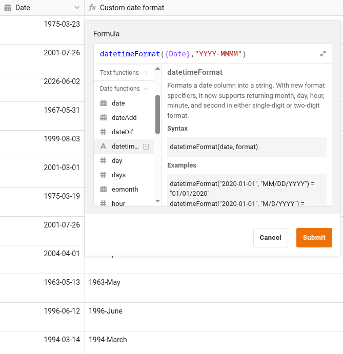
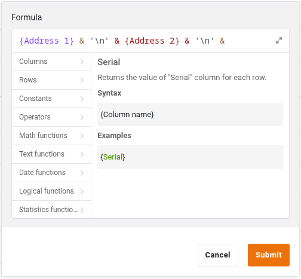

With SeaTable 6.2, the [App Builder]() gains a new page type: **HTML pages** allow you to create fully customized pages based on HTML, JavaScript, and CSS. This removes almost all limitations when it comes to data visualization. Web forms can also be designed exactly to your requirements, and even complex interactions are easy to implement. "It can't be done" is a thing of the past!

In other respects, too, the App Builder takes center stage in version 6.2. The [Single Record]() page type receives a threefold upgrade all at once: all column values can now be displayed uniformly as text, formatted universally, and – a frequently requested feature – edited directly "inline" on the page.

Other [page types]() benefit from expanded permission management for link columns. In addition, minor design adjustments provide greater clarity: apps without pages are marked as such to avoid misunderstandings, and the avatar, including app notifications, has found a new home.

With SeaTable 6.2, [formula columns]() gain two new capabilities at once: the new **datetimeFormat()** function converts date values into strings with a freely definable format. If your preferred date format was not previously offered by SeaTable, that is now a thing of the past. In addition, string formulas now support **line breaks**, which makes it much more flexible to combine texts from different columns.

Last but not least, SeaTable 6.2 improves collaboration: [external links]() and [invitation links]() can now be given a description, so that the purpose and intended recipients can be noted directly on the link. In addition, the ribbon for bases and views accessed via external links has been reworked and made clearer.

The [changelog](https://cloud.seatable.io/dtable/view-external-links/c9124bcd934b47bc8f30/) records – as always – all relevant changes.

For [SeaTable Server](), version 6.2 is available for download as of today in the [SeaTable Docker Repository](https://hub.docker.com/r/seatable/seatable-enterprise).

The update for [SeaTable Cloud]() takes place **on August 4**. With the update, the monthly quota for [running Python scripts]() becomes dynamic. Just like API calls or automations, the total quota for Python scripts is tied to the size of a team. A Plus team receives 250 Python script runs, an Enterprise team 1,000 Python executions per user and month. For the Free subscription, a flat execution limit of 100 per month continues to apply.



The return values of the context object and the query method for the Date, Formula, and Formula for links column types are being harmonized in version 6.2. This may cause the execution of your scripts to result in errors. Please review and update your Python scripts.



## New app page type: HTML page

With the **SeaTable App Builder**, you can create powerful applications – without any programming. Thanks to the predefined page types, a fully functional web application is created in a short amount of time. However, this efficiency comes at a price: while the **10 page types** offer numerous configuration options, they predetermine the structure and behavior of a page. Individual customizations beyond that were not possible until now.

Would you like to use a chart type that SeaTable does not support? Create a highly customized web form? Embed an interactive diagram with clickable elements? Or combine multiple representations – for example, a table and a single record – on one page? With the new **HTML page** page type, these and many other requirements can be implemented.

HTML pages can display **static content**, but they realize their full potential in combination with the **data of a base**. Just like other page types of the App Builder, they can retrieve data from a base and modify records in a base. When it comes to **designing the user interface**, however, you are almost completely free. What can be achieved with HTML, CSS, and JavaScript can, in principle, also be implemented as an HTML page in the App Builder.

Don't let the name confuse you. HTML pages support not only **HTML**, but also **JavaScript and CSS**. The entire code of the page is uploaded to the app as a bundle. You can find the way it works, the possible development approaches, and the reference for the associated Software Development Kit (SDK) in the [SeaTable Developer Manual](https://developer.seatable.com/html-pages/ 'SeaTable Developer Manual'). You will also find an example page there.

Currently, the page type is aimed in particular at **users with programming experience**. Already in development is an AI function that will allow HTML pages to be created in natural language and without programming knowledge in the future.

## Improved app page type: Single Record

The **Single Record** page type receives several improvements in SeaTable 6.2. Until now, you could only edit records via the row details, which you first had to open using the "Edit entry" button. This meant additional clicks and an unnecessary UX break in the editing workflow.

With SeaTable 6.2, this intermediate step is a thing of the past. If a user has the necessary editing permissions, fields can now be edited directly on the page. **A click on a field activates edit mode**, entries are validated as usual, and changes are saved immediately. This provides a significantly smoother and more intuitive workflow.

The display has also been expanded. **Column types** with their own visual representation – for example, the labels of [single select]() or [collaborator columns]() – can now optionally be displayed as plain text. For all values displayed as text, a uniform set of **formatting options** is also available: font size, font color, alignment, and background can be adjusted consistently, independent of the original column type. This allows you to design pages with a uniform and tidy appearance.

## Extended permissions for links in the app

SeaTable 6.2 closes a gap in the permission management of [link columns]() in the App Builder. With the new **Remove existing entries** permission, you can specifically define whether users are allowed to delete existing links.

Until now, every user with editing permission could remove existing links. This behavior can now be controlled for the link column independently of the other [page permissions]().

Now you can comprehensively manage the access rights for link columns: depending on the configuration, users may create new records in the linked table, link existing records, and modify and remove them – each with its own permissions. This enables **significantly more precise control of editing rights in apps**.

## New function in the formula column

The new **datetimeFormat()** function helps you display date values exactly as you need them. The first parameter contains the date to be formatted or the reference to the column that contains the value. In the second parameter, you define the target format.

In string formulas, you can now insert a **line break** using "\n" or '\n'. This is particularly helpful when you concatenate multiple columns but do not want to write the values on one line. A prime example of this is an address:

## Improvements to external links and invitation links

Last but not least, SeaTable 6.2 has an optimization for **external links and invitation links** in store. You can now give these a **description**. This allows you, for example, to note the purpose and intended recipients directly on the link. In addition, we have reworked the ribbon for bases and views accessed via external links and made it clearer.

## And quite a bit more

- **Improved base log**:​ The [base log]() has been reworked in several places. Search fields make it easier to make a selection in large bases, drop-down menus present themselves in a uniform design, and you can now also filter actions in deleted tables.

- **Improved date widget​**: The date widget has been optimized in terms of operation and display and offers even more convenient work with [date values]().

- **Emojis in comments​**: [Comments]() now support emojis. This makes feedback, reactions, and collaboration even more expressive.

## Adjustment of the return values in Python scripts

With the aim of harmonizing the formats, the return values of some column types for the context object and the query method are being updated in SeaTable 6.2. This may require you to adjust your Python scripts.

You can find a comparison of the return values in SeaTable 6.1 and SeaTable 6.2 in the [SeaTable Forum](https://forum.seatable.com/t/important-changes-related-to-python-client-in-seatable-6-2/7435).

For manually executed scripts, i.e. scripts that you run via a button or in the SeaTable Python editor, you must take into account all the changes mentioned there. For scripts that are executed via automation, you only need to make adjustments regarding the changes related to the query method.
