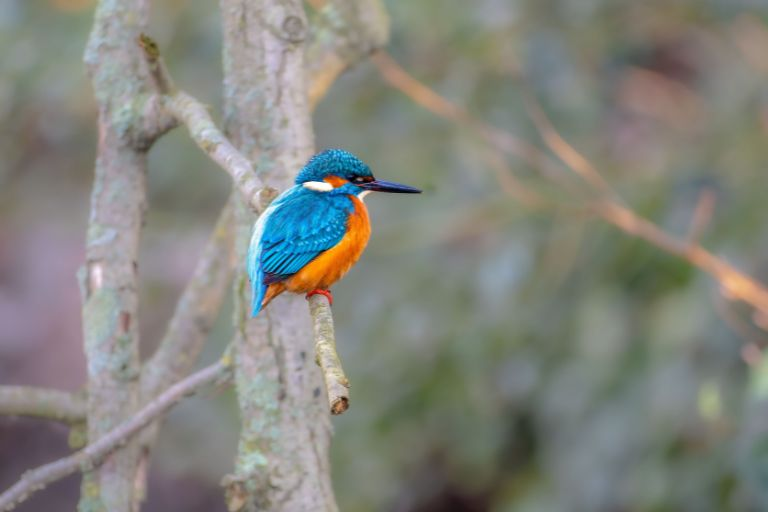
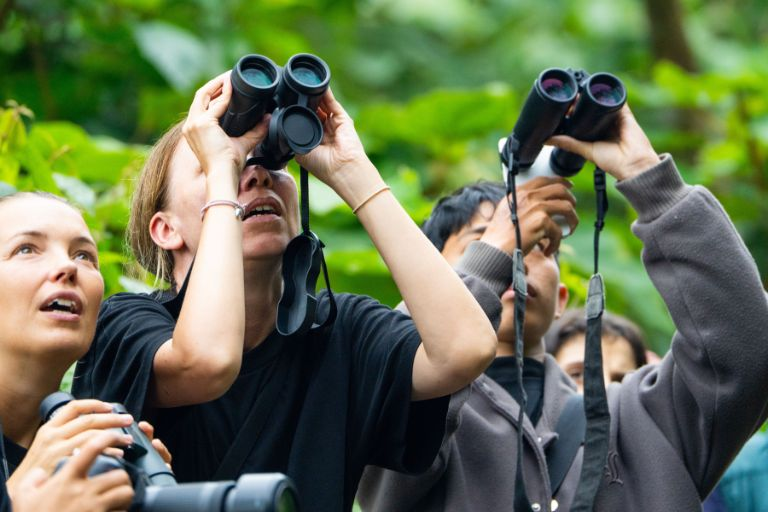
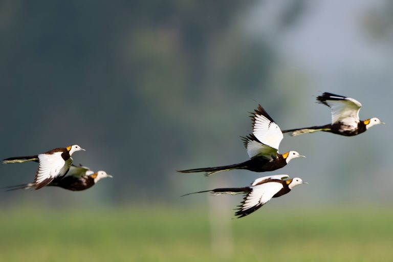
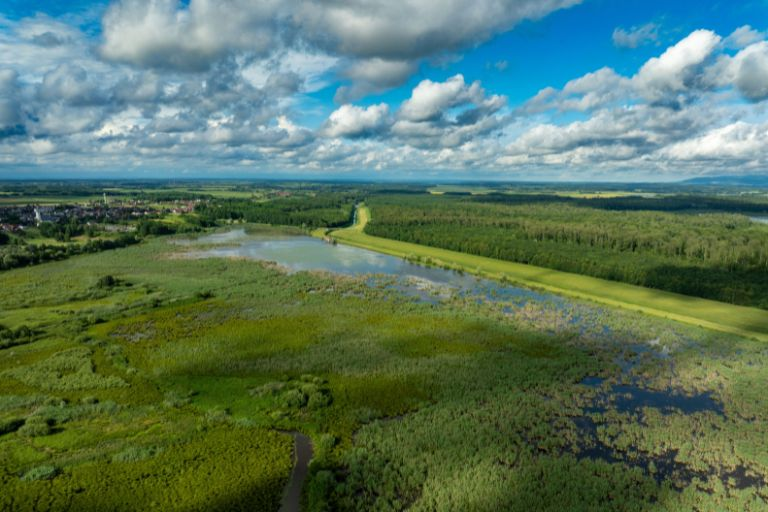
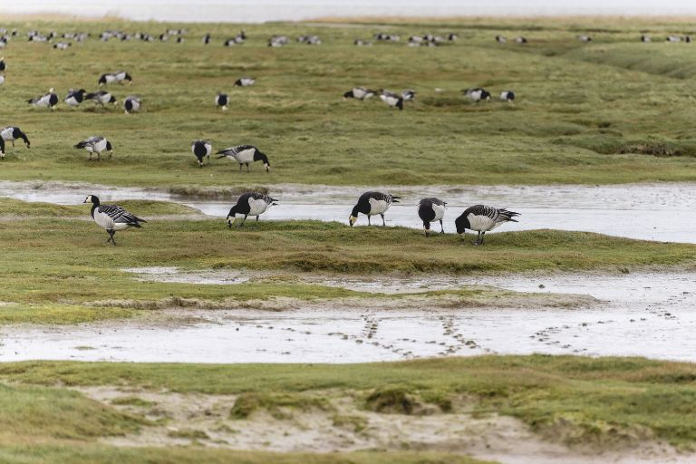
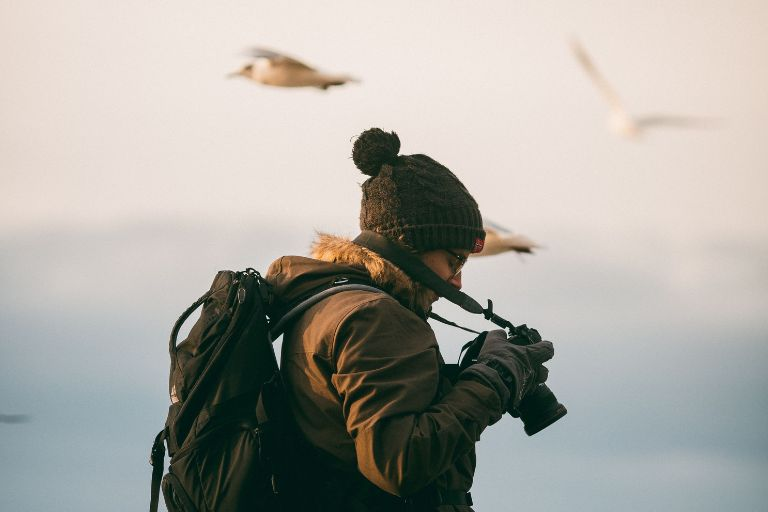

Ein Fernglas, ein ruhiger Morgen im Wald und der Ruf eines unbekannten Vogels. Was früher als verstaubtes Hobby der Rentner galt, erlebt gerade eine überraschende Renaissance. Vogelbeobachtung boomt, und das nicht nur bei der älteren Zielgruppe. Immer mehr junge Menschen entdecken **das Beobachten heimischer und exotischer Vogelarten als bewusste Auszeit vom digitalen Alltag**. 

In diesem Artikel erfahren Sie, warum Vogelbeobachtung gerade jetzt so beliebt ist, wie Ihnen der Einstieg gelingt, ob Birdwatching-Touren sich lohnen und warum sich die digitale Dokumentation Ihrer Beobachtungen auszahlt.

## Warum Vogelbeobachtung heute so beliebt ist

Vogelbeobachtung ist längst nicht mehr nur etwas für Menschen mit jahrzehntelanger Erfahrung und teurem Equipment. Der Trend hat sich in den letzten Jahren deutlich verjüngt. Das hat folgende Gründe:

1.	**Social Media als Einstiegstor:** Ein wesentlicher Treiber ist paradoxerweise genau das Medium, dem viele Menschen mit dem Hobby entkommen wollen: Social Media. Unter dem Hashtag #BirdTok teilen Nutzerinnen und Nutzer kurze Videos von seltenen Sichtungen, beeindruckenden Balzritualen oder einfach vom Vogelhäuschen im eigenen Garten. Die Birding-Community wächst auf diesen Plattformen rasant, wodurch modernes Birding ein deutlich jüngeres, urbaneres Image bekommt als noch vor zehn Jahren.

2.	**Naturerlebnis statt Bildschirm:** Gleichzeitig sehnen sich viele Menschen nach einem bewussten Gegenpol zur ständigen Bildschirmzeit. Vogelbeobachtung verlangt Aufmerksamkeit für die reale Umgebung, für Geräusche, Bewegungen und Details, die im hektischen Alltag sonst untergehen. Wenn Sie einmal versucht haben, einen Zaunkönig im dichten Gebüsch zu orten, wissen Sie, wie sehr dieses Hobby den Blick schärft und den Kopf freimacht.

3.	**Stressabbau, Achtsamkeit und Bewegung:** Vogelbeobachtung verbindet leichte körperliche Bewegung an der frischen Luft mit einer Form von Achtsamkeit, die Sie sonst oft mühsam erlernen müssen. Wenn Sie konzentriert nach Vögeln Ausschau halten, denken Sie automatisch weniger an To-do-Listen oder ungelesene Nachrichten. Diese Mischung aus Lernen und Entspannung macht einen großen Teil der Faszination aus.

4.	**Einstieg in die Ornithologie:** Für viele beginnt die Leidenschaft für Vogelbeobachtung als lockeres Hobby und entwickelt sich mit der Zeit zu einem ernsthafteren Interesse an der Ornithologie. Sie beginnen, Arten anhand von Gesang zu unterscheiden, Zugmuster zu verfolgen oder sich mit Lebensräumen auseinanderzusetzen. Der Übergang vom gelegentlichen Beobachten zur systematischen Vogelbeobachtung verläuft dabei meist fließend.



Beim Birding schärfen Sie Ihre Aufmerksamkeit für Details und trainieren so Ihre Wahrnehmung. Jedes Mal, wenn Sie eine neue Vogelart entdecken oder bestimmen, erleben Sie einen kleinen Erfolgsmoment, der Freude bereitet und motiviert. Gleichzeitig verbringen Sie Zeit in der Natur und nehmen ihre Veränderungen im Laufe der Jahreszeiten viel bewusster wahr.

 

## So gelingt Ihnen der Einstieg in die Vogelbeobachtung

Der Einstieg in die Vogelbeobachtung ist einfacher, als viele denken. Sie brauchen weder ein großes Budget noch Vorwissen, um mit den ersten Beobachtungen zu starten.

### Die richtige Ausrüstung zur Vogelbeobachtung

Ein gutes **Fernglas zur Vogelbeobachtung ist die wichtigste Anschaffung**. Für den Einstieg reicht bereits ein Modell mit acht- bis zehnfacher Vergrößerung und einem möglichst geringen Gewicht, damit auch längere Beobachtungsgänge nicht zur Belastung werden. Ein **Spektiv lohnt sich erst, wenn Sie regelmäßig größere Distanzen überbrücken** möchten, etwa beim Beobachten von Wasservögeln am offenen Ufer oder von Greifvögeln in weiter Ferne. Für den Anfang ist ein Spektiv aber meist überdimensioniert und unnötig teuer. 

Neben dem Fernglas zur Vogelbeobachtung gehört **wetterfeste Kleidung zur Grundausstattung**. Da Sie oft längere Zeit still stehen oder sitzen, kühlt der Körper schneller aus als bei Bewegung, weshalb sich ein Zwiebellook mit mehreren Schichten bewährt. Ein **Notizbuch oder alternativ das Smartphone** rundet die Ausrüstung ab und hilft dabei, Sichtungen direkt vor Ort festzuhalten.

### Wie Sie Arten leichter erkennen

Am Anfang lohnt es sich, heimische Vögel bestimmen zu lernen, bevor Sie sich an seltenere oder exotische Arten wagen. Amsel, Kohlmeise oder Rotkehlchen bieten einen guten Einstieg in die Vogelbeobachtung, weil sie häufig vorkommen und relativ leicht zu unterscheiden sind. 

Ob Sie dabei auf ein klassisches Bestimmungsbuch oder eine App setzen, ist letztlich Geschmackssache. Bestimmungsbücher bieten oft **detailliertere Illustrationen und funktionieren unabhängig vom Handyempfang**, während Apps meist **zusätzlich Vogelstimmen abspielen können und die Suche über Filterfunktionen** erleichtern. Viele erfahrene Vogelbeobachter nutzen inzwischen beides parallel.

Um eine Art sicher zu bestimmen, helfen fünf zentrale Merkmale:

- **Größe** im Vergleich zu bekannten Referenzvögeln wie Spatz oder Taube
- **Gefieder** und auffällige Farbmuster
- **Ruf** beziehungsweise Gesang
- **Verhalten**, etwa die Art der Fortbewegung oder Nahrungssuche
- **Lebensraum**, in dem die Beobachtung stattfindet
  
### Die besten Orte zum Vögel beobachten und fotografieren

Wald, Seen, Parks, Küsten und Naturschutzgebiete bieten jeweils unterschiedliche Artenvielfalt, weil verschiedene Vogelarten an unterschiedliche Lebensräume angepasst sind. Besonders ergiebig sind **Beobachtungsgebiete während der Zugzeit im Frühjahr und Herbst**, wenn Zugvögel auf ihrem Weg in die Winter- oder Sommerquartiere zwischenrasten. Wer in dieser Zeit an einem bekannten Rastplatz unterwegs ist, kann innerhalb weniger Stunden deutlich mehr Arten entdecken als an einem gewöhnlichen Wochenende.

## Birdwatching Touren: Die schönsten Reiseziele für Vogelbeobachtung

Wer über die eigene Region hinausblicken möchte, findet in Birdwatching Touren eine gute Möglichkeit, neue Lebensräume und Arten kennenzulernen. Während sich die Vogelbeobachtung im eigenen Umfeld meist auf vertraute Arten beschränkt, eröffnen Reisen an ausgewählte Standorte einen ganz anderen Blick auf die Vielfalt der Vogelwelt. Wer beispielsweise noch nie einen Seeadler im Flug oder eine ganze Kolonie brütender Seevögel gesehen hat, wird auf einer gut geplanten Tour schnell verstehen, warum sich viele Vogelbeobachter regelmäßig auf Reisen begeben. 

Solche Touren bieten zudem die Möglichkeit, von erfahrenen Guides zu lernen und Techniken der Vogelbeobachtung zu vertiefen, die sich im Alleingang nur schwer aneignen lassen. Gerade für Menschen, die ihre Leidenschaft für Vogelbeobachtung zu einem festen Bestandteil ihres Jahres machen möchten, lohnt sich daher der Blick über die eigene Region hinaus.

### Was eine gute Birdwatching Tour ausmacht

Kleine Gruppen sind bei geführten Birdwatching Touren besonders wichtig, da große Gruppen die Tiere unnötig stören und die Beobachtung erschweren. Ein **erfahrener Guide mit fundierter Artenkenntnis macht dabei oft den entscheidenden Unterschied**, weil er Rufe zuordnen und seltene Arten anhand kleinster Hinweise erkennen kann, die Laien leicht entgehen. Zunehmend achten Anbieter für Birdwatching-Touren zudem auf Nachhaltigkeit, etwa durch begrenzte Gruppengrößen, feste Wegeführung und die Zusammenarbeit mit lokalen Naturschutzorganisationen. Diese Form des Ökotourismus kommt sowohl den Tieren als auch den Menschen vor Ort zugute.

### Beliebte Reiseziele

Je nach verfügbarer Zeit und gewünschter Artenvielfalt kommen für eine Birdwatching Tour ganz unterschiedliche Ziele infrage, von der weiten Reise bis zum Ausflug vor der eigenen Haustür.



Island ist berühmt für seine beeindruckenden Seevogel-Kolonien, die sich an den steilen Klippen der Küste zu Tausenden ansiedeln. Wer die Insel bereist, kann dort besonders folgende Vögel entdecken:

- Papageitaucher, vor allem in den Sommermonaten an der Küste 
- Basstölpel in großen Brutkolonien 
- Eissturmvögel, die oft in unmittelbarer Nähe der Steilküsten kreisen.





In den artenreichen Nationalparks beider Länder tummelt sich auf engstem Raum eine außergewöhnliche Vielfalt an Vogelarten, was diese Region zu einem der spannendsten Ziele für Vogelbeobachtung weltweit macht. Zu den Highlights zählen unter anderem:

- Quetzal, einer der farbenprächtigsten und begehrtesten Sichtungen in den Nebelwäldern 
- Tukane mit ihrem markanten, großen Schnabel 
- Kolibris in einer außergewöhnlich hohen Artenvielfalt 
- Aras, häufig in leuchtenden Farben und gut sichtbar in den Baumkronen





Das Donaudelta gehört zu den artenreichsten Feuchtgebieten Europas und bietet mit seinen weitläufigen Schilfflächen und Wasserläufen ideale Bedingungen für zahlreiche seltene Arten. Besonders sehenswert sind zum Beispiel:

- Krauskopfpelikane, deren Kolonien zu den größten Europas zählen 
- Seeadler, oft über dem Schilf und den Wasserflächen kreisend 
- Purpurreiher, versteckt zwischen dichter Vegetation





Die Algarve überzeugt mit einer vielseitigen Küsten- und Feuchtgebietslandschaft, in der eine bemerkenswert hohe Artendichte zu Hause ist. Naturbegeisterte können hier vor allem folgende Vögel antreffen:

- Bienenfresser mit ihrem auffällig bunten Gefieder 
- Löffler, gut erkennbar an ihrem spatelförmigen Schnabel 
- Weißstörche, die in der Region häufig auch außerhalb klassischer Nester brüten





Das Wattenmeer zählt zu den bedeutendsten Rastplätzen für Zugvögel in ganz Europa und ist während der Zugzeiten Schauplatz eindrucksvoller Vogelschwärme. Beobachten lässt sich hier insbesondere:

- Ringelgänse, die in großen Schwärmen während des Vogelzugs rasten 
- Austernfischer mit ihrem charakteristischen orangefarbenen Schnabel 
- Alpenstrandläufer, oft in dichten, koordiniert fliegenden Schwärmen zu beobachten



## Die wichtigsten Verhaltensregeln beim Vogelbeobachten

So faszinierend das Hobby ist, es bringt auch Verantwortung mit sich. Wer Vögel beobachtet, sollte stets **auf Distanz zu den Tieren achten** und keinesfalls versuchen, sich unnötig anzunähern. Besonders **während der Brutzeit ist Rücksicht entscheidend**, denn Störungen können dazu führen, dass Elterntiere ihre Nester verlassen. Nester sollten grundsätzlich nicht aktiv aufgesucht werden, auch wenn die Neugier noch so groß ist. **Ruhiges, langsames Verhalten ohne hektische Bewegungen** sorgt außerdem dafür, dass sich die Tiere nicht gestört fühlen und länger beobachtbar bleiben.

## Warum Sie Ihre Vogelbeobachtungen dokumentieren sollten

Viele erfahrene Vogelbeobachter schwören auf eine konsequente Dokumentation ihrer Sichtungen - und das aus gutem Grund. Eine persönliche Artenliste macht sichtbar, **wie vielfältig die eigenen Beobachtungen bereits sind**, und wirkt gleichzeitig motivierend für künftige Ausflüge. Über die Zeit lässt sich zudem die eigene Entwicklung der Artenkenntnis nachvollziehen, etwa wenn Arten, die früher schwer zu bestimmen waren, plötzlich auf den ersten Blick erkannt werden. 
Jahresvergleiche zeigen darüber hinaus **saisonale Muster, etwa wann bestimmte Zugvögel typischerweise in der eigenen Region eintreffen**. Nicht zuletzt dienen **dokumentierte Beobachtungen als Erinnerung an Reisen** und schaffen einen persönlichen Rückblick auf besondere Erlebnisse. Wer seine Fortschritte dokumentiert, macht persönliche Erfolge sichtbar und bleibt langfristig motiviert.



- Nutzen Sie weiches Licht am frühen Morgen oder späten Nachmittag 
- Geduld ist wichtiger als teures Equipment 
- Der Serienbildmodus erhöht die Chance auf ein scharfes Foto in Bewegung 
- Fotografieren Sie das Verhalten des Vogels, nicht nur die technische Perfektion des Bildes

 

## Digitale Dokumentation mit SeaTable

Wer regelmäßig Vögel beobachten und fotografieren möchte, profitiert stark davon, Sichtungen und Fotos an einem Ort zu sammeln statt sie über verschiedene Ordner und Apps zu verteilen. Genau an diesem Punkt setzt die [KI-gestützte No-Code-Plattform]() SeaTable an. Mit SeaTable lässt sich eine **eigene Beobachtungsdatenbank aufbauen, in der jede Sichtung mit Datum, Ort, Art und weiteren Details erfasst wird**. Fotos können direkt der jeweiligen Sichtung zugeordnet und gespeichert werden, sodass Bild und Information nicht getrennt voneinander existieren. 



Über eine [Kartenansicht]() lassen sich alle Beobachtungsorte visuell darstellen, was besonders praktisch ist, um Muster in der eigenen Beobachtungsregion zu erkennen. Praktische Filter nach Vogelarten erleichtern die Auswertung, wenn Sie beispielsweise nachschauen möchten, wie oft Sie eine bestimmte Art bereits gesichtet haben. Über das [Webformular]() können Sie bequem auch von unterwegs neue Sichtungen eintragen. Nicht zuletzt hilft eine gut gepflegte Datenbank bei der Vorbereitung auf die nächste Birdwatching Tour, da sich frühere Beobachtungen und offene "Wunschlisten" jederzeit einsehen lassen.

## Fazit

Vogelbeobachtung verbindet Naturerlebnis, Entspannung und Lernen auf eine Weise, die im digitalen Alltag selten geworden ist. Der Einstieg ist einfach und kostengünstig, denn ein solides Fernglas und etwas Geduld reichen für die ersten Erfolge bereits aus. Wer tiefer einsteigen möchte, findet in Birdwatching Touren eine Möglichkeit, besondere Naturerlebnisse an neuen Orten zu sammeln. Und wer seine Beobachtungen digital dokumentiert, sorgt dafür, dass Erinnerungen, Artenlisten und Fotos dauerhaft erhalten bleiben, anstatt in Notizbüchern oder verstreuten Apps verloren zu gehen.

## FAQs



Birding wird häufig mit einer aktiveren, community-getriebenen Herangehensweise assoziiert, bei der das gezielte Aufspüren möglichst vieler Arten und der Austausch in Communitys wie auf #BirdTok im Vordergrund stehen. Die klassische Art, einen Vogel zu beobachten, ist dagegen oft ruhiger geprägt und muss nicht zwangsläufig auf das Sammeln neuer Arten ausgerichtet sein.





Ein Fernglas mit acht- bis zehnfacher Vergrößerung, wetterfeste Kleidung sowie ein Notizbuch oder Smartphone zur Dokumentation reichen für den Einstieg vollkommen aus. Ein Spektiv wird erst bei fortgeschritteneren Beobachtungen relevant.





Ja, geführte Touren mit erfahrenen Guides erleichtern gerade Anfängern den Einstieg erheblich, da Rufe und Arten schneller richtig zugeordnet werden können. Wer lieber allein unterwegs ist, kann natürlich auch eigenständig mit einem Bestimmungsbuch oder einer App starten.





Wenn Sie gesichtete Vögel dokumentieren, macht das Ihre eigene Entwicklung sichtbar, ermöglicht Jahresvergleiche und bewahrt Erinnerungen an besondere Beobachtungen und Reisen. Mit einer digitalen Lösung wie SeaTable lassen sich diese Informationen zudem strukturiert und dauerhaft verwalten.

