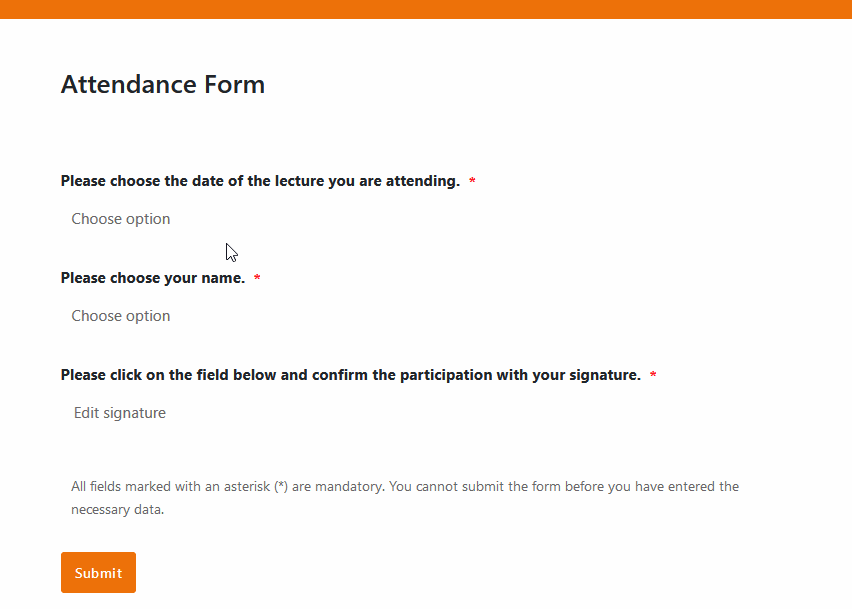

Bieten Sie Gesundheits- und Sportkurse an? Arbeiten Sie in einer Bildungseinrichtung oder planen Sie sonstige Veranstaltungen in Präsenz oder virtuell? Dann ist eine digitale Teilnehmerliste genau das Richtige für Sie! Erfahren Sie alles über diekostenlose Anwesenheitsliste Vorlage von SeaTable und die Vorteile im Vergleich zu einer herkömmlichen Teilnehmerliste in Excel oder handschriftlichen Listen auf Papier.

## Was ist eine Anwesenheitsliste?

In einer Anwesenheitsliste tragen sich die Teilnehmer einer Veranstaltung ein, um ihre Anwesenheit bei einem Termin zu bestätigen.

## Ist eine Anwesenheitsliste das Gleiche wie eine Teilnehmerliste?

Nein, eine Anwesenheitsliste ist nicht mit einer Teilnehmerliste gleichzusetzen. Aber eine Teilnehmerliste ist quasi die Vorlage für die Anwesenheitsliste: Während eineTeilnehmerlistedarstellt, welche Personen sich für eine Veranstaltung angemeldet haben – unabhängig davon, ob sie wirklich kommen, dokumentiert die Anwesenheitslistedie tatsächliche Teilnahme der Personen an einem Termin.

Mit einer Teilnehmerliste Vorlage planen Sie Ihre Veranstaltungenim Voraus. Die Anwesenheitsliste lassen Sie hingegenan den jeweiligen Terminenunterschreiben. Heutzutage wird die Anwesenheitsliste per Excel Vorlage oftdigitalangelegt, doch zum Zwecke der Unterschrift immer noch aufPapierausgedruckt. Wie das auch anders geht, erfahren Sie unten.

## Wozu benötigen Sie eine Anwesenheitsliste?

Mit einer Anwesenheitsliste können Sie nachvollziehen, wer an welchen Terminen teilgenommen hat. Auf Basis dessen können Sie beispielsweise den Teilnehmern an einem Kurs eineBescheinigungoder einZertifikatfür die erfolgreiche Teilnahme ausstellen. Zudem kann bei Versammlungen eine unterschriebene Teilnehmerliste erforderlich sein, damit Abstimmungen wirklich bindend sind. Aufgrund der Anwesenheitsquote können Sie meist auch Rückschlüsse ziehen, wie gut die Veranstaltung bei den Teilnehmern ankommt.

## Rechtliche Anforderungen an eine Teilnehmerliste

Achten Sie bei jeder Teilnehmerliste, die als Vorlage für eine Anwesenheitsliste dient, auf dieDatenschutz-Grundverordnung (DSGVO)​. Insbesondere, wenn es sich um sensible, personenbezogene Daten wie Adress- oder Gesundheitsdaten handelt, sollten die Teilnehmer der Verarbeitung ihrer Daten zugestimmt haben.

Ebenso wichtig ist es, Ihre Teilnehmerliste z. B. in Excelvor unbefugtem Zugriff zu schützen. Davor bietet eine Software-Lösung, mit der Sie nur bestimmte Personen zum Zugriff auf die Teilnehmerliste berechtigen können, einen besseren Schutz als eine Excel Vorlage. Prüfen Sie ebenfalls eine mögliche Aufbewahrungspflichtder Anwesenheitsliste für Ihre Veranstaltung.

## Was sollten Sie in einer Teilnehmerliste erfassen?

Welche Daten Sie von Ihren Teilnehmern abfragen, bleibt Ihnen überlassen. Wenn Sie eine Teilnehmerliste erstellen, sind einige Informationen aber immer nötig: Dazu zählen die Namen und Kontaktdaten(E-Mail-Adresse, Telefonnummer) der Teilnehmenden. Des Weiteren können je nach Zweck der Veranstaltung auch die Adresse, das Geburtsdatum, das Geschlecht oder bestimmte Vorkenntnisse und Qualifikationen relevant sein.

Bei einer Anwesenheitsliste sollten Sie auf keinen Fall denTitel und das Datum der Veranstaltungsowie ein Feld für die Unterschriftvergessen. All diese Informationen finden Sie natürlich auch in der Anwesenheitsliste Vorlage von SeaTable, sodass Sie keine neue Excel Vorlage für Ihre Anwesenheitsliste erstellen müssen.

## Wie Sie ohne Excel eine Vorlage für Ihre Anwesenheitsliste erstellen

SeaTable kombiniert die Power einer Datenbank mit der Einfachheit einer Excel Vorlage zu einer Anwesenheitsliste. Wenn Sie neben den Beispieldaten noch zusätzliche Informationen erfassen möchten, können Sie unsere kostenlose Anwesenheitsliste Vorlage beliebig nach Ihren Bedürfnissen anpassen, indem Sie Spalten für die benötigten Angaben hinzufügen.

## Die Anwesenheitsliste Vorlage mit integrierter Teilnehmerliste

Mit SeaTable organisieren und verwalten Sie mühelos Veranstaltungen wie Kurse, Seminare oder Trainings. In der ersten Tabelle listen Sie zunächst alle Termine Ihrer Veranstaltung auf. Hier können Sie auch Details zur Lehrkraft, zum Veranstaltungsort und zur Dauer sowie Dokumentehinterlegen. Als Beispiel haben wir eine **Vorlesungsreihe an einer Universität** genommen.

In der zweiten Tabelle befindet sich die Teilnehmerliste Vorlage. Hier sind Informationen (z. B. Matrikelnummer, Studiengang und E-Mail-Adresse) von Studenten gespeichert, die sich für die Vorlesung angemeldet haben. Am Ende der Vorlesungszeit können Sie per Knopfdruck Teilnahmebescheinigungen für diejenigen erstellen, die regelmäßig zur Vorlesung erschienen sind.

## Automatische Datenerfassung mit Webformularen

Nutzen Sie intuitive Webformulare, in denen Ihre Teilnehmer digital unterschreiben und selbst Daten erfassenkönnen. Nach Einreichung werden die Daten automatisch in Ihren Tabellen gespeichert. Die Anwesenheitsliste Vorlage in Tabelle 3 arbeitet zudem mit Verknüpfungenzu Tabelle 1 und 2: So müssen die Teilnehmer nur den aktuellen Termin und ihren Namen aus der Teilnehmerliste auswählen, bevor sie ihre Anwesenheit mit ihrer Unterschrift bestätigen.

Mithilfe eines Webformulars können Sie nach der Veranstaltung zudem eine Umfrage zur Evaluation durchführen, in der Teilnehmer Feedback und Bewertungen abgeben können.

## Vorteile der Anwesenheitsliste Vorlage auf einen Blick

​

**•Kostenlos**: Um die Anwesenheitsliste Vorlage von SeaTable zu nutzen,registrieren Sie sich einfach kostenlos mit Ihrer E-Mail-Adresse.

•**Weniger Aufwand**: Lassen Sie Ihre Teilnehmer über Webformulare Daten erfassen, die automatisch in Ihrer Teilnehmerliste Vorlage landen. Verwalten Sie alle Daten digital und scannen Sie nie wieder umständlich Papier-Anwesenheitslisten ein!

•**Intuitiv**: Durch das benutzerfreundliche Design geht die Dateneingabe schnell und ist weniger fehleranfällig als bei einer Excel Teilnehmerliste oder manuellen Aufzeichnungen.

•**Flexibel**:​Fügen Sie beliebig viele Spalten hinzu und passen Sie die Anwesenheitsliste Vorlage an Ihre individuellen Wünsche an. Anders als in einer Excel Teilnehmerliste können Sie auch Dateien, Bilder und Signaturen speichern.

•**Datenschutz**: Die sichere und DSGVO-konforme Speicherung der Teilnehmerdaten in der Cloud oder On-Premises ermöglicht ebenso wie die granularen Zugriffsrechte volle Kontrolle.

•**Bequem**: Die Online-Teilnehmerliste ist von überall und zu jeder Zeit zugänglich und gleichzeitig vor Verlust geschützt. Wenn Sie möchten, können Sie die Teilnehmerliste Vorlage auch als Excel- oder CSV-Datei exportieren und ausdrucken.

•**Leistungsstark**: Profitieren Sie vom integrierten App-Builder, zahlreichen Visualisierungsmöglichkeiten sowie Filter-, Sortierungs- und Gruppierungsfunktionen zur Datenaufbereitung.

•**Immer aktuell**: Bleiben Sie dank der Kommunikationsfunktionen, vollständiger Änderungshistorie und Echtzeitaktualisierung immer auf dem neuesten Stand.

•**Skalierbar**: Unsere Lösung wächst mit Ihrem Unternehmen – unabhängig davon, ob Sie einen oder tausend Teilnehmer haben.

## Interaktives Template

Scrollen Sie durch unser interaktiv eingebettetes Template oder lesen Sie die Beschreibung, indem Sie auf das  hinter dem Vorlagennamen klicken. So bekommen Sie ein besseres Gefühl für die Funktionen der Anwesenheitsliste Vorlage. Bei Fragen und Problemen empfehlen wir Ihnen, unseren [Hilfebereich]()zu nutzen.

​
